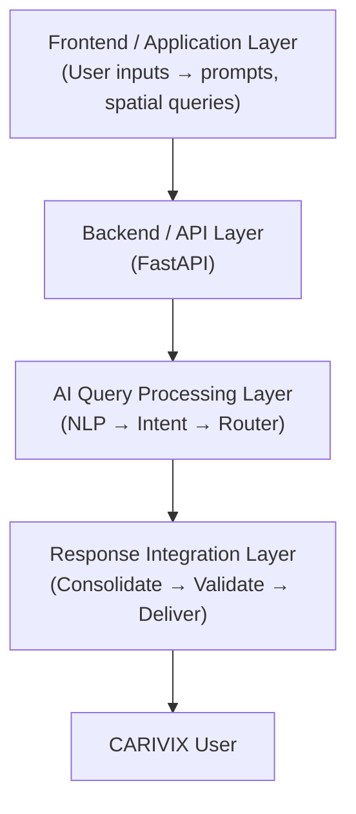
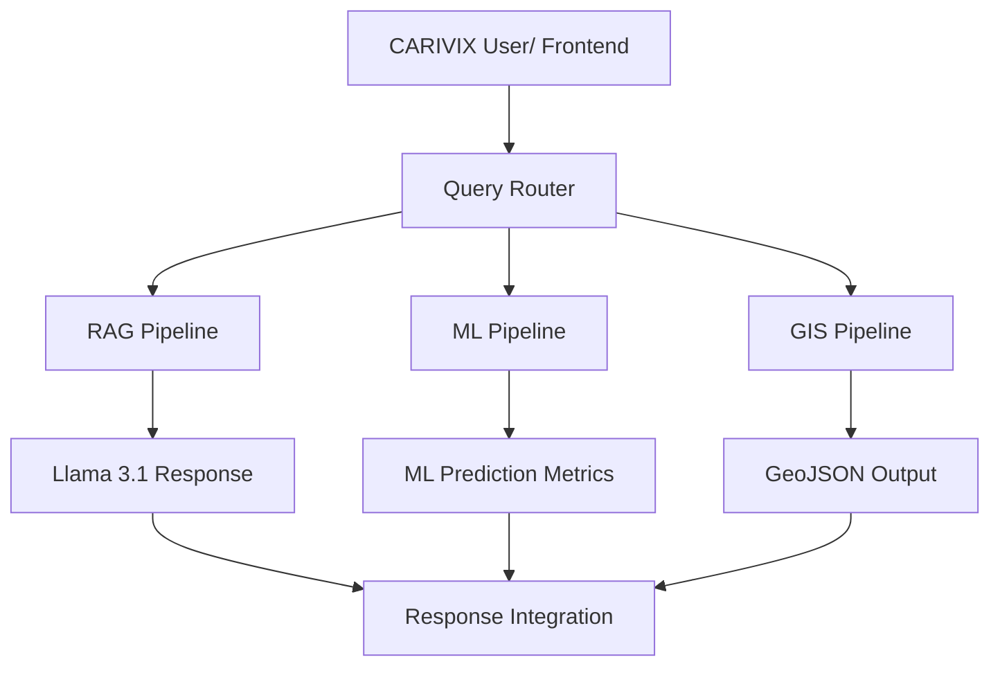

# CARIVIX AI — Comprehensive System Architecture

## 1. Overview

This document provides a **complete review of the CARIVIX AI system architecture**, synthesizing the technical blueprints and workflow designs detailed in the project's Knowledge Base.

It documents:

| # | Topic |
|---|---|
| 1 | High-level layered architecture |
| 2 | Core processing pipelines (RAG, ML, GIS) |
| 3 | Data flow and response integration |
| 4 | Architectural strengths |

---

## 2. High-Level Architecture

The CARIVIX AI ecosystem is designed as a **multi-layered, modular platform** that bridges standard web application architecture with advanced AI processing capabilities.

The flow of **data and execution** is separated into distinct functional layers:

| # | Layer | Responsibility |
|---|---|---|
| 1 | **Frontend / Application Layer** | Captures user inputs (prompts, spatial constraints) and renders outputs (GeoJSON maps, text responses, dashboards) |
| 2 | **Backend / API Layer** | Built on FastAPI; acts as the central traffic controller — handling requests, data ingestion, database interactions, and routing |
| 3 | **AI Query Processing Layer** | The core intelligent router that dissects incoming queries and directs them to the appropriate processing pipeline (RAG, ML, or GIS) |
| 4 | **Response Integration Layer** | Consolidates the outputs from various pipelines into a unified, coherent response for the user |

### High-Level Architecture Flow

---

## 3. Core Processing Pipelines

When a request reaches the backend, it is passed to the **NLP Module** for:

- Intent Detection
- Entity Extraction
- Feature Extraction

Based on this analysis, the **Query Router** directs the request to one or more of the following pipelines.

### A. RAG (Retrieval-Augmented Generation) Pipeline

The RAG pipeline is responsible for querying the **unstructured knowledge base**.

| Stage | Description |
|---|---|
| **Ingestion** | Documents are loaded, preprocessed, and semantically chunked |
| **Embedding & Storage** | Embeddings are generated and stored in a FAISS Vector Store |
| **Retrieval** | User queries are embedded, and Semantic Similarity Search is performed to retrieve the Top-K relevant chunks |
| **Generation** | A Context Builder constructs the prompt, which is passed to **Llama 3.1** (hosted via **Ollama**) to generate an intelligent, context-aware response |

### B. Machine Learning (ML) Prediction Pipeline

The ML pipeline handles **structured data forecasting and statistical predictions**.

| Stage | Description |
|---|---|
| **Model Service** | Manages model configurations and validates incoming input |
| **Inference** | Applies feature preparation to the data and passes it to pre-trained ML models (e.g., ARIMA for time-series forecasting) |
| **Result Generation** | Outputs structured prediction results (e.g., growth rates, anomaly detection) |

### C. Geographic Information System (GIS) Processing

The GIS module handles all **spatial data requests**.

| Stage | Description |
|---|---|
| **Spatial Queries** | Translates user intent into PostGIS SQL queries |
| **Processing** | Performs bounding box filtering, spatial joins, and geometric operations |
| **Output** | Generates GeoJSON outputs for frontend mapping components (Leaflet.js) |

### Core Pipeline Flow

---

## 4. Data Flow and Response Integration

The architecture is **highly concurrent**. A single user prompt may trigger:

- A spatial query (**GIS**)
- A statistical forecast (**ML**)
- A literature search (**RAG**)

…**simultaneously**.

### Execution Flow

| Step | Action |
|---|---|
| 1 | **Execution** — The Query Router dispatches tasks to the RAG, ML, and GIS pipelines |
| 2 | **Consolidation** — The independent outputs (Llama 3.1 text, ML prediction metrics, and GIS GeoJSON) flow into the **Response Integration** module |
| 3 | **Validation** — The integrated response undergoes validation and formatting |
| 4 | **Delivery** — The final response is passed back through the API Layer to the CARIVIX Frontend |

---

## 5. Architectural Strengths

### 5.1 Modularity

> By **decoupling** the RAG, ML, and GIS pipelines, the system allows for **independent scaling**.

**Example:** If the LLM generation requires more GPU resources, **Ollama** can be scaled independently of the **PostgreSQL/PostGIS** database.

### 5.2 Unified Query Routing

> The NLP-driven **Query Router** abstracts the complexity away from the frontend.

The frontend simply sends a natural language prompt, and the backend orchestrates the complex multi-pipeline execution.

### 5.3 Standardized NLP Flow

> The strict breakdown of **Intent, Entity, and Feature extraction** ensures that ambiguous queries can be accurately mapped to the correct technical execution path.

---

## 6. Module Relationships

The table below summarizes how the major CARIVIX modules interact with each other.

| Module | Interacts With | Relationship |
|---|---|---|
| **Frontend / Application Layer** | Backend / API Layer | Sends requests, receives responses |
| **Backend / API Layer** | AI Query Processing Layer | Routes incoming requests to the AI router |
| **Backend / API Layer** | Response Integration Layer | Receives unified responses to return to frontend |
| **AI Query Processing Layer** | NLP Module | Passes query for intent, entity, and feature extraction |
| **NLP Module** | Query Router | Provides structured query for routing decisions |
| **Query Router** | RAG Pipeline | Dispatches knowledge-based queries |
| **Query Router** | ML Pipeline | Dispatches structured prediction queries |
| **Query Router** | GIS Pipeline | Dispatches spatial queries |
| **RAG Pipeline** | FAISS Vector Store | Retrieves relevant document chunks |
| **RAG Pipeline** | Llama 3.1 / Ollama | Generates context-aware natural-language responses |
| **ML Pipeline** | Model Service | Manages model configs and executes inference |
| **GIS Pipeline** | PostgreSQL / PostGIS | Executes spatial queries and geometric operations |
| **GIS Pipeline** | Leaflet.js (frontend) | Delivers GeoJSON for map rendering |
| **Response Integration Layer** | Backend / API Layer | Delivers unified, validated responses |

---

## 7. Conclusion

The CARIVIX AI system architecture is an **ambitious, enterprise-ready blueprint**. It successfully marries:

| Traditional | Modern |
|---|---|
| Geospatial mapping | Generative AI (Llama 3.1) |
| Structured data processing | Vector search capabilities |

> The architecture is **logically sound** and prepared for **scalable deployment**.

---

## Version Control

| Version | Date | Author | Changes |
|---|---|---|---|
| 1.0 | 2026-09-18 | Shivanath Samudrala | Initial version — comprehensive system architecture review |
