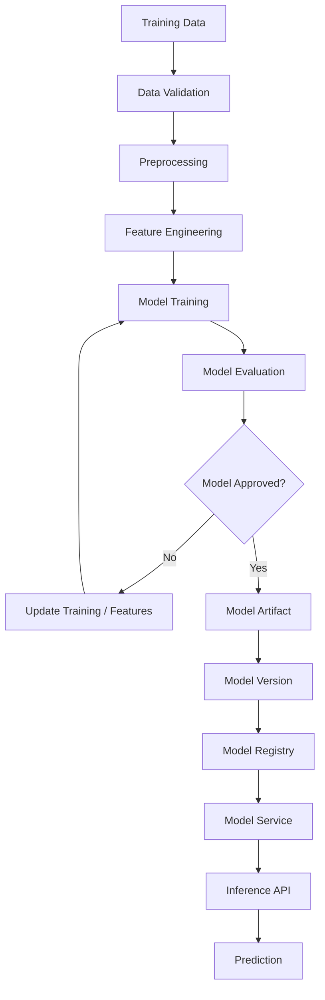
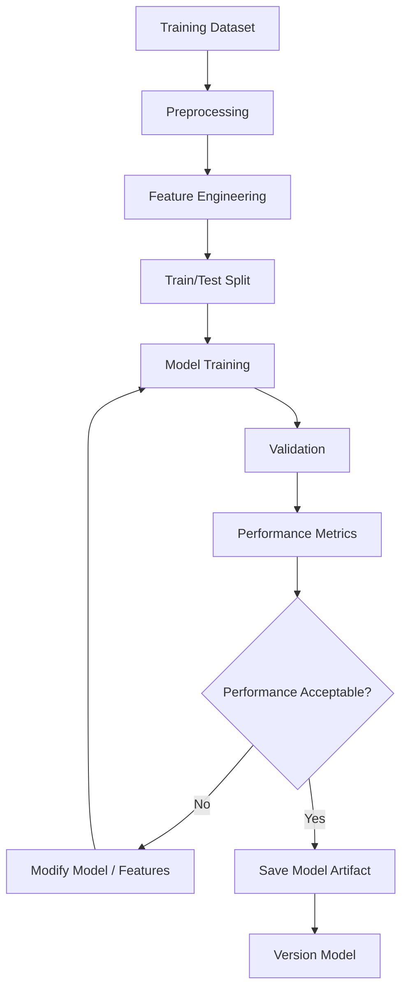
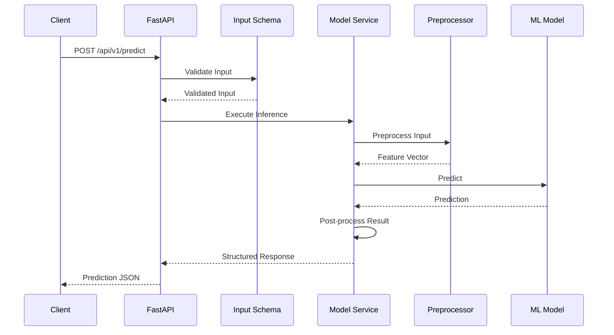
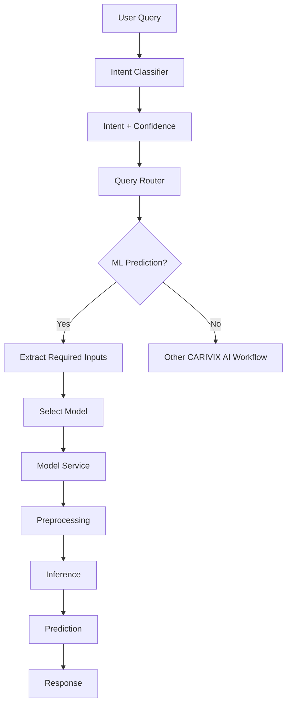
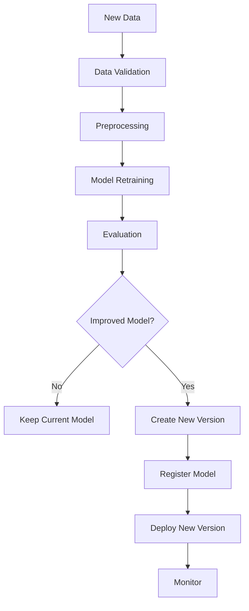
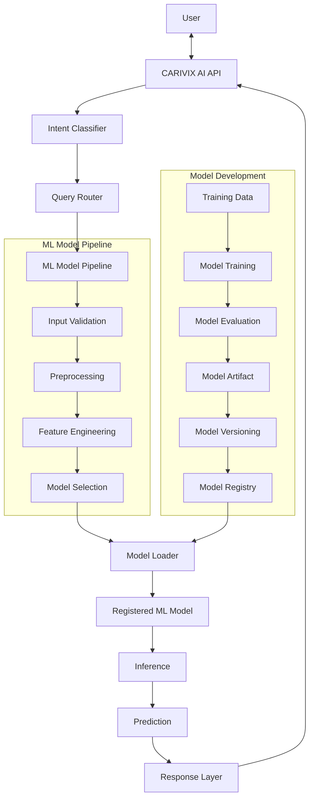
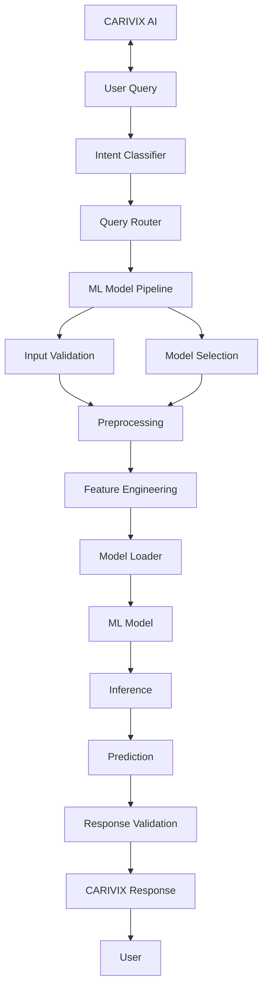

## 1. Document Overview

The CARIVIX AI Model Pipeline is the machine-learning execution layer responsible for taking structured input, preparing the required features, loading the appropriate trained model, performing inference, validating the prediction, and returning a structured result.

The pipeline covers the following areas:
- Model input preparation
- Data preprocessing
- Feature engineering
- Model training
- Model evaluation
- Model artifact generation
- Model versioning
- Model loading
- Model inference
- Prediction validation
- API-based inference
- Integration with the CARIVIX AI query workflow

The model pipeline is designed to work as an independent ML component within the broader CARIVIX AI system.

---

## 2. Purpose

The main purpose of the model pipeline is to provide a consistent and reusable mechanism for executing trained ML models in CARIVIX AI.

The pipeline ensures that:
- Input data is validated before inference
- The required preprocessing is applied consistently
- The correct model is selected and loaded
- Model versions can be maintained
- Predictions are generated through a standardized service
- Model inference can be accessed through FastAPI
- Model training and inference remain separate
- New models can be integrated without redesigning the entire AI system
- The ML workflow can be connected to the CARIVIX intent classifier and query router

---

## 3. Model Pipeline Position in CARIVIX AI

The model pipeline is one of the execution paths inside the CARIVIX AI engine. The overall flow is:

```
User Query
    ↓
CARIVIX API
    ↓
Intent Classifier
    ↓
Query Router
    ↓
ML Model Pipeline
    ↓
Model Service
    ↓
Prediction
    ↓
Response
```

Other AI workflows such as RAG and LLM generation are handled separately by the query router.

---

## 4. High-Level Model Pipeline Architecture

The model lifecycle begins with data preparation and ends with production inference.

The architecture follows this flow:



This represents the complete lifecycle of a machine learning model within CARIVIX AI.

---

## 5. Data Preparation

The model pipeline begins with the training dataset. The data preparation stage is responsible for ensuring that the data is suitable for model training.

Typical activities include:
- Loading the dataset
- Checking columns
- Checking data types
- Handling missing values
- Removing duplicate records
- Checking invalid values
- Selecting required features
- Preparing the target variable

A dataset used during the CARIVIX AI ML work includes `cleaned_business_dataset.csv`. The final dataset structure depends on the specific prediction task.

---

## 6. Data Preprocessing

Preprocessing converts raw data into a format that the ML model can consume.

Typical preprocessing operations include:
- Missing-value handling
- Numerical feature processing
- Categorical feature encoding
- Data-type conversion
- Feature selection
- Scaling where required
- Date transformation where required

The most important principle is that the same preprocessing logic used during training must be applied during inference.

---

## 7. Feature Engineering

Feature engineering transforms the processed input into the feature representation expected by the model.

The flow is:
```
Raw Input → Validation → Preprocessing → Feature Engineering → Feature Vector → ML Model
```

Feature engineering must remain consistent between training and inference. If a feature transformation is used during model training, the same transformation must be available when the production model receives an API request.

---

## 8. Model Training Pipeline

The model training pipeline is responsible for creating the trained ML model artifact.

Different ML algorithms can be used depending on the prediction requirement. Algorithms considered or used during the CARIVIX AI ML work include:
- Logistic Regression
- Random Forest
- Gradient Boosting
- XGBoost

The algorithm is selected based on the prediction problem and evaluation results.

---

## 9. Model Evaluation

After training, the model must be evaluated before being used for inference.

For classification models, evaluation can include:
- Accuracy
- Precision
- Recall
- F1-score
- Confusion matrix
- ROC-AUC

For regression models:
- MAE (Mean Absolute Error)
- MSE (Mean Squared Error)
- RMSE (Root Mean Squared Error)
- R² (R-squared)

The evaluation result is used to determine whether the trained model can proceed to model artifact creation and registration.

**Evaluation Flow:**
```
Trained Model → Test Data → Predictions → Evaluation Metrics → Model Validation → Approved / Rejected
```

---

## 10. Experiment Tracking

Experiment tracking records information about each training experiment.

The experiment record can contain:
- Experiment ID
- Model Name
- Model Version
- Algorithm
- Dataset
- Features
- Hyperparameters
- Training Date
- Evaluation Metrics
- Artifact Location
- Status

This allows different training experiments to be compared and provides traceability for the model that is eventually deployed.

---

## 11. Model Artifact

After successful training and evaluation, the model is serialized into a model artifact. Example: `model.pkl`

A basic model storage structure can be:
```
models/
│
├── business_prediction/
│   ├── v1/
│   │   └── model.pkl
│   └── v2/
│       └── model.pkl
├── intent_classifier/
│   └── v1/
│       └── model.pkl
└── metadata/
    └── model_metadata.json
```

---

## 12. Model Versioning

Model versioning ensures that every trained model can be identified and managed independently.

Example:
```
Business Prediction Model
│
├── v1
├── v2
└── v3
```

Each version can maintain:
- Model artifact
- Model name
- Algorithm
- Training information
- Evaluation metrics
- Dataset information
- Deployment status

The production service should always know which model version it is using.

---

## 13. Model Version Lifecycle

The model version lifecycle follows this progression:

```
Draft → Trained → Evaluated → Validated → Staged → Production → Archived
```

This lifecycle allows a new model to be tested and approved before replacing the currently active model.

---

## 14. Model Service Architecture

The Model Service is the runtime component responsible for loading and executing trained models.

Its responsibilities include:
1. Loading model configuration
2. Identifying the model
3. Loading the model artifact
4. Validating input
5. Applying preprocessing
6. Preparing features
7. Executing inference
8. Processing the prediction
9. Returning the output

The model service should remain separate from the model-training code.

---

## 15. Model Service Structure

A recommended structure is:

```
app/
├── api/
│   ├── routes_predict.py
│   └── routes_health.py
│
├── schemas/
│   ├── request.py
│   └── response.py
│
├── services/
│   ├── model_loader.py
│   ├── inference_service.py
│   └── preprocessing_service.py
│
└── core/
│   ├── config.py
│   └── logging.py
│
models/
└── model.pkl
training/
├── train.py
└── evaluate.py
config/
└── config.yaml
```

This structure separates API, schemas, model execution, configuration, and training responsibilities.

---

## 16. Model Configuration Management

Model configuration should be maintained outside the application code.

Example configuration:
```yaml
model:
  name: business_prediction_model
  version: v1
  path: models/business_prediction/v1/model.pkl

api:
  host: 0.0.0.0
  port: 8000

logging:
  level: INFO
```

Configuration management allows the model path and version to be changed without changing the inference logic.

---

## 17. Model Loading

The model loader is responsible for loading the required model artifact.

The runtime process is:
```
Service Startup → Load Configuration → Identify Model → Identify Version → Locate model.pkl → Load Model → Validate Model → Model Ready
```

The model should preferably be loaded during service startup instead of loading the artifact for every individual request.

---

## 18. Model Input Schema

The model service uses a structured input schema to validate incoming data.

Example request:
```json
{
  "feature_1": 35,
  "feature_2": 65000,
  "feature_3": 720,
  "feature_4": 250000
}
```

The schema layer verifies:
- Required fields
- Data types
- Numeric ranges
- Allowed categorical values
- Missing values
- Input structure

Invalid requests should be rejected before model inference.

---

## 19. Model Output Schema

The model service should return a standardized response.

For classification:
```json
{
  "prediction": 1,
  "prediction_label": "approved",
  "confidence": 0.91,
  "model_name": "business_prediction_model",
  "model_version": "v1"
}
```

For regression:
```json
{
  "prediction": 1245.62,
  "model_name": "sales_prediction_model",
  "model_version": "v1"
}
```

The exact response fields depend on the model type.

---

## 20. Model Inference Pipeline

The inference pipeline is the main runtime path:


---

## 21. FastAPI Inference Endpoint

The primary inference endpoint is:

```
POST /api/v1/predict
```

Its purpose is to execute single-record model inference.

The request flow is:
```
HTTP Request → FastAPI → Input Validation → Model Service → Preprocessing → ML Model → Prediction → JSON Response
```

FastAPI acts as the interface between the CARIVIX AI application and the ML model service.

---

## 22. Health Endpoint

The model service should expose:

```
GET /health
```

The endpoint can verify:
```
API Available → Configuration Available → Model Loaded → Model Service Ready
```

Example response:
```json
{
  "status": "healthy",
  "model_loaded": true,
  "model_name": "business_prediction_model",
  "model_version": "v1"
}
```

---

## 23. Integration with Intent Classification

CARIVIX AI uses an intent-classification layer before selecting the appropriate AI workflow.

The intent classifier can use:
```
TF-IDF + Logistic Regression → Intent + Confidence
```

Example:
```
User: "Predict next month's sales."
    ↓
Intent Classifier
    ↓
Prediction Intent
    ↓
Query Router
    ↓
ML Model Pipeline
```

The intent classifier identifies the user's requirement; it does not replace the actual prediction model.

---

## 24. Query Router to Model Pipeline

The query router determines whether the request should be processed through the ML pipeline.



This keeps query understanding and model execution as separate components.

---

## 25. Model Dispatcher

If CARIVIX AI contains multiple ML models, a model dispatcher can select the correct model.

Example:
```
Prediction Request → Model Dispatcher
    ↓
    ├── Sales Model
    ├── Revenue Model
    ├── Profit Model
    └── Customer Model
    ↓
Selected Model → Inference
```

The dispatcher can map prediction types to registered model names and versions.

Example mapping:
```
sales_prediction → sales_model:v1
revenue_prediction → revenue_model:v1
profit_prediction → profit_model:v1
```

---

## 26. Error Handling

The model pipeline should validate errors before they reach the model.

**Input Errors:**
- Missing field
- Invalid data type
- Invalid value
- Invalid category
- Invalid input structure

**Model Errors:**
- Model artifact missing
- Model failed to load
- Unsupported model version
- Prediction failure

**Service Errors:**
- Configuration failure
- Internal service failure
- Dependency failure

Example error response:
```json
{
  "error": "ValidationError",
  "message": "Invalid input provided"
}
```

---

## 27. Testing and Validation

Testing should focus on the actual model pipeline.

**Model Tests:**
- Model loads correctly
- Model accepts the expected features
- Prediction executes successfully
- Output is generated in the expected format

**Preprocessing Tests:**
- Input transformation works correctly
- Missing values are handled correctly
- Feature ordering is maintained
- Training and inference transformations are consistent

**API Tests:**
- `/api/v1/predict`
- `/health`

**Integration Test:**
The complete flow should be tested:
```
Request → Validation → Preprocessing → Model → Inference → Response
```

---

## 28. Model Pipeline Validation

Before a model is made available for production inference, the following should be validated:

```
Trained Model → Model Loading Test → Input Schema Test → Preprocessing Test → Inference Test → Output Schema Test → Performance Validation → Model Approval
```

This prevents an incorrectly trained or incorrectly packaged model from being exposed through the API.

---

## 29. Model Monitoring

The production model service should capture basic runtime information.

**Important metrics include:**
- Request count
- Prediction count
- Error count
- Inference latency
- Active model version
- Failed inference requests
- Prediction distribution

Example inference record:
```json
{
  "request_id": "req-001",
  "model_name": "business_prediction_model",
  "model_version": "v1",
  "prediction": 1,
  "latency_ms": 42,
  "status": "success"
}
```

Monitoring is intended to identify runtime issues and support future model improvement.

---

## 30. Retraining Workflow

When new or improved data becomes available, the model can be retrained.




A new model should replace the existing production model only after validation.

---

## 31. Complete CARIVIX AI Model Architecture

The model pipeline's position inside the complete CARIVIX AI architecture is:



This represents the complete consolidated architecture.

---

## 32. Current CARIVIX AI Model Pipeline Status

Based on the CARIVIX AI development work completed so far:

**Completed:**
- Model-service structure established
- Model input/output schemas defined
- Model configuration management prepared
- Baseline ML model integration completed
- Model inference pipeline tested
- Inference results recorded
- Model training workflow configured
- Experiment tracking workflow configured
- Model data-flow testing completed
- FastAPI inference architecture established
- Model artifact and versioning approach defined
- Intent classification workflow established
- Query routing architecture defined
- ML workflow separated from RAG and LLM workflows

**Current Model Flow:**
```
Training Data → Preprocessing → Feature Engineering → Model Training → Evaluation → Model Artifact → Model Version → Model Service → FastAPI → Inference → Prediction
```

---

## 33. Final Model Pipeline

The final CARIVIX AI model pipeline can be summarized as:



The CARIVIX AI Model Pipeline provides the complete ML execution path from trained model preparation to production inference. It keeps model training, model management, model serving, and AI query routing separated while providing a clear integration point through the FastAPI model service.

---

