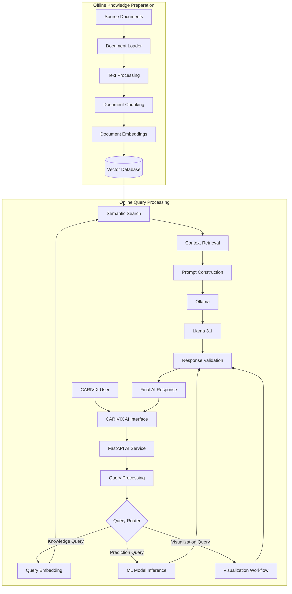

## 1. Introduction

CARIVIX AI uses a Retrieval-Augmented Generation (RAG) architecture to provide responses based on relevant information available in the project knowledge base.

RAG combines three key components:

- **Information Retrieval** – identifies relevant information from indexed documents
- **Context Construction** – prepares the retrieved information for the LLM
- **LLM Generation** – uses Llama 3.1 to generate the final response

The RAG architecture prevents the LLM from depending only on its general pre-trained knowledge for project-specific questions. Instead, relevant information is retrieved and supplied to the model as context.

**Primary Workflow:**
```
User Query → Query Processing → Query Routing → Retrieval → Context Construction → Prompt Construction → Llama 3.1 → Response Validation → Final Response
```

---

## 2. Objectives

The CARIVIX RAG workflow is designed to:

1. Process natural-language user queries
2. Identify queries that require knowledge retrieval
3. Process and prepare project documents
4. Divide documents into meaningful chunks
5. Generate embeddings for document chunks
6. Store embeddings in a vector database
7. Convert user queries into embeddings
8. Perform semantic similarity search
9. Retrieve relevant document information
10. Construct context for the LLM
11. Generate grounded responses using Llama 3.1
12. Validate and return the generated response
13. Integrate the RAG workflow with the CARIVIX AI engine

---

## 3. RAG Architecture Overview

The CARIVIX RAG system consists of two main stages:

### Offline Knowledge Preparation

This stage prepares documents before they are queried.

```
Documents → Document Loading → Text Processing → Chunking → Embedding Generation → Vector Database
```

### Online Query Processing

This stage is executed when a user submits a question.

```
User Query → Query Processing → Query Routing → Query Embedding → Semantic Search → Context Retrieval → Prompt Construction → Llama 3.1 → Response
```

The vector database connects the document preparation stage with the online query-processing stage.

---

## 4. Document Processing

The RAG pipeline requires project documents to be converted into a searchable knowledge representation.

The document-processing stage performs the following activities:

1. Load the source document
2. Extract textual information
3. Clean and normalize the extracted text
4. Preserve relevant document metadata
5. Prepare the content for chunking

The objective is to create clean and meaningful text that can be efficiently indexed.

---

## 5. Document Loading

The document loader is responsible for reading supported project documents and converting them into an internal representation.

The document representation should preserve:

- Document ID
- Source information
- Document content
- Document type
- Relevant metadata

**Example Document Representation:**
```
{
  "document_id": "doc_001",
  "source": "business_report",
  "content": "Document text...",
  "metadata": {
    "document_type": "report",
    "source_name": "business_report.pdf"
  }
}
```

The processed document is then passed to the chunking stage.

---

## 6. Text Processing

Raw document content may contain unnecessary formatting, extra spaces, duplicated text, or extraction artifacts.

The preprocessing stage prepares the content for indexing.

The processing can include:

- Text cleaning
- Whitespace normalization
- Removal of unnecessary formatting
- Preservation of meaningful headings
- Removal of irrelevant duplicated content
- Preservation of important metadata

The goal is to maintain the semantic meaning of the source document while creating clean input for the embedding stage.

---

## 7. Document Chunking

Large documents are divided into smaller sections called chunks.

Chunking is an important part of RAG because retrieving an entire document for every query would introduce unnecessary information.

The chunking strategy should produce meaningful sections that can independently provide useful context.

**Benefits of Chunking:**
- Improve retrieval precision
- Reduce irrelevant information
- Reduce prompt size
- Improve semantic matching
- Retrieve specific sections of documents

Each chunk maintains a relationship with its source document.

**Example Chunk Representation:**
```
{
  "chunk_id": "chunk_001",
  "document_id": "doc_001",
  "text": "Revenue increased during...",
  "metadata": {
    "source": "business_report.pdf",
    "section": "Revenue"
  }
}
```

---

## 8. Embedding Generation

After document chunking, each chunk is converted into a numerical representation called an embedding.

The embedding represents the semantic meaning of the chunk. The generated embeddings are used for semantic retrieval.

**Conceptual Flow:**
```
Document Chunk → Embedding Model → Vector Representation
```

The embedding and associated metadata are then stored in the vector database.

---

## 9. Vector Database

The vector database stores the embeddings generated from document chunks.

**A stored record contains:**
- Chunk ID
- Document ID
- Chunk text
- Embedding vector
- Source metadata
- Additional retrieval metadata

The vector database serves as the searchable knowledge layer of the RAG architecture.

When a user submits a query, the query embedding is compared against the stored document embeddings to identify relevant information.

---

## 10. Knowledge Ingestion Pipeline

The complete offline knowledge preparation process follows this flow:

```
Documents → Document Loader → Text Processing → Chunking → Embedding Generation → Vector Database
```

This represents the complete document-ingestion workflow for the RAG knowledge-preparation stage.

---

## 11. Query Processing

When a user submits a query, the request is received by the FastAPI AI service.

The query-processing layer performs the initial processing required before retrieval.

**Responsibilities:**
- Request validation
- Query normalization
- Query classification
- Intent identification
- Determining whether retrieval is required

The processed query is then passed to the query-routing component.

---

## 12. Query Routing

CARIVIX AI can contain multiple AI processing workflows. The query router determines the appropriate workflow based on the user's request.

For RAG-related requests, the query is passed to the RAG pipeline.

**Typical Routing Categories:**
- Knowledge/document queries → RAG
- Prediction queries → ML model inference
- Visualization queries → Visualization workflow
- General requests → Direct LLM processing where applicable

The router ensures that queries are handled by the appropriate AI component.

---

## 13. Query Embedding

For a query that requires RAG, the user's question is converted into an embedding using the embedding process.

```
User Query → Embedding Model → Query Vector
```

The generated query vector represents the semantic meaning of the question. This vector is then used for semantic search against the document embeddings stored in the vector database.

---

## 14. Semantic Search

Semantic search identifies document chunks that are conceptually related to the user's question.

**Example:**
- User asks: "Why did sales decrease?"
- A document may contain: "Sales units declined during the second quarter because customer demand decreased."

Although the wording is different, the underlying meaning is similar. The semantic search process identifies the relevant chunk based on vector similarity rather than requiring an exact keyword match.

---

## 15. Retrieval Process

The retrieval layer performs the following operations:

1. Receive the query embedding
2. Search the vector database
3. Calculate semantic similarity
4. Rank candidate document chunks
5. Select the most relevant chunks
6. Return the retrieved information to the context-building layer

The retrieved chunks form the knowledge context used by the LLM.

---

## 16. Context Construction

The context-building component prepares the retrieved information for LLM processing.

**The context can contain:**
- Relevant document chunks
- Source information
- Document metadata
- Other information required for traceability

Only relevant information should be included to avoid unnecessary prompt expansion.

The context is then passed to the prompt-construction component.

---

## 17. Prompt Construction

The prompt construction stage combines the user's question with the retrieved context.

**A logical prompt structure contains:**

**System Instructions:** Defines how the CARIVIX AI assistant should process the request

**Retrieved Context:** Contains relevant information retrieved from the knowledge base

**User Query:** Contains the original user question

**Response Instructions:** Defines the expected response behavior

**Simplified Structure:**
```
System Instructions

Retrieved Context:
[Relevant document information]

User Query:
[User question]

Response Instructions:
Generate a clear and context-grounded response.
```

The objective is to provide Llama 3.1 with sufficient information to generate a relevant response.

---

## 18. Llama 3.1 and Ollama

The selected LLM for the CARIVIX AI architecture is Llama 3.1. Ollama is used as the local inference layer for running the model.

The RAG system retrieves relevant information first and then supplies that information to Llama 3.1 through the constructed prompt.

**Component Responsibilities:**

| Component | Responsibility |
|-----------|----------------|
| Vector Database | Stores and retrieves knowledge |
| Embedding Model | Converts text into vectors |
| Retrieval Layer | Finds relevant information |
| Context Builder | Prepares retrieved information |
| Prompt Builder | Constructs LLM input |
| Ollama | Provides local model inference |
| Llama 3.1 | Generates the response |

---

## 19. RAG Query and Generation Workflow

The primary online RAG workflow is:

```
User Query → Query Processing → Query Routing → Query Embedding → Semantic Search → Context Retrieval → Prompt Construction → Llama 3.1 → Response Validation → Final Response
```

This is the primary query-processing workflow for the RAG pipeline.

---

## 20. Response Generation

After the prompt is constructed, it is sent to Llama 3.1 through Ollama.

**Llama 3.1 processes:**
- The system instructions
- The retrieved context
- The user's question
- The response requirements

The model then generates the response. The generated response is returned to the AI service for validation.

---

## 21. Response Validation

The generated response should be validated before being returned to the user.

**Validation can include:**
- Checking that a response was generated
- Checking for empty responses
- Checking expected response structure
- Applying AI guardrails
- Checking whether sufficient retrieval context was available
- Handling model or retrieval failures

After validation, the response is returned through the FastAPI service.

---

## 22. Insufficient Context Handling

The RAG pipeline should handle cases where the knowledge base does not contain enough relevant information.

If the retrieval layer fails to identify sufficiently relevant context, the system should use a controlled fallback rather than presenting unsupported information as retrieved knowledge.

**Possible Handling:**
- Returning an insufficient-context response
- Asking the user to provide more information
- Routing the request through another appropriate AI workflow where applicable

This improves reliability and reduces unsupported responses.

---

## 23. End-to-End RAG Workflow

The complete CARIVIX RAG workflow can be summarized in 11 steps:

**Step 1 – User Query:** The user submits a natural-language question

**Step 2 – API Request:** FastAPI receives and validates the request

**Step 3 – Query Processing:** The query is normalized and classified

**Step 4 – Query Routing:** The system determines whether RAG is required

**Step 5 – Query Embedding:** The query is converted into a semantic vector

**Step 6 – Semantic Retrieval:** The vector database is searched for relevant document chunks

**Step 7 – Context Retrieval:** The highest-relevance information is selected

**Step 8 – Prompt Construction:** The retrieved context and user query are combined into a structured prompt

**Step 9 – LLM Inference:** The prompt is sent to Llama 3.1 through Ollama

**Step 10 – Response Validation:** The generated response is checked

**Step 11 – Final Response:** The validated response is returned to the CARIVIX user

---

## 24. CARIVIX AI Engine Integration

The RAG pipeline is part of the larger CARIVIX AI engine. The overall architecture uses query routing to connect the appropriate AI capability with the user's request.

The RAG workflow is responsible specifically for knowledge retrieval and context-grounded generation.

**The broader AI engine contains:**
- Query processing
- Query routing
- RAG workflow
- ML model inference
- Visualization workflow
- LLM response generation
- Response validation

The RAG component remains independent and modular so that it can be maintained and improved separately.

---

## 25. RAG and ML Model Integration

RAG and ML inference have different responsibilities within the CARIVIX AI engine.

**RAG:** Handles questions that require information from documents or the knowledge base

**ML Model Inference:** Handles requests requiring predictions from trained machine-learning models

The query-routing layer determines which component should process the request. This separation prevents the RAG pipeline from being unnecessarily used for prediction requests and keeps the AI architecture modular.

---

## 26. Error Handling

The major RAG components should include controlled error handling.

| Component | Potential Issue | Handling |
|-----------|-----------------|----------|
| Document Loader | Invalid document | Log and flag |
| Text Processing | Extraction failure | Record processing error |
| Chunking | Empty/invalid chunk | Remove or flag |
| Embedding | Generation failure | Retry or record failure |
| Vector Database | Search failure | Controlled error |
| Retrieval | No relevant context | Fallback |
| Prompt Construction | Invalid context | Validate |
| Ollama | Model unavailable | Inference error handling |
| Llama 3.1 | Empty response | Retry/fallback |
| FastAPI | Invalid request | Request validation |

---

## 27. Logging and Monitoring

The RAG workflow should maintain appropriate logs for operational monitoring and debugging.

**Important events to log:**
- Request received
- Query classified
- Query embedding generated
- Retrieval completed
- Relevant context retrieved
- Prompt constructed
- LLM inference started
- LLM inference completed
- Response validated
- Response returned

Monitoring these stages helps identify retrieval, inference, latency, and response-quality issues.

---

## 28. RAG Evaluation

RAG evaluation should cover both retrieval and generation.

**Retrieval Evaluation:**
- Relevance of retrieved chunks
- Top-K retrieval quality
- Context precision
- Context recall
- Semantic similarity quality

**Generation Evaluation:**
- Relevance
- Grounding
- Factual consistency
- Completeness
- Overall response quality

**End-to-End Evaluation:**
The complete workflow should be evaluated from:
```
User Query → Retrieval → Context → LLM Generation → Final Response
```

---

## 29. RAG Testing

Testing should be performed at different stages of the pipeline.

**Document Processing Testing:**
- Document loading
- Text extraction
- Text preprocessing
- Chunk generation
- Metadata preservation

**Retrieval Testing:**
- Embedding generation
- Vector indexing
- Semantic search
- Relevant chunk retrieval
- Context quality

**LLM Testing:**
- Prompt construction
- Llama 3.1 inference
- Response validation

**End-to-End Testing:**
- Query submission
- RAG routing
- Retrieval
- Context generation
- LLM response
- Final response delivery

---

## 30. Security and AI Guardrails

The RAG workflow should follow the CARIVIX AI security and guardrail architecture.

**Important controls include:**
- Input validation
- Document validation
- Controlled retrieval
- Access control
- Prompt protection
- Output validation
- Prevention of unsupported claims
- AI operation logging

If the knowledge base contains restricted information, retrieval should respect the applicable access permissions.

---

## 31. Performance Considerations

RAG response time depends on several processing stages:

```
API Processing + Query Embedding + Vector Search + Context Preparation + LLM Inference + Response Validation
```

**Performance can be improved through:**
- Efficient vector indexing
- Appropriate chunk sizes
- Controlled retrieval count
- Optimized query embeddings
- Reduced unnecessary context
- Efficient prompt construction
- Proper Ollama inference configuration

LLM inference can be one of the major contributors to overall response latency when using local model execution.

---

## 32. Current CARIVIX RAG Implementation Status

Based on the CARIVIX AI development work completed so far, the following RAG activities have been addressed:

**Completed / Validated:**
- RAG architecture defined
- Prototype RAG pipeline implemented
- Document loader tested
- Document chunking tested
- Document indexing completed
- Embedding generation validated
- Semantic search tested
- Context retrieval pipeline tested
- End-to-end RAG pipeline validation completed
- Prompt architecture defined
- Query routing defined
- Llama 3.1 selected as the LLM
- Ollama selected and validated for local inference
- RAG workflow integrated conceptually with the CARIVIX AI engine

---

## 33. RAG Workflow Summary

The CARIVIX RAG architecture follows the principle:

**Retrieve → Ground → Generate → Validate → Respond**

**The complete workflow is:**

**Offline:**
```
Source Documents → Document Processing → Chunking → Embeddings → Vector Database
```

**Online:**
```
User Query → Query Processing → Query Routing → Query Embedding → Semantic Search → Context Retrieval → Prompt Construction → Llama 3.1/Ollama → Response Validation → Final Response
```

The RAG pipeline provides CARIVIX AI with a modular knowledge-retrieval capability that can work alongside the ML model inference and other AI components through the central query-routing architecture.

---

## 34. Final Architecture

The final CARIVIX RAG architecture consists of the following core layers:

| Layer | Components |
|-------|------------|
| Application Layer | CARIVIX AI Interface |
| API Layer | FastAPI |
| Query Layer | Query Processing and Routing |
| Knowledge Layer | Documents, Chunking, Embeddings |
| Retrieval Layer | Vector Database and Semantic Search |
| Context Layer | Context Retrieval and Prompt Construction |
| LLM Layer | Ollama and Llama 3.1 |
| Validation Layer | Response Validation and AI Guardrails |
| Output Layer | Final CARIVIX AI Response |

The architecture is designed to keep document retrieval, AI generation, ML inference, and other AI capabilities modular, allowing each component to be developed, tested, monitored, and improved independently.




|-------------|----------|------------|-------------|
| 1.0 | 22-08-2026 | Shivanath Samudrala | Initial version created |
