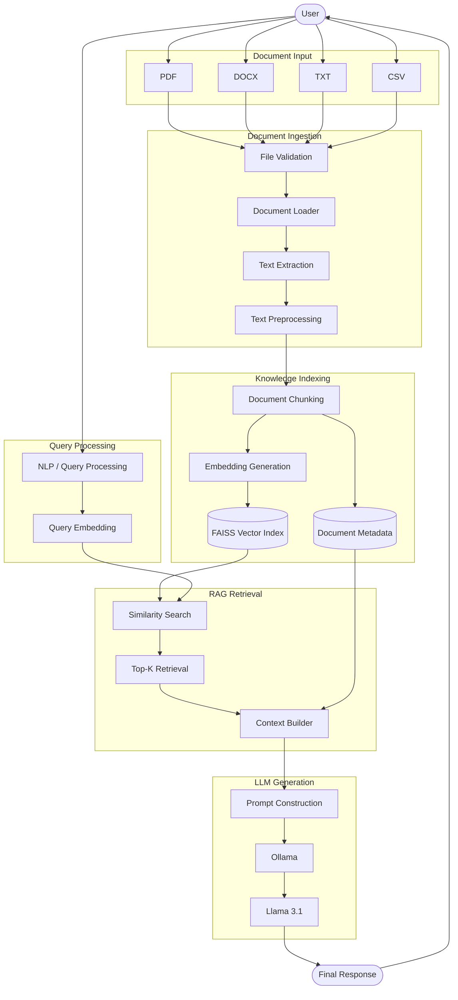
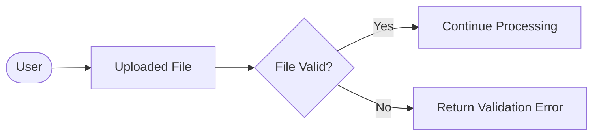
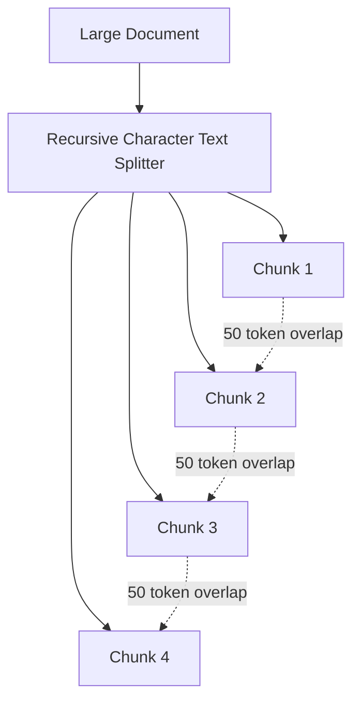
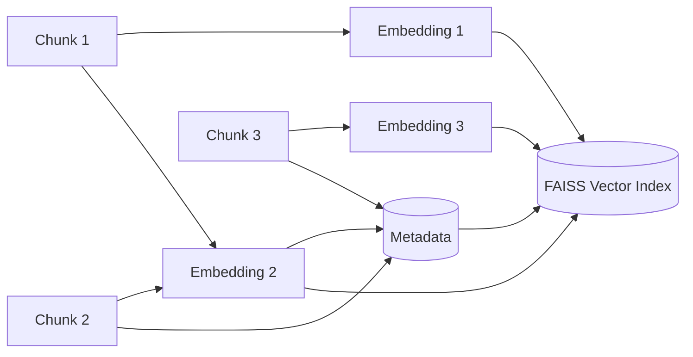
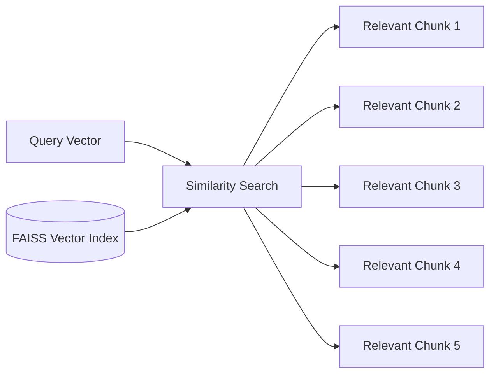
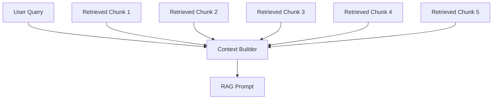
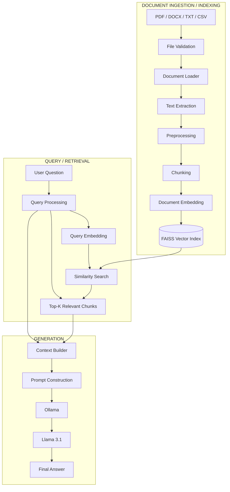

## 1. Overview

AI/RAG is the component of CARIVIX that enables the AI system to process and understand information stored in documents. The purpose is to convert unstructured or semi-structured documents into information that can be searched and used by the AI system.

**Supported Document Types:**

- PDF
- DOCX
- TXT
- CSV
- Business reports
- Technical documents
- Data documents

**Overall Objective:**

```
Document → Process → Extract Knowledge → Index Knowledge → Retrieve Relevant Information → Generate Answer
```

---

## 2. RAG Architecture

RAG (Retrieval-Augmented Generation) combines information retrieval with LLM generation. Instead of asking the LLM to answer only from its pretrained knowledge, RAG first searches the available documents and provides relevant information to the LLM.

### Three Major Operations

| Operation | Description |
|---|---|
| Retrieval | Find relevant document information |
| Augmentation | Add the retrieved information to the prompt |
| Generation | Generate the final response using the LLM |

**High-Level Flow:**

```
User Query
    ↓
Query Processing
    ↓
Query Embedding
    ↓
Vector Search
    ↓
Relevant Document Chunks
    ↓
Context
    ↓
LLM
    ↓
Response
```

---

## 3. Overall CARIVIX AI Architecture




## Flow Summary

| Stage | Components |
|---|---|
| **Document Input** | PDF, DOCX, TXT, CSV |
| **Document Ingestion** | File Validation → Document Loader → Text Extraction → Text Preprocessing |
| **Knowledge Indexing** | Document Chunking → Embedding Generation → FAISS Vector Index (+ Document Metadata) |
| **Query Processing** | NLP / Query Processing → Query Embedding |
| **RAG Retrieval** | Similarity Search → Top-K Retrieval → Context Builder |
| **LLM Generation** | Prompt Construction → Ollama → Llama 3.1 |
| **Output** | Final Response returned to User |
---

## 4. Document Input and Validation

The first stage is receiving the document.

**Input Formats:**

- PDF
- DOCX
- TXT
- CSV

**Validation Checks:**

- File exists
- File format is supported
- File is readable
- File is not empty
- File is not corrupted
- File size is acceptable

This stage prevents invalid files from entering the RAG pipeline.
# CARIVIX AI – File Validation Flow



## Flow Summary

| Step | Description |
|---|---|
| **User** | Initiates the upload |
| **Uploaded File** | File received by the system |
| **File Valid?** | Decision point — checks format, size, integrity, etc. |
| **Yes → Continue Processing** | File passes validation and enters the ingestion pipeline |
| **No → Return Validation Error** | File fails validation and an error is returned to the user |
---

## 5. Document Loading and Text Extraction

After validation, the appropriate document loader processes the file.

| File Type | Loader |
|---|---|
| PDF | PDF Loader |
| DOCX | DOCX Loader |
| TXT | Text Loader |
| CSV | CSV Loader |

The purpose is to convert different formats into a common internal representation.

**Example:**

```
PDF: business_report.pdf
    ↓
{
  "document_id": "DOC001",
  "file_name": "business_report.pdf",
  "page": 5,
  "content": "Revenue increased by 15 percent."
}
```

**Metadata Preserved:**

- Document ID
- File name
- Page number
- File type
- Source

This becomes useful for retrieval, debugging, and source tracking.

---

## 6. Text Preprocessing

Extracted text may contain unnecessary information such as:

- Extra spaces
- Repeated headers
- Repeated footers
- Page numbers
- Broken lines
- Special characters
- Formatting artifacts

**Key Principle:** Remove noise without removing information required for answering questions.

---

## 7. Document Chunking

Large documents are divided into smaller pieces called chunks.

**CARIVIX RAG Configuration:**

- Chunk Size: 500
- Chunk Overlap: 50

**Example:**


# CARIVIX AI – Document Chunking Flow



## Flow Summary

| Step | Description |
|---|---|
| **Large Document** | The original, unsplit document |
| **Recursive Character Text Splitter** | Splits the document into smaller chunks |
| **Chunk 1 – Chunk 4** | Sequential chunks produced by the splitter |
| **50 token overlap** | Each consecutive chunk pair shares 50 tokens of overlap, preventing information loss at chunk boundaries |

**Why Chunking is Required:**

- A complete document may be too large to send to the LLM
- Chunking allows the retrieval system to identify only the relevant portions
- Overlap helps prevent information from being lost at chunk boundaries

---

## 8. Embedding Generation

After chunking, every chunk is converted into a numerical representation called an embedding.

**CARIVIX Architecture Uses:**

```
Sentence Transformers → all-MiniLM-L6-v2
```

**Example:**

```
"Revenue increased by 15%"
    ↓
Embedding Model
    ↓
[0.12, -0.42, 0.71, 0.33, ...]
```

The embedding represents the semantic meaning of the text.

---

## 9. FAISS Vector Index and Metadata

The generated embeddings are stored in a FAISS vector index. FAISS allows the system to perform efficient similarity searches.

**Metadata Structure:**

```json
{
  "chunk_id": "DOC001_CH005",
  "document_id": "DOC001",
  "file_name": "business_report.pdf",
  "page": 5
}
```
# CARIVIX AI – Embedding Generation & Indexing Flow



## Flow Summary

| Step | Description |
|---|---|
| **Chunk 1, 2, 3** | Individual document chunks produced during chunking |
| **Embedding 1, 2, 3** | Numerical vector representations generated for each chunk |
| **Metadata** | Reference information (chunk ID, document ID, page, etc.) linked to each chunk |
| **FAISS Vector Index** | Central store where all embeddings (and their metadata) are indexed for similarity search |
Metadata connects the vector back to its original document, allowing the system to identify where retrieved information came from.

---

## 10. User Query Processing

The second major flow begins when the user asks a question.

**Example:**

```
"What was the revenue growth?"
```

**Query Processing Flow:**

```
User Query
    ↓
Query Processing
    ↓
Query Normalization
    ↓
Query Embedding
```

The objective is to convert the natural-language question into a representation suitable for semantic retrieval.

---

## 11. Retrieval and Top-K Search

The query is converted into an embedding using the same embedding model.

**Retrieval Flow:**

```
Question
    ↓
Embedding Model
    ↓
Query Vector
    ↓
FAISS Search
```

FAISS compares the query vector against document vectors.

**CARIVIX Configuration:**

- Retrieval K = 5
- The system retrieves the top five relevant chunks

This is the Retrieval part of RAG.
# CARIVIX AI – Similarity Search (Top-K Retrieval) Flow



## Flow Summary

| Step | Description |
|---|---|
| **Query Vector** | Embedding generated from the user's question |
| **FAISS Vector Index** | Stored embeddings of all indexed document chunks |
| **Similarity Search** | Compares the query vector against the FAISS index |
| **Relevant Chunk 1–5** | Top-K (K = 5) most relevant chunks returned by the search |
---

## 12. Context Building and Prompt Construction

The retrieved chunks are combined with the user's question.

**Conceptual Prompt Structure:**

```
System Instructions
    +
Retrieved Context
    +
User Question
    ↓
RAG Prompt
```

This is the Augmentation part of RAG.
# CARIVIX AI – Context Building & RAG Prompt Flow



## Flow Summary

| Step | Description |
|---|---|
| **User Query** | The original question asked by the user |
| **Retrieved Chunk 1–5** | Top-K relevant chunks returned by the similarity search |
| **Context Builder** | Combines the user query with the retrieved chunks |
| **RAG Prompt** | Final constructed prompt, ready to be sent to the LLM |
---

## 13. LLM Generation – Llama 3.1 + Ollama

The constructed prompt is sent to the LLM.

**CARIVIX Architecture Uses:**

```
Llama 3.1 → Ollama
```

Ollama provides the local runtime through which the model can be executed.

The LLM uses the retrieved context to generate a natural-language response.

---

## 14. Complete End-to-End RAG Flow
# CARIVIX AI – Complete End-to-End Architecture



## Flow Summary

| Group | Purpose |
|---|---|
| **Document Ingestion / Indexing** | Takes raw documents (PDF/DOCX/TXT/CSV) through validation, loading, extraction, preprocessing, chunking, and embedding, ending in the FAISS Vector Index |
| **Query / Retrieval** | Takes the user's question, processes and embeds it, then runs a similarity search against the FAISS index to get the Top-K relevant chunks |
| **Generation** | Builds context from the query and retrieved chunks, constructs the prompt, and runs it through Ollama → Llama 3.1 to produce the Final Answer |

This is the master diagram tying together all the individual flows from the earlier documents (validation, chunking, embedding/indexing, similarity search, and context building).

## 15. CARIVIX Architecture Summary

**Complete Pipeline:**

```
Document → Validation → Document Loader → Text Extraction → Preprocessing → 
Chunking → Embedding Generation → FAISS Vector Index
                                        │
User Query → Query Processing → Query Embedding → FAISS Search ◄────────────┘
                                        ↓
                              Top-K Relevant Chunks
                                        ↓
                              Context Building
                                        ↓
                              Prompt Construction
                                        ↓
                              Llama 3.1 / Ollama
                                        ↓
                              Final Response
```

**Architecture Principle:**

```
Ingest → Extract → Clean → Chunk → Embed → Index → Query → Retrieve → Augment → Generate
```

**Important Separation:**

- **Document Pipeline:** Prepares and indexes knowledge
- **Query Pipeline:** Understands what the user is asking
- **Retrieval Layer:** Finds relevant information
- **Generation Layer:** Uses that information to produce the final response

---

## 16. Technology Stack

| Component | Technology |
|---|---|
| Programming | Python |
| API Layer | FastAPI |
| Documents | PDF, DOCX, TXT, CSV |
| Text Processing | Python / NLP |
| Chunking | RecursiveCharacterTextSplitter |
| Embeddings | Sentence Transformers |
| Embedding Model | all-MiniLM-L6-v2 |
| Vector Index | FAISS |
| Retrieval | Similarity Search |
| LLM | Llama 3.1 |
| LLM Runtime | Ollama |
| Experiment Tracking | MLflow |
| API Testing | Swagger / Postman |

