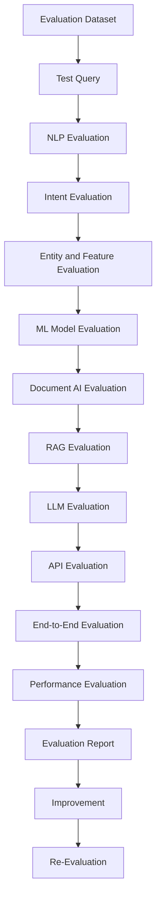
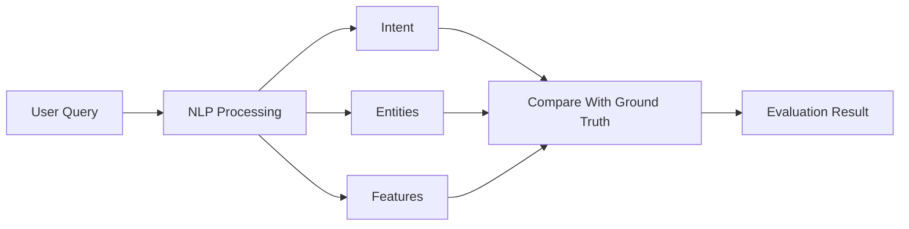
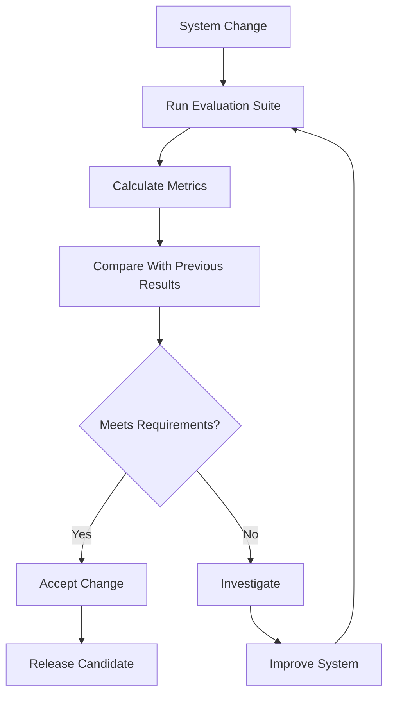

## 1. AI Evaluation Overview

The AI Evaluation Process is a systematic approach used to measure the accuracy, reliability, performance, consistency, and overall quality of the CARIVIX AI system.

**CARIVIX Contains Multiple AI and Software Components:**
- NLP processing
- Intent classification
- Entity extraction
- Feature extraction
- Domain-specific feature mapping
- Machine Learning models
- Model Service
- Document AI
- Document ingestion
- Text preprocessing
- Chunking
- Embedding generation
- FAISS vector search
- RAG pipeline
- Llama 3.1
- Ollama
- API layer
- GIS/visualization integration

**Key Principle:** Because the final response depends on several components, evaluating only the final answer is not sufficient. Each component must first be evaluated individually and then evaluated as part of the complete end-to-end CARIVIX workflow.

**Overall Evaluation Flow:**
```
Input → Processing → Retrieval/Inference → Response → Measurement → Improvement
```

---

## 2. Evaluation Objectives

The first stage is to define what the evaluation is expected to measure.

**The CARIVIX Evaluation Should Determine Whether:**
- User queries are understood correctly
- User intent is identified correctly
- Entities are extracted correctly
- Model features are mapped correctly
- Model inputs are valid
- ML predictions are accurate
- Documents are processed correctly
- Relevant information is retrieved
- RAG provides useful context
- LLM responses are grounded in available information
- API responses are correct
- The complete system works correctly
- The system responds within acceptable time
- Errors are handled correctly
- Results remain consistent after system changes

**Evaluation Questions:**
1. Did the system understand the query?
2. Did it identify the correct intent?
3. Did it extract the required information?
4. Did it create the correct model input?
5. Did the ML model produce the correct prediction?
6. Did RAG retrieve the correct information?
7. Did the LLM use the retrieved information?
8. Is the final answer correct and relevant?
9. Is the response sufficiently fast?
10. Does the system behave correctly when something goes wrong?

---

## 3. Evaluation Architecture

The evaluation architecture should cover both individual components and the complete CARIVIX pipeline.


---

## 4. Evaluation Dataset Preparation

The evaluation dataset is one of the most important parts of AI evaluation. The dataset should contain representative examples of the queries and documents that CARIVIX is expected to process.

**Query Categories:**
- Normal queries
- Prediction queries
- Business queries
- Location-related queries
- Document questions
- Feature-related queries
- Short queries
- Long queries
- Ambiguous queries
- Incomplete queries
- Invalid queries
- Out-of-domain queries

**Example:**
| **Field** | **Value** |
|-----------|-----------|
| Query | "Predict the business performance for this location." |
| Expected Intent | business_prediction |
| Expected Operation | ML prediction |
| Expected Output | Prediction result |

**Key Principle:** The evaluation dataset should contain enough variation to determine whether the system generalizes beyond a small set of predefined examples.

---

## 5. Ground Truth and Annotation

Ground truth represents the expected correct result. The AI output is compared against this ground truth during evaluation.

**Example:**
```json
{
  "query": "Predict business performance",
  "expected_intent": "business_prediction",
  "expected_features": [
    "population",
    "location",
    "accessibility"
  ],
  "expected_response_type": "prediction"
}
```

**Ground Truth Sources:**
- Labelled datasets
- Domain documentation
- Existing project requirements
- Data Scientist-provided expected outputs
- Technical rules
- Expert review
- Manually verified examples

**Key Principle:** For RAG, the expected answer should be connected to the source document. For ML prediction, the expected value should come from the appropriate ground-truth dataset.

**Importance:** Incorrect ground truth can make a good AI system appear bad or a bad system appear good. Therefore, ground truth must be reviewed carefully.

---

## 6. Test Case Design

A test case defines one specific scenario that needs to be evaluated.

**Each Test Case Should Contain:**
- Test Case ID
- Input/query
- Expected intent
- Expected entities
- Expected features
- Expected operation
- Expected output
- Actual output
- Evaluation metric
- Pass/Fail status
- Remarks

**Example:**
| **Field** | **Example** |
|-----------|-------------|
| Test ID | TC-001 |
| Query | Predict business performance |
| Expected Intent | business_prediction |
| Expected Operation | ML Prediction |
| Actual Intent | business_prediction |
| Actual Output | Model prediction |
| Status | PASS |

**Types of Test Cases:**
- **Positive:** Valid queries, Complete inputs, Valid documents
- **Negative:** Invalid inputs, Missing information, Unsupported files
- **Boundary:** Minimum/maximum values, Very short queries, Very large documents
- **Ambiguous:** Queries with multiple possible interpretations

---

## 7. NLP Evaluation

The NLP layer converts natural-language input into structured information. NLP evaluation determines whether CARIVIX understands user queries correctly.

**Evaluation Covers:**
- Text preprocessing
- Normalization
- Tokenization
- Intent identification
- Entity extraction
- Feature extraction
- Query classification
- Query routing

**Evaluation Flow:**
```
User Query → NLP Processing → Structured Output → Compare with Expected
```


The output should be compared against the expected structured representation.

---

## 8. Intent Classification Evaluation

Intent classification determines what the user wants the system to do.

**Example:**
| **User Query** | **Expected Intent** | **Predicted Intent** | **Result** |
|----------------|---------------------|---------------------|------------|
| "Give me a prediction for this location." | business_prediction | business_prediction | Correct |

**Important Metrics:**

| **Metric** | **Formula** |
|------------|-------------|
| Accuracy | Correct Predictions / Total Predictions |
| Precision | True Positives / (True Positives + False Positives) |
| Recall | True Positives / (True Positives + False Negatives) |
| F1 Score | 2 × Precision × Recall / (Precision + Recall) |

A confusion matrix can also be used to identify incorrectly classified intents.

---

## 9. Entity and Feature Extraction Evaluation

Once the intent is identified, the system must extract the required entities and model features.

**Example:**
| **Query** | **Expected** | **Actual** |
|-----------|--------------|------------|
| "Predict performance for an area with high population." | Performance, Area/location, Population | Performance, Location, Population |

**Evaluation Checks:**
- Entity detected
- Entity type correct
- Entity value correct
- Feature identified
- Feature value correct
- Unnecessary entities avoided
- Missing entities identified

**Metrics:**
- Precision
- Recall
- F1 Score
- Exact Match

**Feature Mapping Verification:**
- Correct feature name
- Correct feature value
- Correct data type
- Correct feature order
- Correct units

---

## 10. ML Model Evaluation

The trained ML model must be evaluated independently from the NLP pipeline. This determines whether the model itself performs correctly when it receives valid input.

**Evaluation Areas:**
- Prediction accuracy
- Generalization
- Error magnitude
- Overfitting
- Underfitting
- Feature behavior
- Model stability

**Key Principle:** The evaluation dataset should preferably contain unseen data that was not used to train the model. This helps measure the model's ability to generalize.

---

## 11. Regression and Classification Metrics

The correct metrics depend on the type of ML model.

**Regression Metrics:**
| **Metric** | **Formula** | **Purpose** |
|------------|-------------|-------------|
| MAE | Mean(\|Actual - Predicted\|) | Average error magnitude |
| MSE | Mean((Actual - Predicted)²) | Penalizes large errors |
| RMSE | √MSE | Error in original units |
| R² | Measures how well the model explains variation in the target | Goodness of fit |

**Classification Metrics:**
- Accuracy
- Precision
- Recall
- F1 Score
- Confusion Matrix
- ROC-AUC (where appropriate)

**Key Principle:** The evaluation report should record the actual measured values instead of manually assigning expected metric values.

---

## 12. Model Input and Preprocessing Evaluation

Correct model input is critical. Even a highly accurate trained model can produce incorrect results if preprocessing during inference differs from preprocessing during training.

**Evaluation Should Verify:**
- Feature names
- Feature order
- Data types
- Missing values
- Scaling
- Encoding
- Normalization
- Input dimensions
- Feature ranges
- Transformation logic

---

## 13. Model Service Evaluation

The Model Service acts as the interface between the CARIVIX AI system and the trained ML model.

**Input Evaluation:**
- JSON structure
- Required fields
- Data types
- Feature names
- Valid values

**Processing Evaluation:**
- Correct model loaded
- Correct preprocessing applied
- Correct model version used
- Correct inference method executed

**Output Evaluation:**
- Prediction value
- Response structure
- Status
- Error handling

**Example:**
```
Request:
{
  "features": {
    "feature_1": 10,
    "feature_2": 25
  }
}

Expected Response:
{
  "prediction": 0.82
}
```

The actual API response should be compared against the expected schema.

---

## 14. Document AI Evaluation

The Document AI pipeline must be evaluated before evaluating the complete RAG system.

**Evaluation Flow:**
```
Document → Validation → Loading → Text Extraction → Preprocessing → Chunking → Embedding → Indexing
```

**Supported Document Types:**
- PDF
- DOCX
- TXT
- CSV

**Evaluation Checks:**
- File accepted
- File type correctly identified
- Content extracted
- Text not lost
- Metadata preserved
- Empty files handled
- Invalid files handled
- Corrupted files handled

---

## 15. RAG Retrieval Evaluation

The RAG system must be evaluated at both retrieval and generation levels.

**CARIVIX RAG Configuration:**
| **Component** | **Configuration** |
|---------------|-------------------|
| Embedding Model | all-MiniLM-L6-v2 |
| Vector Search | FAISS |
| Retrieval Configuration | Top-K = 5 |

**Retrieval Metrics:**
- Precision@K
- Recall@K
- Hit Rate
- Retrieval relevance

**If Relevant Information Consistently Fails to Appear in Top-K Results:**
- Check chunking strategy
- Check embedding quality
- Check query processing
- Check metadata
- Check similarity search
- Check retrieval configuration

---

## 16. Embedding, Chunking and Context Evaluation

RAG quality depends heavily on document preparation.

**Chunking Evaluation:**
- Chunks are generated
- Chunks are not empty
- Important content is preserved
- Chunk boundaries are meaningful
- Overlap works correctly
- Metadata is retained

**CARIVIX Chunking Configuration:**
| **Parameter** | **Value** |
|---------------|-----------|
| Chunk Size | 500 |
| Chunk Overlap | 50 |

**Embedding Evaluation:**
- Correct model loaded
- Embeddings generated
- Consistent vector dimensions
- Query/document compatibility
- No invalid vectors

**Context Evaluation:**
- Relevance
- Completeness
- Accuracy
- Duplication
- Noise
- Source coverage

---

## 17. LLM and Response Evaluation

CARIVIX has selected Llama 3.1 with Ollama for local LLM inference.

**Evaluation Criteria:**

| **Criteria** | **Description** |
|--------------|-----------------|
| Relevance | Does the response answer the user's actual question? |
| Correctness | Is the response factually correct? |
| Groundedness | Is the response supported by the retrieved context? |
| Completeness | Does it contain the important information required? |
| Clarity | Is it easy to understand? |
| Consistency | Does the system produce stable responses for equivalent queries? |
| Hallucination | Does the model introduce unsupported information? |

**Example:**
| **Retrieved Context** | **Generated Response** | **Result** |
|-----------------------|----------------------|------------|
| "The model requires five input features." | "The model requires five input features." | Grounded and relevant |

If the generated response adds information that cannot be supported by the retrieved context, it should be flagged for review.

---

## 18. API, Integration and End-to-End Evaluation

The API layer connects the different CARIVIX components.

**API Evaluation Should Check:**
- Endpoint availability
- Request validation
- Response schema
- HTTP status codes
- Error handling
- Model Service integration
- RAG integration
- Response time

**End-to-End Evaluation Flow:**
```
User → API → NLP → Intent → Entity → Model Service → ML Model → Response → User
```

**For RAG:**
```
User → API → Query → Retrieval → Context → LLM → Response → User
```

End-to-end evaluation confirms that all components communicate correctly.

---

## 19. Performance, Reliability and Continuous Evaluation

AI quality also depends on system performance and reliability.

**Performance Evaluation:**
- API latency
- NLP processing time
- Model inference time
- Embedding generation time
- FAISS retrieval time
- LLM generation time
- Total response time
- Memory usage
- CPU/GPU utilization (where applicable)

**For RAG:**
```
Total Response Time = Query Processing + Embedding + Retrieval + Prompt Construction + LLM Generation
```

**Reliability Evaluation:**
- Empty query
- Invalid query
- Missing features
- Invalid feature values
- Unsupported document
- Corrupted document
- Empty document
- Model unavailable
- Ollama unavailable
- FAISS unavailable
- API failure

**Key Principle:** The system should return controlled errors rather than misleading results.

**Regression Testing:**
Whenever a component changes, previous test cases should be executed again.

**Changes That Require Regression Testing:**
- NLP model
- Intent classifier
- Feature mapping
- ML model
- Preprocessing
- Embedding model
- Chunking
- FAISS index
- Prompt
- LLM
- API
- RAG pipeline

**Continuous Evaluation Cycle:**
```
Test → Measure → Analyze → Improve → Re-Test
```
``
 

 
This ensures that improvements do not unintentionally reduce the quality of another component.

---

## 20. Complete Evaluation Process Summary

**The CARIVIX AI Evaluation Process Covers:**

| **#** | **Evaluation Stage** |
|-------|---------------------|
| 1 | Evaluation Dataset Preparation |
| 2 | Ground Truth Annotation |
| 3 | Test Case Design |
| 4 | NLP Evaluation |
| 5 | Intent Classification Evaluation |
| 6 | Entity and Feature Extraction Evaluation |
| 7 | ML Model Evaluation |
| 8 | Preprocessing Evaluation |
| 9 | Model Service Evaluation |
| 10 | Document AI Evaluation |
| 11 | Chunking and Embedding Evaluation |
| 12 | FAISS Retrieval Evaluation |
| 13 | RAG Context Evaluation |
| 14 | LLM Evaluation |
| 15 | API Evaluation |
| 16 | End-to-End Evaluation |
| 17 | Performance Evaluation |
| 18 | Reliability Testing |
| 19 | Regression Testing |
| 20 | Final Evaluation Report |

---

## 21. Key Principles

| **Principle** | **Description** |
|---------------|-----------------|
| **Component-Level First** | Each component must be evaluated individually before end-to-end testing |
| **Unseen Data** | Evaluation datasets should contain data not used for training |
| **Ground Truth Accuracy** | Incorrect ground truth leads to incorrect evaluation results |
| **Consistent Preprocessing** | Preprocessing during inference must match training |
| **Continuous Cycle** | Evaluation is not a single test; it is a continuous process |
| **Regression Testing** | Changes to any component require re-testing all previous test cases |
| **Controlled Errors** | The system should return controlled errors, not misleading results |

---

## 22. Conclusion

The CARIVIX AI Evaluation Process provides a complete framework for validating the AI system from individual components to the complete end-to-end application.

**The Most Important Principle:** AI evaluation should not be treated as a single test. CARIVIX contains multiple interconnected components, so each component must be measured independently and then validated together.

**The Final Evaluation Should Establish Whether the System Is:**
- Accurate in its predictions
- Correct in understanding user intent
- Reliable in processing inputs
- Relevant in retrieving information
- Grounded in its RAG responses
- Consistent across repeated evaluations
- Robust against invalid inputs
- Performant under expected workloads
- Integrated correctly across AI, NLP, ML, RAG, API, and GIS components

**Continuous Cycle:**
```
Test → Measure → Analyze → Improve → Re-Test
```

This continuous approach provides the foundation for improving CARIVIX AI quality and preparing the system for reliable deployment.
