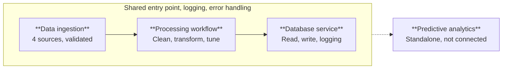
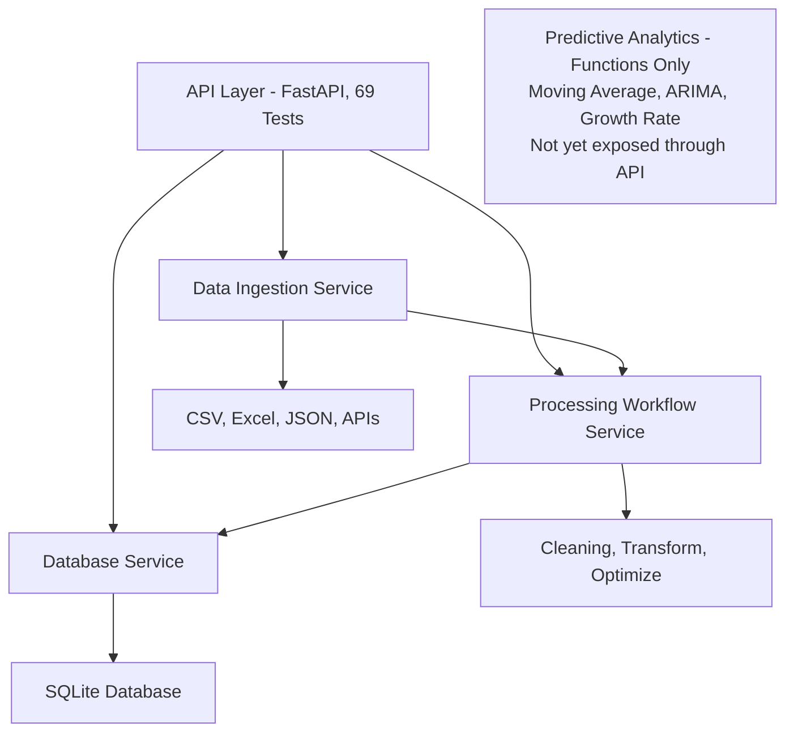

---

## 1. Overview

The CARIVIX AI backend is organized into four core services. Three of them are fully connected and share a consistent design pattern. The fourth exists as a set of functions but has not yet been wrapped into a service of its own.

**The Four Core Services Are:**
1. Data Ingestion Service
2. Processing Workflow Service
3. Database Service
4. Predictive Analytics (functions only, not yet a service)

---

## 2. Data Ingestion Service

This service handles pulling data into the system from four source types:
- CSV files
- Excel files
- JSON files
- External APIs

**Key Features:**
- All four source types are accessed through one common entry point
- Calling code does not need to know which importer to use for a given source
- Validates the request before any data is fetched
- Checks that the source category is valid
- Checks that the requested source name actually exists in the configuration
- Returns a clear error immediately if either check fails

**Flow:**
```
Request → Validate Category → Validate Source → Fetch Data → Return DataFrame
```

---

## 3. Processing Workflow Service

This service takes raw data and runs it through a full cleaning and transformation sequence.

**Processing Steps:**
- Removing duplicate rows
- Standardizing column names and text values
- Handling missing values
- Converting non-numeric values in numeric columns into a consistent missing value marker
- Normalizing numeric columns
- Encoding categorical columns
- Applying memory optimizations to reduce dataset size

**Configuration-Based Mode:**
- Supports a configuration-based mode where a named profile defines which columns should be normalized, encoded, or treated as dates
- Same processing logic can be reused across different datasets without repeating column-level instructions
- Available profiles are defined in a configuration file
- Can be extended without changing any application code

**Flow:**
```
Raw Data → Validation → Cleaning → Transformation → Optimization → Processed Data
```

---

## 4. Database Service

This service manages all interaction with the underlying database.

**Responsibilities:**
- Opening and closing connections
- Writing single records or batches of records
- Reading records back with optional filtering
- Returning clear errors if an operation fails
- Not exposing raw low-level database errors to the caller

**Current Implementation:**
- Uses a single fixed database file
- Does not support multiple configurable databases

**Operations:**
- Create (Insert records)
- Read (Query records with optional filtering)
- Update (Modify existing records)
- Delete (Remove records)

---

## 5. Predictive Analytics

This includes forecasting functions that exist and are tested, but are not yet wrapped into a connected service.

**Available Functions:**
- Moving average forecasting
- ARIMA-based forecasting
- Growth rate calculations

**Current Status:**
- Functions exist and are tested
- Not yet wrapped into a connected service
- Not currently reachable through the API
- Expected future work

---

## 6. Shared Design Pattern

Each of the three connected services follows the same structure.

| **Aspect** | **Description** |
|------------|-----------------|
| Clear Entry Point | Each service has one clear entry point, not requiring the caller to work with several smaller functions directly |
| Logging | Each logs its own operations, including what was requested and whether it succeeded or failed |
| Error Handling | Each raises a specific, named error type when something goes wrong, rather than letting an unrelated technical error surface to the caller |

---

## 7. Service Architecture Diagram





---

## 8. Technology Stack

| **Component** | **Technology** |
|---------------|----------------|
| Programming | Python |
| API Layer | FastAPI |
| Data Processing | Pandas, NumPy |
| Database | SQLite |
| File Formats | CSV, Excel, JSON |
| APIs | REST APIs |
| Testing | Pytest (69 tests) |

---

## 9. Current Status

| **Service** | **Status** | **API Accessible** |
|-------------|------------|-------------------|
| Data Ingestion Service |  Fully Connected |  Yes |
| Processing Workflow Service | ✅ Fully Connected | Yes |
| Database Service |  Fully Connected |  Yes |
| Predictive Analytics |  Functions Only |  No |

---

## 10. Known Limitations

| **#** | **Limitation** | **Description** |
|-------|----------------|-----------------|
| 1 | No Authentication | API currently has no authentication or access control. Any system that can reach the server can call any endpoint, including writing to and reading from the database. Should be treated as a development environment only until access control is added. |
| 2 | Single Database File | Database used by the API is a single fixed file rather than a configurable connection, so all stored data currently lives in one place. |
| 3 | Predictive Analytics Not Exposed | Predictive analytics functions are not yet exposed through the API and can only be accessed directly in Python. |

---

## 11. Testing

All four services, along with the API layer built on top of them, are covered by an automated test suite.

| **Test Type** | **Description** |
|---------------|-----------------|
| Total Tests | 69 |
| Invalid Data Tests | Checks behavior with invalid data |
| End-to-End Tests | Checks full workflow from ingestion through to storage |
| Concurrency Tests | Confirms database service handles multiple simultaneous write requests correctly |

