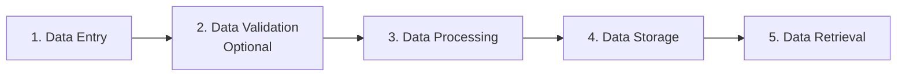
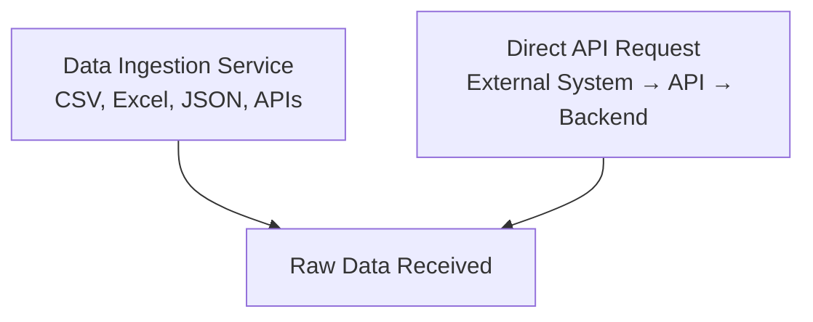
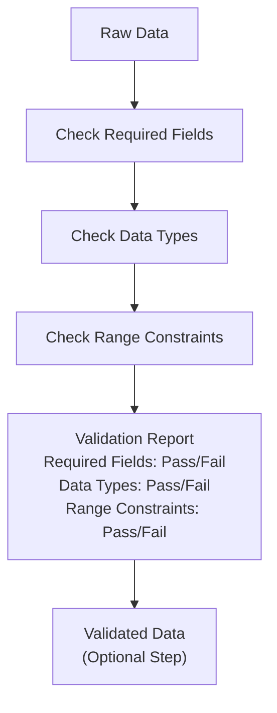
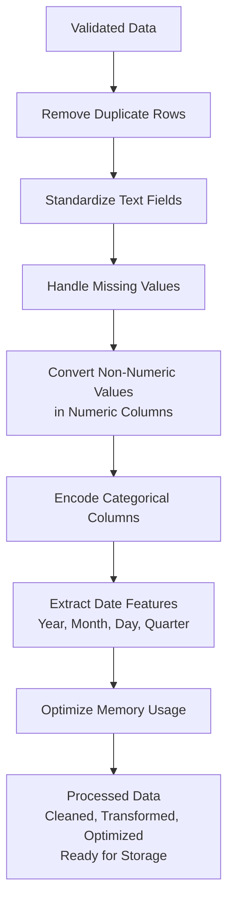
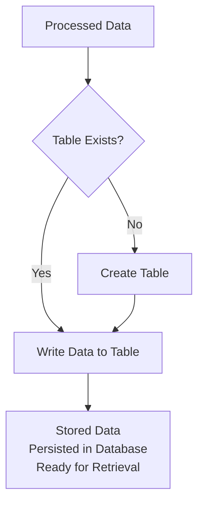
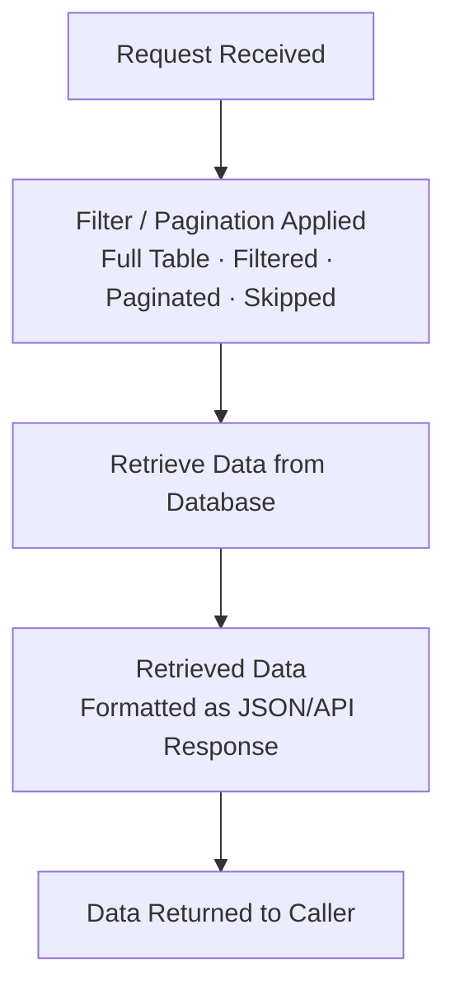
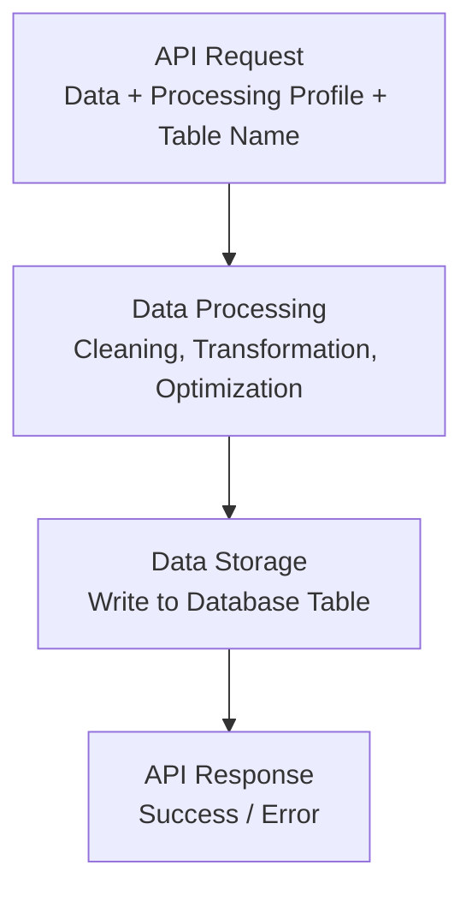
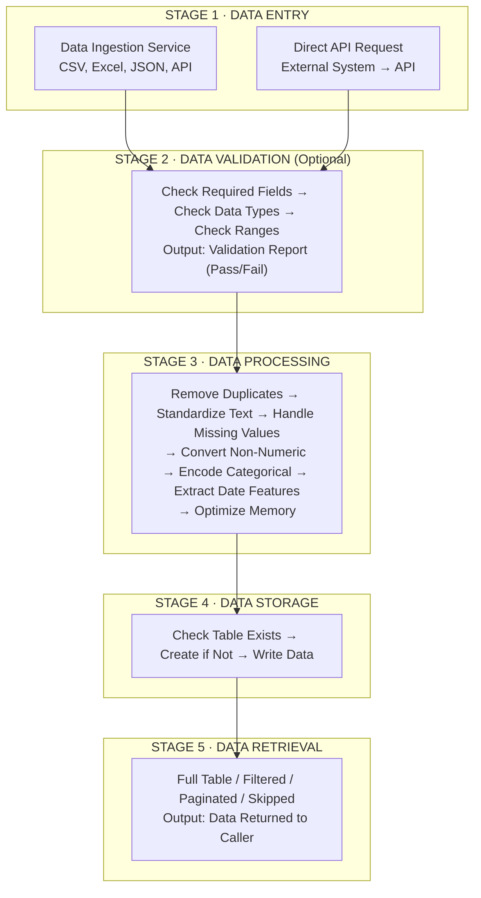

# CARIVIX AI – Data Flow

**Document Version:** 1.0  
**Date:** 08-09-2026  
**Author:** Shivanath Samudrala  
**Role:** Technical Writer  
**Status:** Final  

---

## 1. Overview

This document describes how a single piece of data moves through the CARIVIX AI backend, from the moment it enters the system to the moment it can be retrieved again.

**The Data Flow Consists of Five Stages:**
1. Data Enters the System
2. Data Is Validated (Optional)
3. Data Is Processed
4. Data Is Stored
5. Data Is Retrieved

---

## 2. Stage 1: Data Enters the System

Data can enter the system in two ways:

| **Entry Method** | **Description** |
|------------------|-----------------|
| **Pull from Source** | Data is pulled automatically from a configured source such as CSV, Excel, JSON, or external API using the Data Ingestion Service |
| **Direct API Request** | Data is sent directly as part of an API request, for example when an external system sends a batch of records to be processed |

---

## 3. Stage 2: Data Is Validated (Optional)

At this point, data can optionally be checked against a set of rules.

**Validation Rules:**
- Whether a field is required
- What data type it should be
- Whether its value must fall within a minimum and maximum range

**What Validation Identifies:**
- Missing required fields
- Incorrect data types
- Values that fall outside an expected range

**Output:**
- Returns a report describing exactly what passed and what failed
- Does not change the data itself

---

## 4. Stage 3: Data Is Processed

The data is then cleaned and transformed.

**Processing Steps:**

| **Step** | **Description** |
|----------|-----------------|
| Remove Duplicate Rows | Eliminate duplicate records from the dataset |
| Standardize Text Fields | Consistent formatting for text values |
| Handle Missing Values | Apply configurable strategy for missing data |
| Convert Non-Numeric Values | Convert invalid text values in numeric columns to proper missing value markers |
| Encode Categorical Columns | Convert categorical data to numeric format for downstream analysis |
| Extract Date Features | If date column is specified, extract year, month, day, and quarter |
| Optimize Memory Usage | Reduce dataset memory footprint |

**Configuration-Based Processing:**
- The entire sequence can be triggered using a named profile
- Profile predefines which columns should be treated in which way
- Same processing logic can be reused across different datasets

---

## 5. Stage 4: Data Is Stored

The processed data is written into a named table in the database.

**Storage Process:**
- If the table does not already exist, it is created automatically based on the structure of the data being written
- Data is persisted for future retrieval

---

## 6. Stage 5: Data Is Retrieved

Stored data can be read back at any time.

**Retrieval Options:**

| **Option** | **Description** |
|------------|-----------------|
| Full Table | Retrieve all records in the table |
| Filtered | Narrow results to records matching a specific field value |
| Paginated | Limit results to a specific number of records |
| Skipped | Skip a given number of records first (supports viewing data in smaller pages) |

---

## 7. Combined Flow Through the API

Steps three and four (Processing and Storage) can be performed independently using two separate API calls, or combined into a single call that performs both processing and storage together.

| **Approach** | **Description** |
|--------------|-----------------|
| **Separate Calls** | Process data → Store data (two API calls) |
| **Combined Call** | Process and Store in one API call |

**Combined Option:**
- Simplifies the path for most use cases
- Removes the need to make two separate requests
- Removes the need to manage the data in between

---

## 8. Complete End-to-End Data Flow

---

## 9. Data Not Currently Included in This Flow

Forecasting and predictive analytics functions sit outside this flow entirely.

| **Item** | **Status** |
|----------|------------|
| Moving Average Forecasting |  Not connected to ingestion, processing, or storage |
| ARIMA Forecasting |  Not connected to ingestion, processing, or storage |
| Growth Rate Calculations |  Not connected to ingestion, processing, or storage |

**Current State:**
- Functions exist and are tested
- Must be called directly rather than through the API
- Not integrated with the data flow described above
- Expected future work

---

## 10. Summary Table

| **Stage** | **Action** | **Input** | **Output** |
|-----------|------------|-----------|------------|
| 1 | Data Entry | CSV, Excel, JSON, API, Direct Request | Raw Data |
| 2 | Data Validation (Optional) | Raw Data | Validation Report |
| 3 | Data Processing | Raw Data | Processed Data |
| 4 | Data Storage | Processed Data | Stored Data (Database) |
| 5 | Data Retrieval | Query | Retrieved Data |

