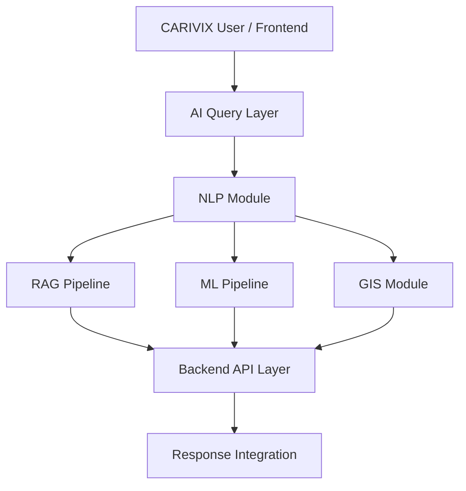
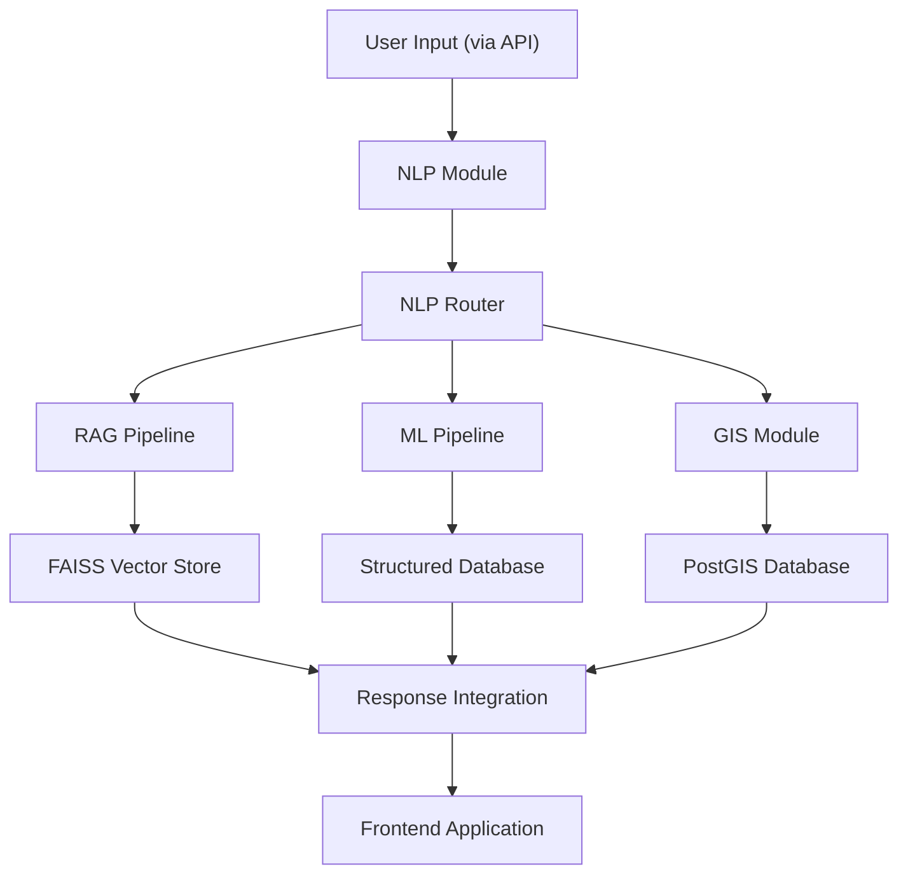

# CARIVIX AI — Module Relationships

## 1. Overview

This document provides a **detailed breakdown of the technical component relationships** within the CARIVIX AI ecosystem. It outlines how individual modules interact to form a **cohesive, AI-powered intelligence platform**.

---

## 2. High-Level Component Flow

The system is designed with a **unidirectional flow of data** from the **User/Client** through to the final **Response Integration**, managed by a central **AI Query Layer**.

---

## 3. Detailed Module Relationships

### A. The Core AI Query Layer & NLP Integration

The **AI Query Layer** acts as the **primary orchestrator**. When a user submits a query, it is immediately routed to the **NLP Module**.

#### NLP Module Responsibilities

| # | Responsibility | Purpose |
|---|---|---|
| 1 | **Intent Classification** | Determines if the user is asking a spatial question, a predictive question, or a knowledge-based question |
| 2 | **Entity & Feature Extraction** | Isolates key parameters (e.g., location names, timeframes, specific metrics) |

#### Relationship

> The NLP Module **dictates the routing logic**. Its output directly commands the AI Query Layer to invoke one or more of the subsequent execution pipelines (RAG, ML, GIS).

---

### B. The RAG (Retrieval-Augmented Generation) Pipeline

If the NLP module detects a **knowledge-based query**, the **RAG Pipeline** is triggered.

#### Components

| # | Component | Description |
|---|---|---|
| 1 | **Document Sources & Ingestion** | Raw documents are preprocessed and chunked |
| 2 | **Embeddings & FAISS** | Text chunks are converted into vector embeddings and stored in a FAISS index |
| 3 | **Semantic Retrieval** | The user's query is embedded and matched against the FAISS index |
| 4 | **LLM Engine** | The retrieved context is formatted into a prompt and sent to a local LLM (Llama 3.1 via Ollama) |

#### Relationship

> The RAG Pipeline has an **internal linear dependency**. It relies on the **FAISS index** to retrieve context, which is **absolutely required** before the LLM can generate a **hallucination-free response**.

---

### C. The Machine Learning (ML) Pipeline

If the NLP module detects a **predictive or statistical query** (e.g., *"forecast population growth"*), the **ML Pipeline** is invoked.

#### Components

| # | Component | Description |
|---|---|---|
| 1 | **Model Service** | Manages input validation and loads the appropriate model configurations |
| 2 | **Inference Engine** | Executes the request against trained ML models (e.g., ARIMA models) |

#### Relationship

> The ML Pipeline is **tightly coupled** with the **Backend Data-Service (FastAPI / Database)**.
>
> It requires **clean, pre-processed structured data** fetched from the SQLite / PostGIS database to perform accurate inference.

---

### D. The Geographic Information System (GIS) Module

If the query requires **spatial context** (e.g., *"show hospitals in this district"*), the **GIS Module** takes over.

#### Components

| # | Component | Description |
|---|---|---|
| 1 | **PostGIS Spatial Database** | Executes geometric and bounding-box queries (`ST_Contains`, `ST_MakeEnvelope`) |
| 2 | **GeoJSON Serialization** | Formats the spatial results |

#### Relationship

> The GIS Module operates **semi-independently** but relies entirely on the **Frontend (Leaflet.js)** to render its output.
>
> It passes **GeoJSON payloads** through the Response Integration layer to the client.

---

### E. Backend APIs & Response Integration

The **Backend API Layer (FastAPI)** manages all **service-to-service communication**.

#### Components

| # | Component | Description |
|---|---|---|
| 1 | **Data Ingestion & Processing** | Pipelines to clean and store raw data |
| 2 | **Response Integration** | A critical convergence point |

#### Relationship

> The Response Integration module is the **final stop**. It receives **potentially asynchronous outputs** from the:
>
> - **RAG** pipeline (text)
> - **ML** pipeline (metrics)
> - **GIS** pipeline (GeoJSON)
>
> …validates them, and constructs a **single, cohesive JSON payload** to return to the Frontend.

---

## 4. Summary of Dependencies

| Module | Dependent On | Feeds Into |
|---|---|---|
| **NLP Module** | User Input (via API) | RAG, ML, GIS Pipelines (via Router) |
| **RAG Pipeline** | NLP Router, FAISS Vector Store | Response Integration |
| **ML Pipeline** | NLP Router, Structured Database | Response Integration |
| **GIS Module** | NLP Router, PostGIS Database | Response Integration |
| **Response Integration** | RAG, ML, GIS | Frontend Application |

### Dependency Flow Diagram

---

## 5. Conclusion

The CARIVIX AI architecture is defined by **strict modular boundaries** connected by a **centralized NLP routing mechanism**.

> This design ensures that complex, multi-domain queries can be executed **in parallel** across the **RAG, ML, and GIS subsystems**, and then **cleanly re-assembled** by the **Response Integration layer**.

### Architectural Principles

| # | Principle |
|---|---|
| 1 | Strict modular boundaries |
| 2 | Centralized NLP routing |
| 3 | Parallel multi-pipeline execution |
| 4 | Clean reassembly via Response Integration |

---

## Version Control

| Version | Date | Author | Changes |
|---|---|---|---|
| 1.0 | 2026-09-18 | Shivanath Samudrala | Initial version — detailed module relationships |
