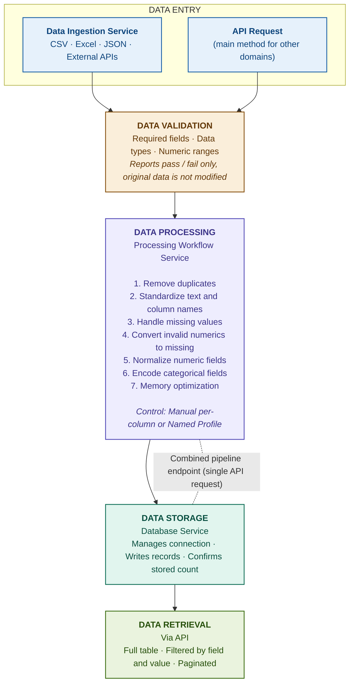

# CARIVIX AI — Data Pipelines

## 1. Purpose

The **Backend Architecture** document explains the individual services used in the backend. **This document focuses on how these services work together as one data pipeline.**

It explains the **complete journey of data** through the system, starting from data entry and continuing through:

```text
Data Entry → Validation → Processing → Storage → Retrieval
```

> **Related documents:**
> - `SD-15 Backend/Data-Service Architecture` — individual service definitions
> - `PY-03 Data Service Layer` — Python/R Developer implementation detail
> - `SD-03 Data Processing Workflow` — processing stage detail
> - `SD-16 Data Flow` — high-level data flow overview

---

## 2. Data Flow

The data pipeline follows a **structured flow** from data input to retrieval.

### Step 1 — Data Ingestion

Data can enter the system in **two main ways**:

| Method | Description |
|---|---|
| **1. Data Ingestion Service** | Can work with configured sources such as CSV files, Excel files, JSON files, and external APIs |
| **2. API Request** | This is the **main method used by other domains** when connecting with the backend |

### Step 2 — Data Validation

After entering the system, data can be passed through the **validation process**.

**Validation checks the data against defined rules:**

| # | Validation Check |
|---|---|
| 1 | Required fields |
| 2 | Correct data types |
| 3 | Expected ranges for numeric values |

> **Important:** The validation process **does not modify the original data**. It only reports **which records passed and which records failed**.

### Step 3 — Data Processing

Validated data moves to the **Processing Workflow Service** for cleaning and transformation.

**The processing workflow includes:**

| # | Processing Step |
|---|---|
| 1 | Removing duplicate records |
| 2 | Standardizing text and column names |
| 3 | Handling missing values |
| 4 | Converting invalid numeric values into a consistent missing value format |
| 5 | Normalizing numeric fields |
| 6 | Encoding categorical fields into numeric values |
| 7 | Applying memory optimization |

**Two ways to control the processing workflow:**

| Method | Description |
|---|---|
| **Manual** | Specify the required treatment for each column |
| **Named Profile** | Run using a configuration profile that already contains the required processing settings |

### Step 4 — Data Storage

After processing, the data is sent to the **Database Service**.

**The Database Service:**

- Manages the database connection
- Writes the processed records
- Confirms the number of records successfully stored

### Step 5 — Data Retrieval

Stored data can be retrieved **through the API** whenever required.

**Retrieval options:**

| # | Option |
|---|---|
| 1 | Retrieve the complete table |
| 2 | Narrow results using a specific field and value |
| 3 | Pagination to control the number of records returned in a single request |

---

## 3. Service Layer Structure

The data pipeline is divided into **separate services**, with each service handling a **specific responsibility**.

### Benefits of This Structure

| # | Benefit |
|---|---|
| 1 | Each service is easier to **test** independently |
| 2 | Each service is easier to **maintain** |
| 3 | Each service is easier to **manage** |

> At the same time, the services are **connected** so that data can move from one stage to the next **without requiring the calling application to manually manage every step**.

### Combined Pipeline Endpoint

The **combined pipeline endpoint** uses this structure to connect the **processing and storage stages** into a **single API request**.

---

## 4. End-to-End Verification

The complete data flow **from ingestion → processing → storage → retrieval** has been tested as **one continuous automated workflow**.

### Test 1 — 500-Row Dataset

| Parameter | Detail |
|---|---|
| **Dataset Size** | 500 rows |
| **Data Quality** | Mixed casing, missing values, and invalid numeric values |
| **Result** |  Processed correctly with **zero data loss** |

### Test 2 — 5,000-Row Dataset

| Parameter | Detail |
|---|---|
| **Dataset Size** | 5,000 rows |
| **Purpose** | Test processing performance at a larger scale |
| **Result** |  Pipeline completed in **under one second** |

---

## 5. Current Scope and Limitations

### Predictive Analytics Outside the Data Pipeline

> Predictive analytics and forecasting functions are currently **outside the data service flow**.

They are **not connected** to:

- Ingestion
- Processing
- Storage
- Retrieval

**Current access method:** Predictive analytics functions must be accessed **directly through Python** rather than through the existing data service flow.

---

## 6. Summary

The **Data Pipeline** provides a **connected flow** for:

```text
Bringing data into the system
  → Validating it
  → Processing it
  → Storing it
  → Retrieving it when required
```

> The services remain **separately managed** while working together as **one complete data workflow**.

The complete flow has been tested with both **realistic data and larger datasets**, confirming the current implementation works correctly from **data input through retrieval**.

---

## 7. Pipeline Flow Diagram


The diagram below renders natively on GitHub (Mermaid).



> **Note:** Predictive analytics and forecasting sit **outside** this pipeline and are accessed directly through Python (see Section 5).
---

## Version Control

| Version | Date | Author | Changes |
|---|---|---|---|
| 1.0 | 2026-09-21 | Shivanath Samudrala | Initial version — data pipelines (system-level reference) |
