# CARIVIX AI — AI Workflow

## 1. Overview

The CARIVIX AI project is designed as an AI-driven processing system that converts user requests into meaningful analytical, predictive, and knowledge-based responses.

The AI workflow does not consist of only an LLM or a single Machine Learning model. It is a combination of multiple AI components working together.

The overall workflow includes:

- User query processing
- API communication
- AI Engine orchestration
- NLP processing
  - Intent identification
  - Entity extraction
  - Confidence handling
- Query routing
- Machine Learning processing
- RAG processing
  - Document ingestion
  - Text chunking
  - Embedding generation
  - Vector retrieval
- LLM-based generation
- Response processing
- AI evaluation
- Performance validation

The primary objective is to provide a structured path from:

```text
User Request → AI Understanding → Appropriate AI Processing → Result Generation → Final Response
```

---

## 2. AI Workflow Overview

The complete CARIVIX AI workflow begins when a user sends a natural-language request.

The request enters through the backend API and is passed to the AI Engine.

The AI Engine first analyzes the request using NLP processing. The NLP layer determines the user's intent, identifies relevant entities, and provides confidence information.

Based on this analysis, the query is routed to the appropriate processing workflow.

A query may require:

- Machine Learning inference
- RAG-based knowledge retrieval
- LLM generation
- A combination of ML and RAG processing

After processing, the result is passed through the response layer and returned to the client.

The overall sequence is:

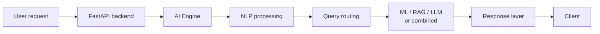

---

## 3. Overall CARIVIX AI Architecture

The following diagram represents the overall project-level AI workflow.

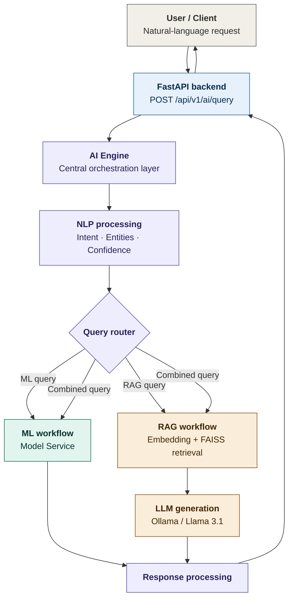

### 3.1 Diagram Explanation

| Component | Description |
|---|---|
| **User / Client** | The workflow begins with the user. The user can submit requests in natural language rather than directly selecting a specific AI model. Examples: "Summarize the economic report", "Compare traffic trends", "Predict the risk", "What information is available about this topic?" The user only provides the requirement. The internal AI architecture determines how the request should be processed. |
| **FastAPI Backend** | Acts as the communication layer between the client and the AI system. The AI query flow uses `POST /api/v1/ai/query`. The API receives the request and passes the relevant query into the AI processing layer. |
| **AI Engine** | Acts as the central orchestration layer. It connects NLP, ML, RAG, LLM, and Response Processing. Instead of the client directly calling individual AI components, the AI Engine coordinates them. |

---

## 4. Query Processing Workflow

Once the request reaches the AI Engine, the query is prepared for AI processing.

The workflow is:

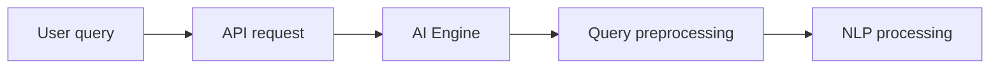

The preprocessing stage ensures that the input is suitable for the subsequent NLP, retrieval, or ML processing.

The purpose is not to generate the answer at this stage. It prepares the query for understanding and routing.

---

## 5. NLP and Query Understanding Workflow

The next stage is understanding what the user actually wants.

The NLP layer can process the query to determine:

- Intent
- Entity
- Confidence

For example:

| Field | Value |
|---|---|
| **Query** | "Compare economic trends in India from 2020 to 2024." |
| **Intent** | `COMPARE` |
| **Entity** | India, 2020–2024 |
| **Confidence** | Classifier confidence |

The outputs are then passed to the routing stage.

### 5.1 Intent

Intent describes the operation requested by the user. Examples relevant to the CARIVIX AI design include:

- `COMPARE`
- `TREND`
- `PREDICT`
- `SUMMARIZE`
- `RAG / KNOWLEDGE QUERY`
- `ML QUERY`

### 5.2 Entity

Entities provide parameters required for processing. They can represent information such as:

- Location
- Time period
- Domain
- Dataset-related values
- Prediction parameters

### 5.3 Confidence

Confidence indicates how strongly the NLP/classification component supports its result.

> The actual threshold values should be taken from the implemented NLP configuration rather than assumed in the documentation.

---

## 6. Query Routing Workflow

After NLP processing, the AI Engine determines which workflow should handle the request.

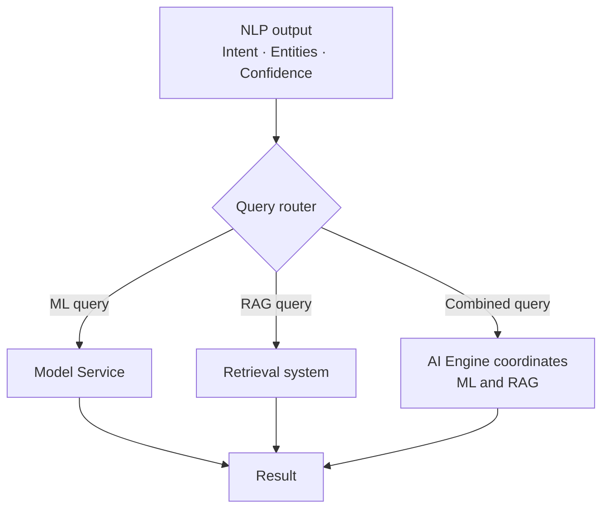

### 6.1 Diagram Explanation

The router is important because different queries require different processing methods.

| Query Type | Example | Routed To |
|---|---|---|
| **ML Query** | "Predict the outcome for this input." | Model Service |
| **RAG Query** | "What does the economic analysis document say?" | Retrieval system |
| **Combined Query** | A query requiring both model inference and retrieved information. | AI Engine coordinates both workflows and combines their outputs. |

---

## 7. Machine Learning Workflow

The Machine Learning workflow consists of two major stages:

1. ML Development
2. ML Inference

The development side creates and evaluates the models. The inference side uses the trained models to produce predictions.

### 7.1 ML Development Workflow

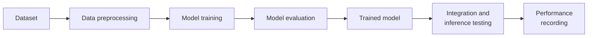

The project work includes baseline ML integration, model inference testing, and recording model performance.

### 7.2 ML Inference Workflow

Once the model is available:

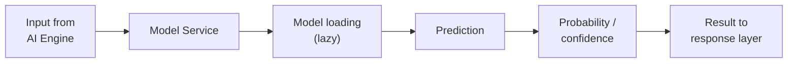

The Model Service provides the interface between the application and trained models.

The implementation discussed for CARIVIX includes functionality around:

- Model loading
- Lazy loading
- Prediction
- Batch prediction
- Probability/confidence
- Model information

---

## 8. RAG Document Ingestion Workflow

RAG has a different workflow from ML. Before a user can query the knowledge base, documents need to be processed and indexed.

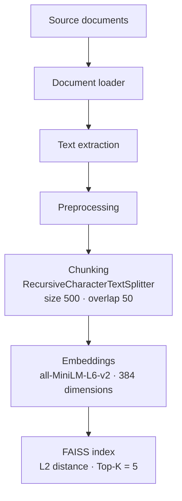

### 8.1 Diagram Explanation

| Component | Description |
|---|---|
| **Source Documents** | The RAG workflow can use documents and datasets such as the project datasets previously processed: `Market Analysis 1981 2025.csv`, `arxiv.csv`, `Economic Trend Analysis.csv`, `Public Program Evaluation.csv`, `Traffic Analysis.csv`. |
| **Document Loader** | Reads the available source material. |
| **Text Extraction** | Converts source content into processable text. |
| **Preprocessing** | Cleans and prepares the extracted content for chunking. |
| **Chunking** | The project configuration uses `RecursiveCharacterTextSplitter` with Chunk Size = 500 and Overlap = 50. This divides larger documents into manageable pieces. |
| **Embeddings** | The project uses Sentence Transformers with `all-MiniLM-L6-v2` at 384 dimensions. Each chunk becomes a numerical vector. |
| **FAISS** | The vectors are indexed in FAISS. The established configuration includes FAISS with L2 distance and Top-K = 5. The resulting index becomes the searchable knowledge layer. |

---

## 9. RAG Query and Generation Workflow

After document ingestion, the system can process user questions.

The online workflow is:

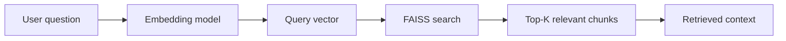

The important separation is:

| Component | Role |
|---|---|
| **Embedding Model** | Converts text to vectors |
| **FAISS** | Retrieves relevant information |

---

## 10. LLM and Grounded Response Workflow

Once relevant context has been retrieved, the context is supplied to the LLM.

The workflow is:

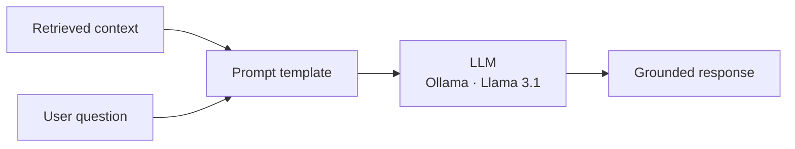

The CARIVIX RAG work has used an Ollama-based local LLM workflow, with Llama 3.1 identified as the selected model and fallback models discussed.

The purpose of supplying retrieved context is to make the response grounded in the information retrieved from the project's knowledge base.

> **FAISS itself does not generate the answer.**

---

## 11. Combined ML + RAG Workflow

Some AI operations may require both structured prediction and contextual knowledge.

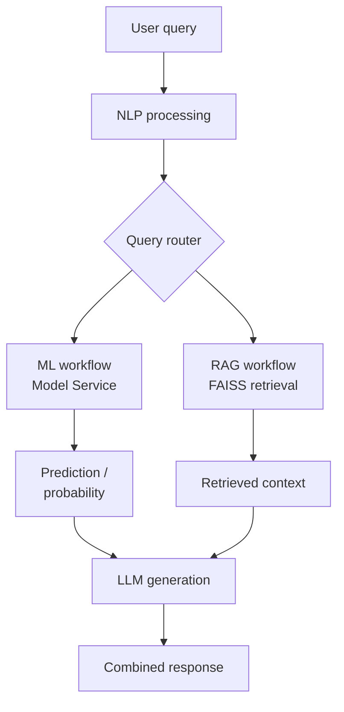

For example, a combined workflow could conceptually answer a question requiring:

| Requirement | Source |
|---|---|
| Historical information | RAG |
| Prediction | ML |
| Explanation | LLM |

This allows CARIVIX AI to combine structured model output with retrieved knowledge.

---

## 12. Response Generation and API Response Workflow

After the AI processing is completed, the result moves toward the response layer.

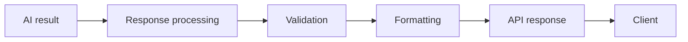

Depending on the workflow, the response may contain:

| Workflow | Response Contents |
|---|---|
| **ML** | ML prediction, probability / confidence, model information |
| **RAG** | Generated answer, retrieved context, metadata |
| **Combined** | Prediction, retrieved information, generated explanation, metadata |

> The exact response structure should follow the current API implementation.

---

## 13. AI Evaluation and Testing Workflow

AI development does not end after implementing the workflow. The components need to be tested independently and end-to-end.

The evaluation workflow is:

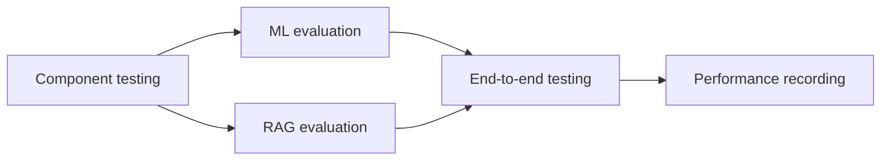

### 13.1 ML Evaluation

Depending on the model:

| Model Type | Metrics |
|---|---|
| Classification | Accuracy, Precision, Recall, F1 |
| Regression | MAE, RMSE, R² |

### 13.2 RAG Evaluation

RAG requires evaluation of both retrieval and generation.

**Retrieval:**

- Relevance
- Top-K Quality
- Context Quality

**Generation:**

- Answer quality
- Grounding in retrieved context
- Generation latency

The project work has also included RAG retrieval testing, context validation, and performance recording.

---

## 14. AI Performance, Validation and Continuous Improvement

The final operational stage is monitoring and improvement.

The system can be evaluated across:

- API Performance
- NLP Performance
- ML Inference Performance
- RAG Retrieval Performance
- LLM Generation Performance
- Final Response Quality

Important measurements can include:

- API latency
- Inference latency
- Retrieval latency
- LLM generation latency
- Error rate
- Model confidence
- Retrieval relevance
- Response quality

The improvement loop is:

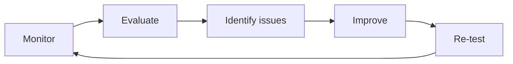

This creates a continuous AI development cycle rather than treating implementation as a one-time activity.

---

## 15. Conclusion

The CARIVIX AI workflow is a multi-stage AI architecture that connects the application layer with NLP, Machine Learning, RAG, vector retrieval, and LLM-based generation.

The workflow begins with a user request and proceeds through the FastAPI API layer into the AI Engine. The AI Engine processes the query through NLP components to identify the intent, entities, and confidence information. Based on these results, the query is routed to the appropriate AI workflow.

For Machine Learning requests, the system uses the Model Service to load and execute the required trained model and return the prediction or probability.

For knowledge-based requests, the RAG workflow retrieves relevant information from the FAISS vector index. Documents are processed through loading, preprocessing, chunking, embedding generation, and vector indexing. During query processing, the user's question is embedded, relevant chunks are retrieved, and the retrieved context is supplied to the LLM through a prompt template.

Where required, ML and RAG can work together to combine structured predictions with retrieved contextual information.

Finally, the generated result is processed through the response layer, validated, formatted, and returned to the client through the API.

Therefore, the complete CARIVIX AI project workflow can be summarized as:

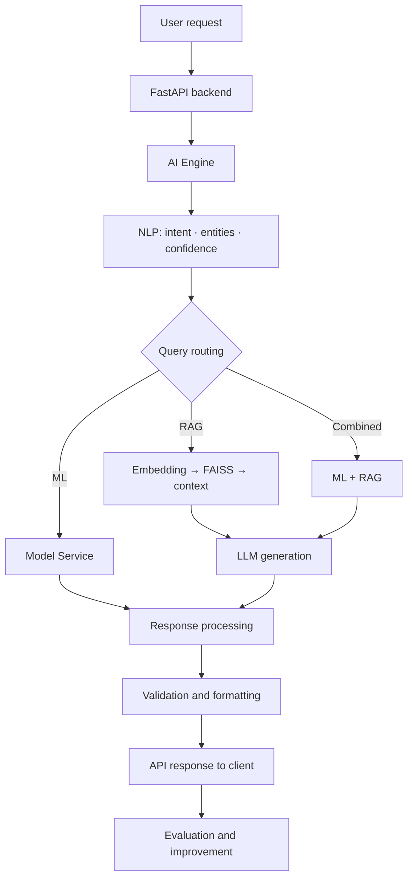

This architecture provides CARIVIX AI with a modular workflow in which each component has a defined responsibility, while the AI Engine coordinates the complete process from query understanding to final response generation.

---

## Document Control

| Version | Date | Author | Changes |
|---|---|---|---|
| 1.0 | 2026-09-21 | Shivanath Samudrala | Initial version created |
