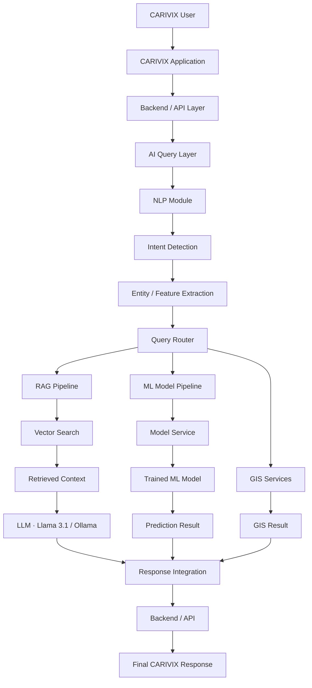

## 1. Overall CARIVIX AI Architecture

This is the primary high-level architecture showing how the complete CARIVIX AI platform is organized.

```mermaid
flowchart TD
    A[CARIVIX User] --> B[CARIVIX Application]
    B --> C[Backend / API Layer]
    C --> D[AI Query Layer]
    D --> E[NLP Module]
    E --> F[Intent Detection]
    F --> G[Entity / Feature Extraction]
    G --> H[Query Router]

    H --> I[RAG Pipeline]
    H --> J[ML Model Pipeline]
    H --> K[GIS Services]

    I --> L[Vector Search]
    L --> M[Retrieved Context]
    M --> N["LLM · Llama 3.1 / Ollama"]

    J --> O[Model Service]
    O --> P[Trained ML Model]
    P --> Q[Prediction Result]

    K --> R[GIS Result]

    N --> S[Response Integration]
    Q --> S
    R --> S
    S --> T[Backend / API]
    T --> U[Final CARIVIX Response]
```
