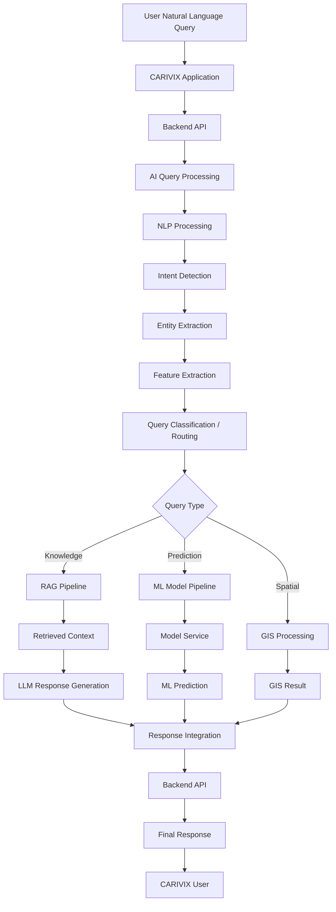

## 2. Complete AI Query Workflow

This diagram represents the main query flow developed and aligned with the CARIVIX technical architecture.

```mermaid
flowchart TD
    A[User Natural Language Query] --> B[CARIVIX Application]
    B --> C[Backend API]
    C --> D[AI Query Processing]
    D --> E[NLP Processing]
    E --> F[Intent Detection]
    F --> G[Entity Extraction]
    G --> H[Feature Extraction]
    H --> I[Query Classification / Routing]
    I --> J{Query Type}
    J -->|Knowledge| K[RAG Pipeline]
    J -->|Prediction| L[ML Model Pipeline]
    J -->|Spatial| M[GIS Processing]
    K --> N[Retrieved Context]
    N --> O[LLM Response Generation]
    L --> P[Model Service]
    P --> Q[ML Prediction]
    M --> R[GIS Result]

    O --> S[Response Integration]
    Q --> S
    R --> S
    S --> T[Backend API]
    T --> U[Final Response]
    U --> V[CARIVIX User]
```
