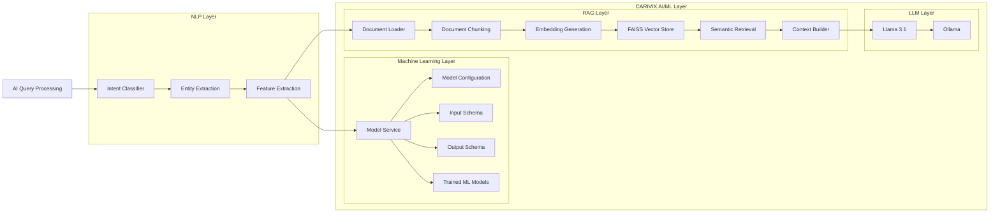

## 3. AI/ML System Component Architecture

This diagram shows the major components of the AI/ML layer.

```mermaid
flowchart LR
    AQ[AI Query Processing] --> IC[Intent Classifier]

    subgraph NLPLayer["NLP Layer"]
        IC --> EE[Entity Extraction]
        EE --> FE[Feature Extraction]
    end

    subgraph AIMLLayer["CARIVIX AI/ML Layer"]
        subgraph MLLayer["Machine Learning Layer"]
            MS[Model Service] --> MC[Model Configuration]
            MS --> IS[Input Schema]
            MS --> OS[Output Schema]
            MS --> TM[Trained ML Models]
        end

        subgraph RAGLayer["RAG Layer"]
            DL[Document Loader] --> DC[Document Chunking]
            DC --> EG[Embedding Generation]
            EG --> FV[FAISS Vector Store]
            FV --> SR[Semantic Retrieval]
            SR --> CB[Context Builder]
        end

        subgraph LLMLayer["LLM Layer"]
            L31[Llama 3.1] --> OL[Ollama]
        end
    end

    FE --> MS
    FE --> DL
    CB --> L31
```
