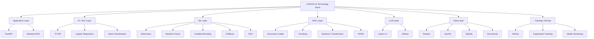

## 4. AI Technology Stack Architecture

```mermaid
flowchart TD
    STACK[CARIVIX AI Technology Stack]

    STACK --> APP[Application Layer]
    APP --> FastAPI
    APP --> BackendAPIs[Backend APIs]

    STACK --> NLP[AI / NLP Layer]
    NLP --> TFIDF[TF-IDF]
    NLP --> LogReg[Logistic Regression]
    NLP --> IntentClass[Intent Classification]

    STACK --> ML[ML Layer]
    ML --> SKLearn[Scikit-learn]
    ML --> RF[Random Forest]
    ML --> GB[Gradient Boosting]
    ML --> XGB[XGBoost]
    ML --> MLP[MLP]

    STACK --> RAG[RAG Layer]
    RAG --> DocLoader[Document Loader]
    RAG --> Chunking
    RAG --> SentTrans[Sentence Transformers]
    RAG --> FAISS

    STACK --> LLM[LLM Layer]
    LLM --> Llama31[Llama 3.1]
    LLM --> Ollama

    STACK --> Data[Data Layer]
    Data --> Pandas
    Data --> NumPy
    Data --> MySQL
    Data --> Documents

    STACK --> Tracking[Tracking / MLOps]
    Tracking --> MLflow
    Tracking --> ExpTracking[Experiment Tracking]
    Tracking --> ModelVersioning[Model Versioning]
```
