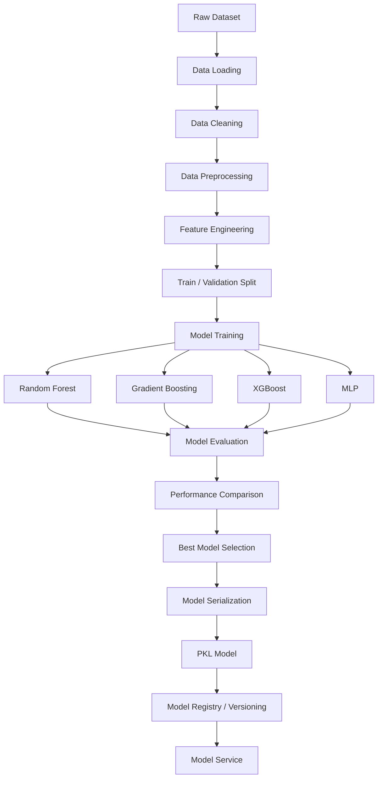

## 5. ML Training Workflow

This represents the ML model development/training side of the CARIVIX AI pipeline.

```mermaid
flowchart TD
    A[Raw Dataset] --> B[Data Loading]
    B --> C[Data Cleaning]
    C --> D[Data Preprocessing]
    D --> E[Feature Engineering]
    E --> F[Train / Validation Split]
    F --> G[Model Training]

    G --> H[Random Forest]
    G --> I[Gradient Boosting]
    G --> J[XGBoost]
    G --> K[MLP]

    H --> L[Model Evaluation]
    I --> L
    J --> L
    K --> L

    L --> M[Performance Comparison]
    M --> N[Best Model Selection]
    N --> O[Model Serialization]
    O --> P[PKL Model]
    P --> Q[Model Registry / Versioning]
    Q --> R[Model Service]
```
