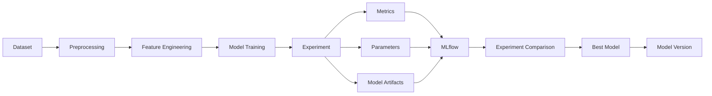

## 6. ML Model Training and Experiment Tracking

```mermaid
flowchart LR
    A[Dataset] --> B[Preprocessing]
    B --> C[Feature Engineering]
    C --> D[Model Training]
    D --> E[Experiment]
    E --> F[Metrics]
    E --> G[Parameters]
    E --> H[Model Artifacts]
    F --> I[MLflow]
    G --> I
    H --> I
    I --> J[Experiment Comparison]
    J --> K[Best Model]
    K --> L[Model Version]
```
