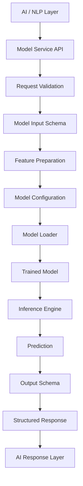

## 7. Model-Service Architecture

This is the detailed Model Service structure established during the ML implementation.

```mermaid
flowchart TD
    A[AI / NLP Layer] --> B[Model Service API]
    B --> C[Request Validation]
    C --> D[Model Input Schema]
    D --> E[Feature Preparation]
    E --> F[Model Configuration]
    F --> G[Model Loader]
    G --> H[Trained Model]
    H --> I[Inference Engine]
    I --> J[Prediction]
    J --> K[Output Schema]
    K --> L[Structured Response]
    L --> M[AI Response Layer]
```
