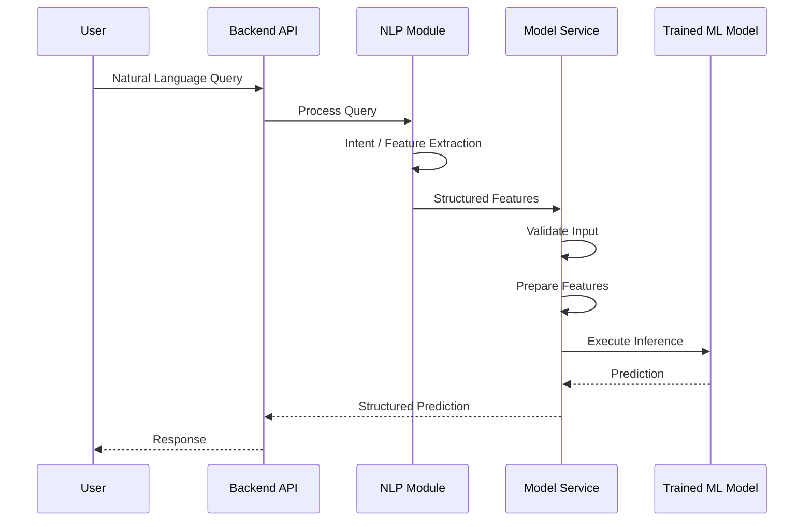

## 8. ML Inference Pipeline

```mermaid
sequenceDiagram
    participant User
    participant BackendAPI as Backend API
    participant NLPModule as NLP Module
    participant ModelService as Model Service
    participant TrainedModel as Trained ML Model

    User->>BackendAPI: Natural Language Query
    BackendAPI->>NLPModule: Process Query
    NLPModule->>NLPModule: Intent / Feature Extraction
    NLPModule->>ModelService: Structured Features
    ModelService->>ModelService: Validate Input
    ModelService->>ModelService: Prepare Features
    ModelService->>TrainedModel: Execute Inference
    TrainedModel-->>ModelService: Prediction
    ModelService-->>BackendAPI: Structured Prediction
    BackendAPI-->>User: Response
```
