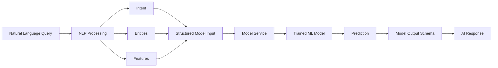

## 9. Model Input/Output Flow

```mermaid
flowchart LR
    A[Natural Language Query] --> B[NLP Processing]
    B --> C[Intent]
    B --> D[Entities]
    B --> E[Features]
    C --> F[Structured Model Input]
    D --> F
    E --> F
    F --> G[Model Service]
    G --> H[Trained ML Model]
    H --> I[Prediction]
    I --> J[Model Output Schema]
    J --> K[AI Response]
```
