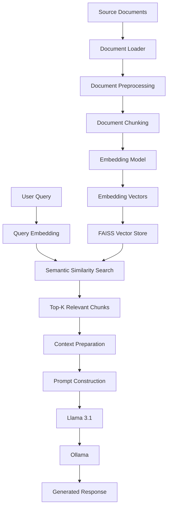

## 10. RAG Architecture

The RAG architecture developed and documented for CARIVIX AI.

```mermaid
flowchart TD
    A[Source Documents] --> B[Document Loader]
    B --> C[Document Preprocessing]
    C --> D[Document Chunking]
    D --> E[Embedding Model]
    E --> F[Embedding Vectors]
    F --> G[FAISS Vector Store]

    H[User Query] --> I[Query Embedding]
    I --> J[Semantic Similarity Search]
    G --> J

    J --> K[Top-K Relevant Chunks]
    K --> L[Context Preparation]
    L --> M[Prompt Construction]
    M --> N[Llama 3.1]
    N --> O[Ollama]
    O --> P[Generated Response]
```
