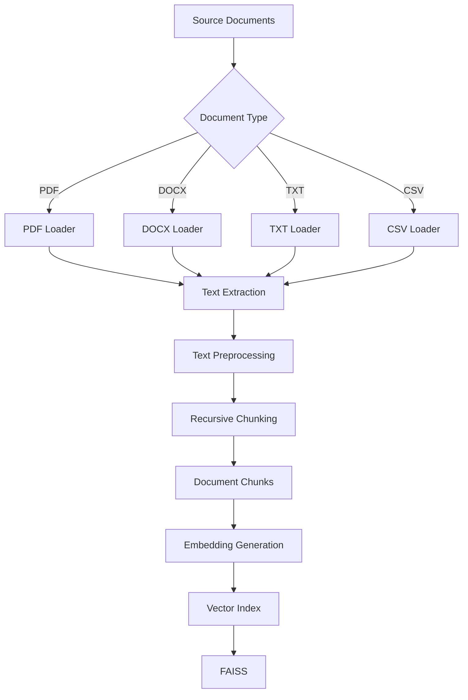

## 11. RAG Document Ingestion Pipeline

```mermaid
flowchart TD
    A[Source Documents] --> B{Document Type}
    B -->|PDF| C[PDF Loader]
    B -->|DOCX| D[DOCX Loader]
    B -->|TXT| E[TXT Loader]
    B -->|CSV| F[CSV Loader]

    C --> G[Text Extraction]
    D --> G
    E --> G
    F --> G

    G --> H[Text Preprocessing]
    H --> I[Recursive Chunking]
    I --> J[Document Chunks]
    J --> K[Embedding Generation]
    K --> L[Vector Index]
    L --> M[FAISS]
```
