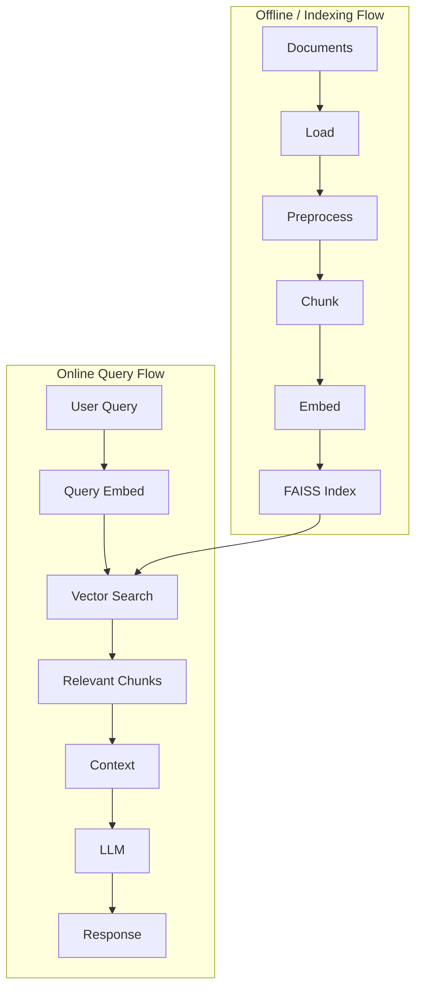

## 13. RAG Data Flow

```mermaid
flowchart TD
    subgraph Offline["Offline / Indexing Flow"]
        A[Documents] --> B[Load]
        B --> C[Preprocess]
        C --> D[Chunk]
        D --> E[Embed]
        E --> F[FAISS Index]
    end

    subgraph Online["Online Query Flow"]
        G[User Query] --> H[Query Embed]
        H --> I[Vector Search]
        I --> J[Relevant Chunks]
        J --> K[Context]
        K --> L[LLM]
        L --> M[Response]
    end

    F --> I
```
