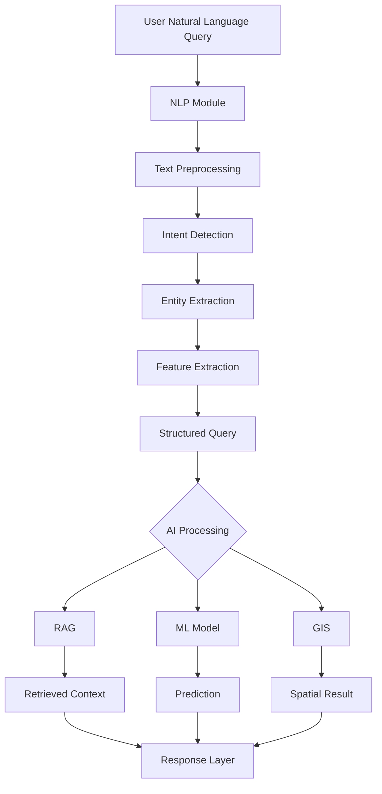

## 14. NLP → AI/ML Integration

```mermaid
flowchart TD
    A[User Natural Language Query] --> B[NLP Module]
    B --> C[Text Preprocessing]
    C --> D[Intent Detection]
    D --> E[Entity Extraction]
    E --> F[Feature Extraction]
    F --> G[Structured Query]
    G --> H{AI Processing}

    H --> I[RAG]
    H --> J[ML Model]
    H --> K[GIS]

    I --> L[Retrieved Context]
    J --> M[Prediction]
    K --> N[Spatial Result]

    L --> O[Response Layer]
    M --> O
    N --> O
```
