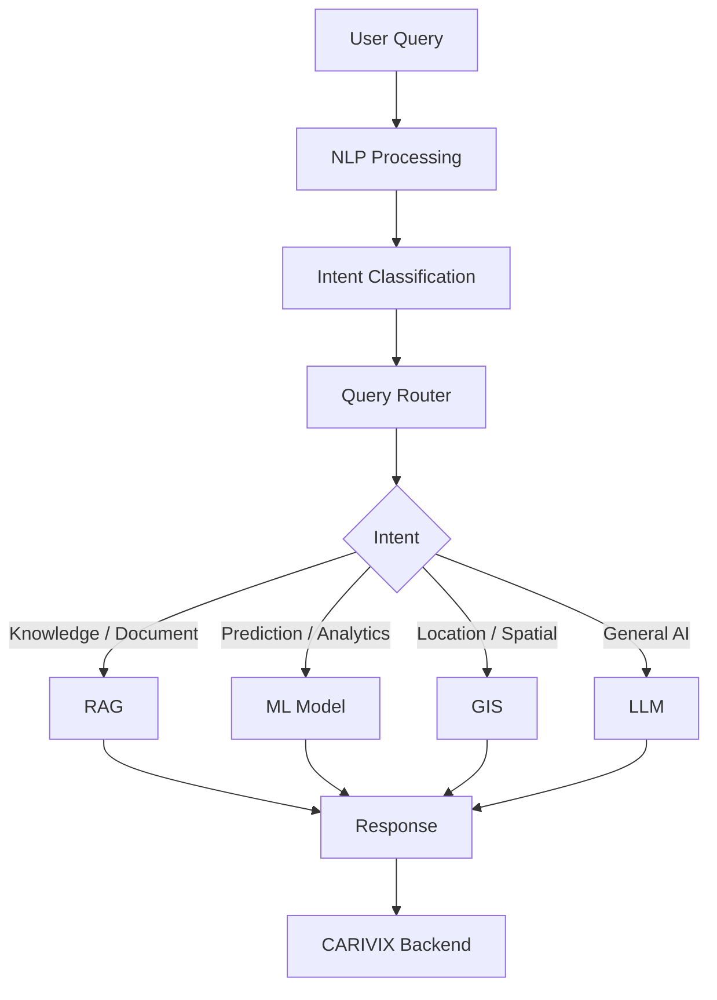

## 15. Query Routing Architecture

```mermaid
flowchart TD
    A[User Query] --> B[NLP Processing]
    B --> C[Intent Classification]
    C --> D[Query Router]
    D --> E{Intent}

    E -->|Knowledge / Document| F[RAG]
    E -->|Prediction / Analytics| G[ML Model]
    E -->|Location / Spatial| H[GIS]
    E -->|General AI| I[LLM]

    F --> J[Response]
    G --> J
    H --> J
    I --> J

    J --> K[CARIVIX Backend]
```
