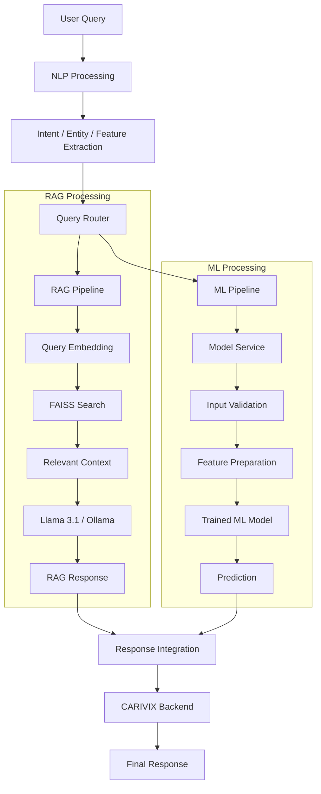

## 16. Complete RAG + ML Combined Architecture

This diagram shows the two major AI processing pipelines together.

```mermaid
flowchart TD
    A[User Query] --> B[NLP Processing]
    B --> C[Intent / Entity / Feature Extraction]
    C --> D[Query Router]

    subgraph RAGProc["RAG Processing"]
        D --> E[RAG Pipeline]
        E --> F[Query Embedding]
        F --> G[FAISS Search]
        G --> H[Relevant Context]
        H --> I[Llama 3.1 / Ollama]
        I --> J[RAG Response]
    end

    subgraph MLProc["ML Processing"]
        D --> K[ML Pipeline]
        K --> L[Model Service]
        L --> M[Input Validation]
        M --> N[Feature Preparation]
        N --> O[Trained ML Model]
        O --> P[Prediction]
    end

    J --> Q[Response Integration]
    P --> Q
    Q --> R[CARIVIX Backend]
    R --> S[Final Response]
```
