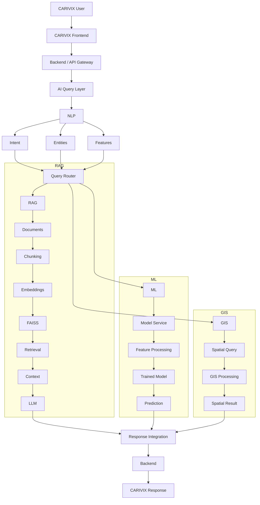

## 17. AI + NLP + ML + RAG + GIS Architecture

This is the main multi-component architecture for the CARIVIX AI system.

```mermaid
flowchart TD
    A[CARIVIX User] --> B[CARIVIX Frontend]
    B --> C[Backend / API Gateway]
    C --> D[AI Query Layer]
    D --> E[NLP]
    E --> F[Intent]
    E --> G[Entities]
    E --> H[Features]
    F --> I[Query Router]
    G --> I
    H --> I

    subgraph RAG["RAG"]
        I --> J[RAG]
        J --> K[Documents]
        K --> L[Chunking]
        L --> M[Embeddings]
        M --> N[FAISS]
        N --> O[Retrieval]
        O --> P[Context]
        P --> Q[LLM]
    end

    subgraph ML["ML"]
        I --> R[ML]
        R --> S[Model Service]
        S --> T[Feature Processing]
        T --> U[Trained Model]
        U --> V[Prediction]
    end

    subgraph GIS["GIS"]
        I --> W[GIS]
        W --> X[Spatial Query]
        X --> Y[GIS Processing]
        Y --> Z[Spatial Result]
    end

    Q --> RI[Response Integration]
    V --> RI
    Z --> RI
    RI --> BE[Backend]
    BE --> CR[CARIVIX Response]
```
