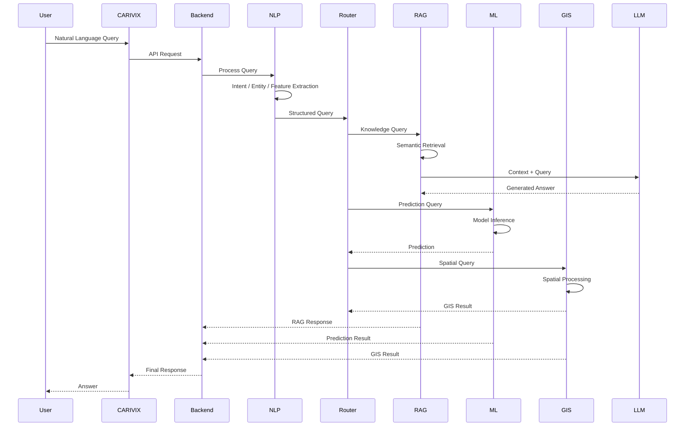

## 18. AI Query End-to-End Sequence

```mermaid
sequenceDiagram
    participant User
    participant CARIVIX
    participant Backend
    participant NLP
    participant Router
    participant RAG
    participant ML
    participant GIS
    participant LLM

    User->>CARIVIX: Natural Language Query
    CARIVIX->>Backend: API Request
    Backend->>NLP: Process Query
    NLP->>NLP: Intent / Entity / Feature Extraction
    NLP->>Router: Structured Query

    Router->>RAG: Knowledge Query
    RAG->>RAG: Semantic Retrieval
    RAG->>LLM: Context + Query
    LLM-->>RAG: Generated Answer

    Router->>ML: Prediction Query
    ML->>ML: Model Inference
    ML-->>Router: Prediction

    Router->>GIS: Spatial Query
    GIS->>GIS: Spatial Processing
    GIS-->>Router: GIS Result

    RAG-->>Backend: RAG Response
    ML-->>Backend: Prediction Result
    GIS-->>Backend: GIS Result

    Backend-->>CARIVIX: Final Response
    CARIVIX-->>User: Answer
```
