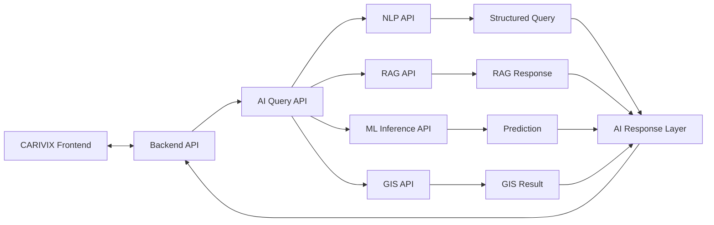

## 19. API Integration Architecture

```mermaid
flowchart LR
    A[CARIVIX Frontend] <--> B[Backend API]
    B --> C[AI Query API]

    C --> D[NLP API]
    D --> E[Structured Query]

    C --> F[RAG API]
    F --> G[RAG Response]

    C --> H[ML Inference API]
    H --> I[Prediction]

    C --> J[GIS API]
    J --> K[GIS Result]

    E --> L[AI Response Layer]
    G --> L
    I --> L
    K --> L
    L --> B
```
