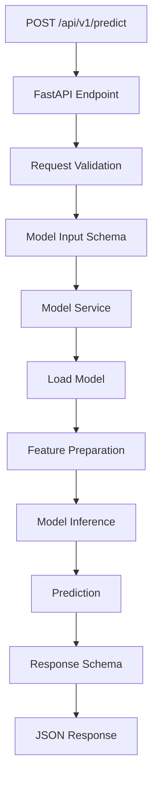

## 20. ML Model API Inference Architecture

```mermaid
flowchart TD
    A["POST /api/v1/predict"] --> B[FastAPI Endpoint]
    B --> C[Request Validation]
    C --> D[Model Input Schema]
    D --> E[Model Service]
    E --> F[Load Model]
    F --> G[Feature Preparation]
    G --> H[Model Inference]
    H --> I[Prediction]
    I --> J[Response Schema]
    J --> K[JSON Response]
```
