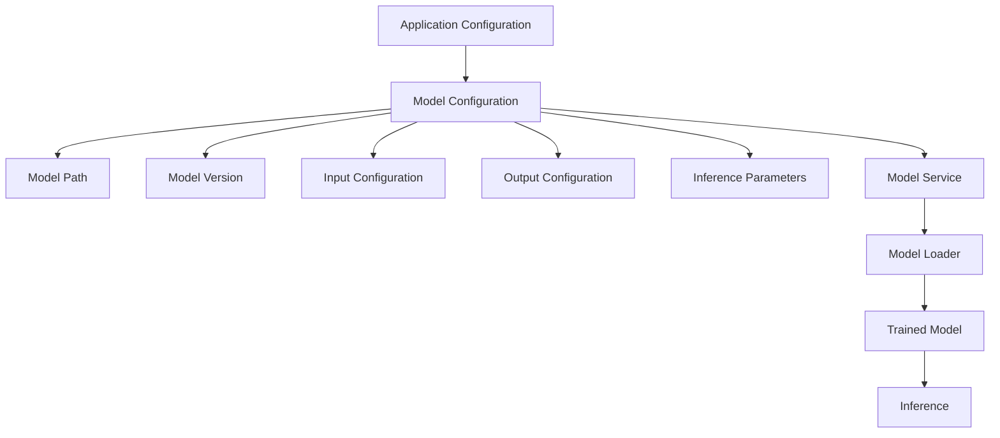

## 21. Model Configuration Architecture

```mermaid
flowchart TD
    A[Application Configuration] --> B[Model Configuration]

    B --> C[Model Path]
    B --> D[Model Version]
    B --> E[Input Configuration]
    B --> F[Output Configuration]
    B --> G[Inference Parameters]
    B --> H[Model Service]

    H --> I[Model Loader]
    I --> J[Trained Model]
    J --> K[Inference]
```
