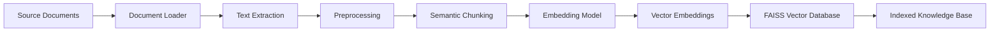

## 22. Document-to-Vector Database Architecture

```mermaid
flowchart LR
    A[Source Documents] --> B[Document Loader]
    B --> C[Text Extraction]
    C --> D[Preprocessing]
    D --> E[Semantic Chunking]
    E --> F[Embedding Model]
    F --> G[Vector Embeddings]
    G --> H[FAISS Vector Database]
    H --> I[Indexed Knowledge Base]
```
