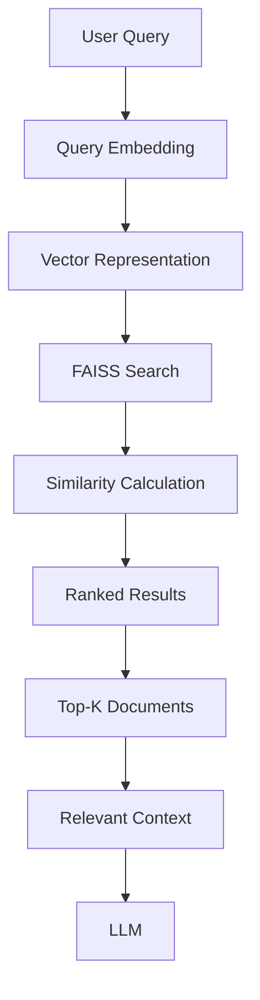

## 23. Vector Search Architecture

```mermaid
flowchart TD
    A[User Query] --> B[Query Embedding]
    B --> C[Vector Representation]
    C --> D[FAISS Search]
    D --> E[Similarity Calculation]
    E --> F[Ranked Results]
    F --> G[Top-K Documents]
    G --> H[Relevant Context]
    H --> I[LLM]
```
