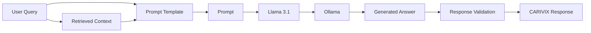

## 24. LLM + RAG Response Generation

```mermaid
flowchart LR
    A[User Query] --> B[Retrieved Context]
    A --> C[Prompt Template]
    B --> C
    C --> D[Prompt]
    D --> E[Llama 3.1]
    E --> F[Ollama]
    F --> G[Generated Answer]
    G --> H[Response Validation]
    H --> I[CARIVIX Response]
```
