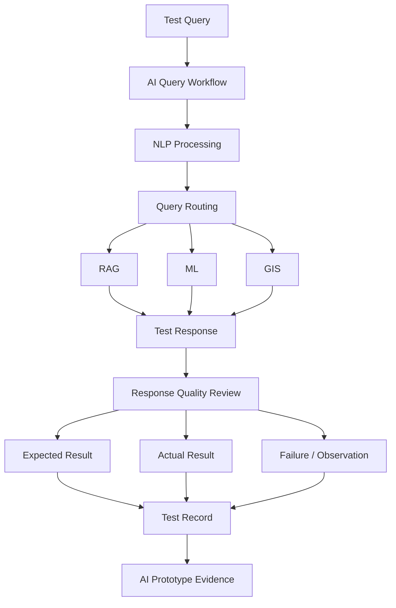

## 26. AI Prototype / Testing Architecture

```mermaid
flowchart TD
    A[Test Query] --> B[AI Query Workflow]
    B --> C[NLP Processing]
    C --> D[Query Routing]
    D --> E[RAG]
    D --> F[ML]
    D --> G[GIS]

    E --> H[Test Response]
    F --> H
    G --> H

    H --> I[Response Quality Review]
    I --> J[Expected Result]
    I --> K[Actual Result]
    I --> L[Failure / Observation]

    J --> M[Test Record]
    K --> M
    L --> M
    M --> N[AI Prototype Evidence]
```
