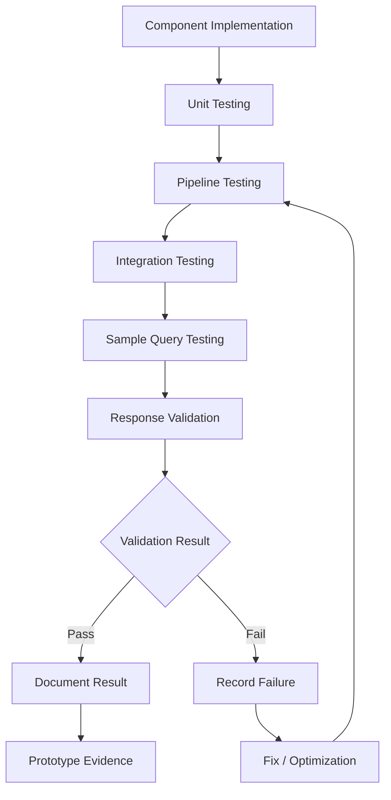

## 27. AI/ML Validation Workflow

```mermaid
flowchart TD
    A[Component Implementation] --> B[Unit Testing]
    B --> C[Pipeline Testing]
    C --> D[Integration Testing]
    D --> E[Sample Query Testing]
    E --> F[Response Validation]
    F --> G{Validation Result}

    G -->|Pass| H[Document Result]
    H --> I[Prototype Evidence]

    G -->|Fail| J[Record Failure]
    J --> K[Fix / Optimization]
    K --> C
```
