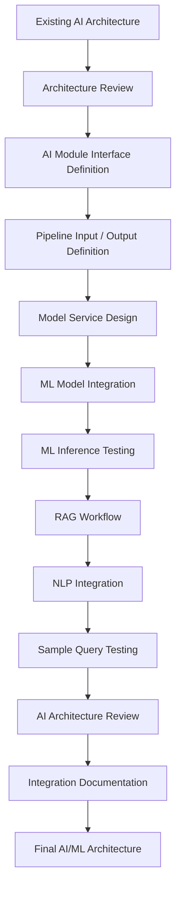

## 28. AI Architecture Development Flow

This represents how the architecture evolved through the project.

```mermaid
flowchart TD
    A[Existing AI Architecture] --> B[Architecture Review]
    B --> C[AI Module Interface Definition]
    C --> D[Pipeline Input / Output Definition]
    D --> E[Model Service Design]
    E --> F[ML Model Integration]
    F --> G[ML Inference Testing]
    G --> H[RAG Workflow]
    H --> I[NLP Integration]
    I --> J[Sample Query Testing]
    J --> K[AI Architecture Review]
    K --> L[Integration Documentation]
    L --> M[Final AI/ML Architecture]
```
