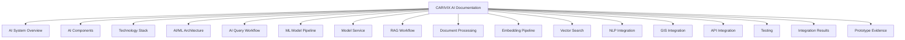

## 29. AI/ML Documentation Architecture

The documentation structure created during the project can be represented as:

```mermaid
flowchart TD
    A[CARIVIX AI Documentation] --> B[AI System Overview]
    A --> C[AI Components]
    A --> D[Technology Stack]
    A --> E[AI/ML Architecture]
    A --> F[AI Query Workflow]
    A --> G[ML Model Pipeline]
    A --> H[Model Service]
    A --> I[RAG Workflow]
    A --> J[Document Processing]
    A --> K[Embedding Pipeline]
    A --> L[Vector Search]
    A --> M[NLP Integration]
    A --> N[GIS Integration]
    A --> O[API Integration]
    A --> P[Testing]
    A --> Q[Integration Results]
    A --> R[Prototype Evidence]
```
