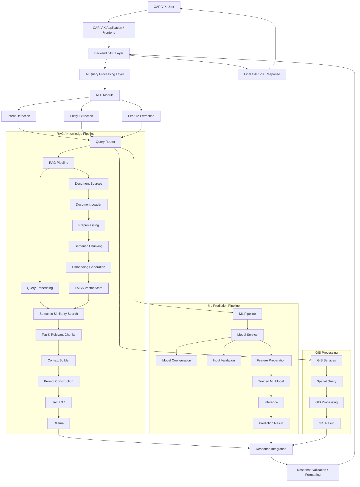

## 30. Final CARIVIX AI Architecture

This should be treated as the master architecture diagram for the project.

```mermaid
flowchart TD
    U[CARIVIX User] --> APP[CARIVIX Application / Frontend]
    APP --> BE[Backend / API Layer]
    BE --> AQ[AI Query Processing Layer]
    AQ --> NLP[NLP Module]
    NLP --> ID[Intent Detection]
    NLP --> EE[Entity Extraction]
    NLP --> FE[Feature Extraction]
    ID --> QR[Query Router]
    EE --> QR
    FE --> QR

    subgraph RAGP["RAG / Knowledge Pipeline"]
        QR --> RP[RAG Pipeline]
        RP --> DS[Document Sources]
        DS --> DL[Document Loader]
        DL --> PP[Preprocessing]
        PP --> SC[Semantic Chunking]
        SC --> EG[Embedding Generation]
        EG --> FVS[FAISS Vector Store]
        RP --> QE[Query Embedding]
        QE --> SSS[Semantic Similarity Search]
        FVS --> SSS
        SSS --> TK[Top-K Relevant Chunks]
        TK --> CBu[Context Builder]
        CBu --> PC[Prompt Construction]
        PC --> L31[Llama 3.1]
        L31 --> OL[Ollama]
    end

    subgraph MLP["ML Prediction Pipeline"]
        QR --> MP[ML Pipeline]
        MP --> MS[Model Service]
        MS --> MC[Model Configuration]
        MS --> IV[Input Validation]
        MS --> FP[Feature Preparation]
        FP --> TM[Trained ML Model]
        TM --> Inf[Inference]
        Inf --> PR[Prediction Result]
    end

    subgraph GISP["GIS Processing"]
        QR --> GS[GIS Services]
        GS --> SQ[Spatial Query]
        SQ --> GP[GIS Processing]
        GP --> GR[GIS Result]
    end

    OL --> RI[Response Integration]
    PR --> RI
    GR --> RI
    RI --> RV[Response Validation / Formatting]
    RV --> BE
    BE --> FR[Final CARIVIX Response]
    FR --> U
```
