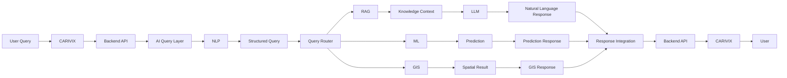

## 31. Complete CARIVIX AI Data Flow

```mermaid
flowchart LR
    A[User Query] --> B[CARIVIX]
    B --> C[Backend API]
    C --> D[AI Query Layer]
    D --> E[NLP]
    E --> F[Structured Query]
    F --> G[Query Router]

    G --> H[RAG]
    H --> I[Knowledge Context]
    I --> J[LLM]
    J --> K[Natural Language Response]

    G --> L[ML]
    L --> M[Prediction]
    M --> N[Prediction Response]

    G --> O[GIS]
    O --> P[Spatial Result]
    P --> Q[GIS Response]

    K --> R[Response Integration]
    N --> R
    Q --> R

    R --> S[Backend API]
    S --> T[CARIVIX]
    T --> U[User]
```
