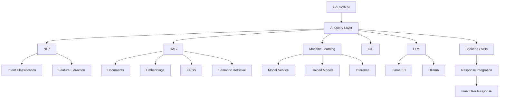

## 32. Final Technical Component Relationship

---

## Recommended Diagram Set for the Final CARIVIX Documentation

For the final project documentation, the diagrams can be organized into these sections:

**A. Architecture**
1. Overall CARIVIX AI Architecture
2. AI/ML System Component Architecture
3. AI/ML Technology Stack
4. Final CARIVIX AI Master Architecture

**B. AI Query Workflow**
5. Complete AI Query Workflow
6. Query Routing Architecture
7. AI End-to-End Sequence
8. AI Response Integration

**C. ML Pipeline**
9. ML Training Workflow
10. ML Experiment Tracking
11. Model-Service Architecture
12. ML Inference Pipeline
13. Model Input/Output Flow
14. Model Configuration Architecture
15. ML Model API Architecture

**D. RAG Pipeline**
16. RAG Architecture
17. RAG Document Ingestion
18. RAG Retrieval Pipeline
19. RAG Data Flow
20. Document-to-Vector Architecture
21. Vector Search Architecture
22. LLM + RAG Response Generation

**E. Integration**
23. NLP → AI/ML Integration
24. AI + NLP + ML + RAG + GIS
25. API Integration Architecture
26. AI/ML + CARIVIX Integration

**F. Testing & Documentation**
27. AI Prototype Testing Architecture
28. AI/ML Validation Workflow
29. AI Architecture Development Flow
30. AI/ML Documentation Architecture

These diagrams together cover the CARIVIX AI technical work from the initial architecture review through the ML pipeline, RAG implementation, NLP integration, query workflow, GIS integration, API integration, testing, and final AI/ML documentation.

The RAG separation into ingestion/indexing and query/retrieval/generation is also consistent with standard RAG architecture patterns, where document preprocessing and embedding storage form one path and query retrieval plus generation form the serving path.
