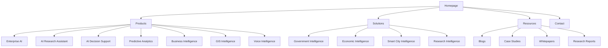

# CARIVIX AI — On-Page SEO Guidelines & Checklist

## 1. Overview

This document defines the **on-page SEO guidelines and audit checklist** for the CARIVIX AI website. It covers:

| # | Area |
|---|---|
| 1 | On-Page SEO Audit Checklist (28 items) |
| 2 | H1 / H2 / H3 Heading Structure |
| 3 | Internal Linking Strategy |
| 4 | On-Page SEO Implementation Guidelines |

---

## 2. On-Page SEO Audit Checklist

| S. No. | On-Page SEO Area | Checklist / Action Items | CARIVIX AI Implementation Focus | Status |
|---|---|---|---|---|
| 1 | Keyword Mapping | Identify primary and secondary keywords for each page | Map keywords around Enterprise AI, Decision Intelligence, Predictive Analytics, Business Intelligence, AI Research, etc. | Working on it |
| 2 | Search Intent | Identify the primary search intent for each page | Align pages with informational, commercial, transactional, or navigational intent | Working on it |
| 3 | URL Optimization | Create short, descriptive, keyword-relevant URLs | Use structures such as `/enterprise-ai/` and `/predictive-analytics/` | Working on it |
| 4 | Title Tags | Create unique and keyword-focused title tags | Include the primary keyword and CARIVIX brand where appropriate | Working on it |
| 5 | Meta Descriptions | Create unique and relevant meta descriptions | Highlight CARIVIX's AI, intelligence, analytics, and decision-support capabilities | Working on it |
| 6 | H1 Heading | Use one clear H1 for each page | Include the primary keyword naturally in the main heading | Working on it |
| 7 | Heading Structure | Organize content using H2 and H3 headings | Structure sections around features, benefits, capabilities, and use cases | Working on it |
| 8 | Keyword Placement | Place primary and secondary keywords naturally | Optimize headings, introductory content, body content, and relevant sections | Working on it |
| 9 | Content Optimization | Create useful, relevant, and comprehensive content | Explain CARIVIX capabilities, problems solved, benefits, and applications | Working on it |
| 10 | Search Intent Alignment | Ensure content satisfies the intended user query | Match product, solution, research, and informational pages with their respective intent | Working on it |
| 11 | Semantic SEO | Include related terms and concepts naturally | Connect AI, ML, NLP, LLMs, predictive analytics, intelligence, and decision support | Working on it |
| 12 | Internal Linking | Add contextual links between relevant pages | Connect product, solution, use-case, and intelligence-domain pages | Working on it |
| 13 | Anchor Text | Use descriptive and relevant anchor text | Use terms such as AI Decision Support, Predictive Analytics, and Business Intelligence | Working on it |
| 14 | Image Optimization | Optimize images, diagrams, dashboards, and visual assets | Optimize CARIVIX dashboards, GIS maps, analytics visuals, and diagrams | Working on it |
| 15 | ALT Text | Add descriptive ALT text to informative images | Describe dashboards, maps, visualizations, and other relevant visuals | Working on it |
| 16 | Content Readability | Improve content structure and readability | Use short paragraphs, clear headings, lists, and accessible language | Working on it |
| 17 | CTA Optimization | Add clear and relevant calls-to-action | Use appropriate CTAs such as Request Demo, Explore Platform, or Contact Us | Working on it |
| 18 | Product Page Optimization | Optimize product/service pages for relevance and conversions | Explain features, benefits, use cases, and relevant capabilities | Working on it |
| 19 | Use-Case Optimization | Include relevant industry and user use cases | Cover business analysis, economic forecasting, policy analysis, research intelligence, and smart-city applications | Working on it |
| 20 | E-E-A-T & Trust | Provide clear company, product, technology, and contact information | Ensure CARIVIX capabilities and claims are clearly and accurately presented | Working on it |
| 21 | Schema Markup | Identify and implement relevant structured data | Consider Organization, WebSite, SoftwareApplication/Product, and BreadcrumbList schema where applicable | Working on it |
| 22 | Canonical URL | Define the preferred URL for each indexable page | Prevent duplicate URL versions and consolidate ranking signals to the preferred page | Working on it |
| 23 | Duplicate Content | Identify and resolve duplicate or overlapping content | Prevent multiple CARIVIX pages from targeting the same search intent | Working on it |
| 24 | Mobile Optimization | Ensure pages function effectively across mobile devices | Check navigation, content, buttons, forms, dashboards, and interactive elements | Working on it |
| 25 | Page Speed | Optimize page resources and loading performance | Optimize images, scripts, CSS, fonts, and other page resources | Working on it |
| 26 | Core Web Vitals | Monitor key page experience metrics | Review LCP, INP, and CLS to support a better user experience | Working on it |
| 27 | Final On-Page QA | Conduct a final review of all on-page SEO elements before publication | Verify keywords, metadata, headings, content, internal links, images, schema, canonical URLs, mobile experience, and performance | Working on it |
| 28 | Technology Content | Keep technology-related information accurate and relevant | Align technical information with CARIVIX's documented technology stack | Working on it |

---

## 3. H1 — Main Page Headings Structure

| Page | H1 |
|---|---|
| Homepage | AI-Powered Intelligence & Decision Support Platform |
| Platform | AI-Powered Intelligence & Decision Support Platform |
| AI Intelligence | AI Intelligence Platform for Research & Decision Support |
| Predictive Analytics | AI Predictive Analytics & Forecasting Platform |
| GIS Intelligence | GIS Intelligence & Geospatial Analytics Platform |
| Voice Intelligence | AI Voice Intelligence Assistant |
| Business Intelligence | AI-Powered Business Intelligence Platform |
| Government Intelligence | AI-Powered Government Intelligence Platform |
| Economic Intelligence | AI-Powered Economic Intelligence Platform |
| Smart City Intelligence | AI-Powered Smart City Intelligence Platform |
| Research Intelligence | AI-Powered Research Intelligence Platform |
| Data Acquisition | AI-Powered Data Acquisition & Collection |
| Data Processing | AI Data Processing & Data Engineering |
| Dashboard | AI Intelligence & Analytics Dashboards |
| Pricing | CARIVIX AI Pricing & Plans |
| Security | CARIVIX AI Security & Data Protection |

---

## 4. H2 — Major Section Headings

| Page | H2 Headings |
|---|---|
| Homepage | Transforming Data into Actionable Intelligence; What is CARIVIX AI?; Core Intelligence Capabilities; Intelligence Solutions; How CARIVIX Works; Who Can Use CARIVIX?; Request a Demo |
| Platform | What is the CARIVIX Intelligence Platform?; CARIVIX Platform Architecture; Core Platform Modules; Intelligence & Decision Support Workflow; Explore CARIVIX Solutions; Request a Demo |
| AI Intelligence | What is AI Intelligence?; CARIVIX AI Intelligence Engine; Natural Language Processing; LLM Intelligence; AI-Powered Research & Analysis; Benefits of AI Intelligence; Request a Demo |
| Predictive Analytics | What is Predictive Analytics?; CARIVIX Predictive Analytics Engine; Business Forecasting; Economic Forecasting; Government Forecasting; Smart City Predictions; Machine Learning & Forecasting Models; Predictive Intelligence for Decision-Making; Request a Demo |
| GIS Intelligence | What is GIS Intelligence?; CARIVIX GIS Intelligence System; Interactive Maps & Geographic Analysis; Urban Heat Intelligence; Infrastructure Mapping; Geospatial Intelligence for Decision-Making; GIS Technologies; Request a Demo |
| Voice Intelligence | What is a Voice Intelligence Assistant?; Conversational AI for Intelligence Queries; Voice Intelligence Features; Ask CARIVIX Through Voice; From Voice Query to Intelligence Report; Benefits of Voice Intelligence; Request a Demo |
| Business Intelligence | What is AI Business Intelligence?; Business Intelligence Capabilities; Market & Competitive Intelligence; AI-Powered Business Decision Support; Business Forecasting; Who Can Use CARIVIX Business Intelligence?; Request a Demo |
| Government Intelligence | What is Government Intelligence?; Government Intelligence Capabilities; Government Data & Intelligence; Policy & Program Analysis; Regional & Infrastructure Intelligence; Predictive Intelligence for Government; Government Decision Support; Request a Government Demo |
| Economic Intelligence | What is Economic Intelligence?; Economic Intelligence Capabilities; Economic Data & Analysis; Economic Forecasting; AI-Powered Economic Decision Support; Request a Demo |
| Smart City Intelligence | What is Smart City Intelligence?; Smart City Intelligence Capabilities; Traffic & Mobility Intelligence; Environmental Intelligence; Infrastructure Intelligence; Predictive Intelligence for Smart Cities; Smart City Decision Support; Request a Demo |
| Research Intelligence | What is Research Intelligence?; Research Intelligence Capabilities; AI-Powered Research Analysis; Research Trends & Insights; Automated Intelligence Reports; Request a Demo |
| Data Acquisition | What is Data Acquisition?; CARIVIX Data Acquisition Engine; Data Sources; Data Collection Capabilities; Request a Demo |
| Data Processing | What is Data Processing?; CARIVIX Data Processing Engine; Data Cleaning; Data Transformation; Data Storage; Data Processing Technologies; Request a Demo |
| Dashboard | CARIVIX Intelligence Dashboards; Executive Dashboard; Analytics Dashboard; GIS Dashboard; Turn Intelligence into Action; Request a Demo |
| Pricing | Choose the Right Intelligence Plan; SaaS Subscription Plans; Government Licensing; Consulting & Advisory Services; Frequently Asked Questions; Request a Demo |
| Security | CARIVIX Security Framework; Authentication; Authorization; Data Security; Compliance |

---

## 5. H3 — Supporting Sub-Headings

| Page | H3 Headings |
|---|---|
| Homepage | AI & Machine Learning; Natural Language Processing; Large Language Model Intelligence; Predictive Analytics; GIS Intelligence; Business Intelligence; Government Intelligence; Economic Intelligence; Smart City Intelligence; Research Intelligence; Data Collection; Data Processing; AI Analysis; Prediction & Forecasting; Insight Generation; Visualization & Reporting; Businesses; Government Organizations; Investors; Researchers; Smart Cities |
| Platform | Data Sources; Data Collection Layer; Data Processing Layer; AI Intelligence Engine; Prediction Engine; Visualization Layer; User Interaction Layer; Data Acquisition Engine; Data Processing Engine; AI Intelligence Engine; Predictive Analytics Engine; GIS Intelligence System; Voice Intelligence Assistant; User Query; Data Retrieval; AI Analysis; Prediction; Insight Generation; Visualization; Report Delivery |
| AI Intelligence | Text Classification; Sentiment Analysis; Entity Recognition; Topic Modeling; Question Answering; Summarization; Recommendation Generation; Strategic Insights; Automated Report Writing |
| Predictive Analytics | Revenue Forecasting; Sales Forecasting; Demand Forecasting; GDP Forecasting; Inflation Prediction; Population Growth; Resource Consumption; Traffic Prediction; Water Demand; Energy Demand; ARIMA; Prophet; XGBoost & Random Forest; LSTM; Deep Neural Networks |
| GIS Intelligence | Interactive Maps; Heat Maps; District Analysis; State Analysis; Heat Island Zones; Temperature Trends; Roads; Hospitals; Schools; Utilities |
| Voice Intelligence | Speech-to-Text; Voice Search; Conversational AI; Voice-Generated Reports; Regional Intelligence Queries; Economic Queries; Traffic & Smart City Queries |
| Business Intelligence | Market Analysis; Competitor Analysis; Pricing Analysis; Investment Research; Customer Sentiment Analysis |
| Government Intelligence | Policy Impact Analysis; Budget Analysis; Public Program Evaluation; Infrastructure Monitoring |
| Economic Intelligence | Economic Trend Analysis; GDP Forecasting; Inflation Forecasting; Employment Analytics |
| Smart City Intelligence | Traffic Analysis; Environmental Monitoring; Urban Heat Mapping; Resource Planning |
| Research Intelligence | Academic Research Analysis; Literature Reviews; Trend Identification; Citation Analysis |
| Data Acquisition | Government Portals & Open Data; Company & Financial Reports; News & Online Sources; IoT & Sensor Data; API Integration; Web Scraping; Real-Time Data Streaming; Scheduled Data Collection; Data Validation |
| Data Processing | Missing Value Removal; Duplicate Removal; Data Standardization; Normalization; Feature Engineering; Data Structuring; Data Warehousing; Data Lakes |
| Dashboard | KPIs; Alerts; Trends; Recommendations; Charts; Graphs; Reports; Forecasts; Maps; Heat Maps; Geographic Insights |
| Pricing | Basic Plan; Professional Plan; Enterprise Plan; Custom Research; Strategic Advisory; Policy Evaluation; Impact Assessment |
| Security | OAuth; Single Sign-On; Multi-Factor Authentication; Role-Based Access Control; AES-256 Encryption; SSL/TLS; Secure APIs; GDPR; ISO 27001; SOC 2 |

---

## 6. Internal Linking Strategy

The internal linking strategy connects CARIVIX's platform capabilities, intelligence domains, resources, and conversion pages in a **logical hierarchy** that reflects the project's documented platform modules and intelligence domains.

### 6.1 Internal Linking Hierarchy

| Level | Page Category | Main Purpose | Should Link To |
|---|---|---|---|
| Level 1 | Homepage | Primary website hub | Platform, Solutions, Resources, Pricing, Company, Request Demo |
| Level 2 | Platform | Main product hub | AI Intelligence, Predictive Analytics, GIS, Voice Intelligence, Data Acquisition, Data Processing |
| Level 2 | Solutions | Intelligence-domain hub | Business, Government, Economic, Smart City, Research Intelligence |
| Level 3 | Feature Pages | Explain individual capabilities | Relevant Solutions, Resources, Request Demo |
| Level 3 | Solution Pages | Explain industry/domain applications | Relevant Features, Resources, Pricing, Request Demo |
| Level 4 | Blog / Resources | Informational & educational content | Feature Pages, Solution Pages |
| Conversion | Pricing / Request Demo | Drive conversions | Relevant Platform & Solution Pages |

### 6.2 Homepage Internal Linking

| From Page | Link To | Purpose |
|---|---|---|
| Homepage | Platform | Introduce CARIVIX platform |
| Homepage | Solutions | Introduce intelligence solutions |
| Homepage | Resources | Support informational discovery |
| Homepage | Pricing | Support commercial intent |
| Homepage | About / Company | Build trust |
| Homepage | Request Demo | Conversion |
| Homepage | Key Feature Pages | Highlight core capabilities |

### 6.3 Platform Internal Linking

| From Platform | Link To |
|---|---|
| Platform | AI Intelligence |
| Platform | Predictive Analytics |
| Platform | GIS Intelligence |
| Platform | Voice Intelligence |
| Platform | Data Acquisition |
| Platform | Data Processing |
| Platform | Dashboards |
| Platform | Relevant Solutions |
| Platform | Request Demo |

### 6.4 Feature Page → Solution Linking

Each feature page should connect the technology/capability to the business or intelligence problem it solves.

| Feature Page | Primary Solution Links |
|---|---|
| AI Intelligence | Business, Government, Economic, Research |
| Predictive Analytics | Business, Economic, Government, Smart City |
| GIS Intelligence | Government, Smart City |
| Voice Intelligence | Business, Government, Research |
| Data Acquisition | Business, Government, Economic, Smart City, Research |
| Data Processing | All relevant intelligence domains |
| Dashboards | Business, Government, Economic, Smart City |

### 6.5 Solution Page → Feature Linking

Internal linking should also work in the opposite direction.

| Solution Page | Link To Relevant Features |
|---|---|
| Business Intelligence | AI Intelligence, Predictive Analytics, Dashboards |
| Government Intelligence | AI Intelligence, Predictive Analytics, GIS Intelligence, Dashboards |
| Economic Intelligence | AI Intelligence, Predictive Analytics |
| Smart City Intelligence | Predictive Analytics, GIS Intelligence, Dashboards |
| Research Intelligence | AI Intelligence, Data Processing, Voice Intelligence |

### 6.6 Blog Page → Feature / Solution Linking

The Resources / Blog section should support the main commercial pages.

| Blog Topic | Internal Links |
|---|---|
| AI Predictive Analytics | Predictive Analytics — Business Intelligence |
| AI in Government | Government Intelligence — AI Intelligence |
| What is GIS Intelligence? | GIS Intelligence — Smart City Intelligence |
| AI Economic Forecasting | Economic Intelligence — Predictive Analytics |
| AI for Smart Cities | Smart City Intelligence — GIS Intelligence |
| AI Research Platforms | Research Intelligence — AI Intelligence |

---

## 7. On-Page SEO Guidelines

### 7.1 URL Structure

For the CARIVIX AI platform, URLs should reflect the website hierarchy, include relevant keywords, and remain clean and user-friendly.

**URL Rules:**

| # | Rule |
|---|---|
| 1 | Use lowercase letters only |
| 2 | Separate words using hyphens |
| 3 | Keep URLs short and descriptive |
| 4 | Include the primary keyword |
| 5 | Avoid special characters, numbers, or unnecessary parameters |

**URL Recommendations:**

| Page | Optimized URL |
|---|---|
| Home | `/home` |
| About | `/about-carivix` |
| Enterprise AI | `/enterprise-ai` |
| AI Research Assistant | `/ai-research-assistant` |
| AI Decision Support | `/ai-decision-support` |
| Predictive Analytics | `/predictive-analytics` |
| Business Intelligence | `/business-intelligence` |
| GIS Intelligence | `/gis-intelligence` |
| Voice Intelligence | `/voice-intelligence` |
| Pricing | `/pricing` |
| Contact | `/contact` |

### 7.2 Title Tag Guidelines

The title tag is one of the most important on-page SEO elements — it tells search engines and users what a page is about and is displayed as the clickable headline in SERPs.

**Title Rules:**

| # | Rule |
|---|---|
| 1 | Length: 50–60 characters |
| 2 | Include the primary keyword at the beginning |
| 3 | Include the CARIVIX brand name |
| 4 | Make every title unique and descriptive |
| 5 | Reflect user search intent |

**Title Recommendations:**

| Page | SEO Title |
|---|---|
| Homepage | Enterprise AI Intelligence Platform \| CARIVIX AI |
| Enterprise AI | Enterprise AI Solutions for Business \| CARIVIX |
| AI Research Assistant | AI Research Assistant for Enterprise Research \| CARIVIX |
| Predictive Analytics | Predictive Analytics Software \| CARIVIX AI |
| Business Intelligence | Business Intelligence Platform \| CARIVIX |
| GIS Intelligence | GIS Intelligence & Spatial Analytics \| CARIVIX |

### 7.3 Meta Description Guidelines

A meta description is an HTML attribute that provides a brief summary of a webpage's content. It significantly influences CTR by encouraging users to visit the page from search results.

**Meta Rules:**

| # | Rule |
|---|---|
| 1 | Length: 150–160 characters |
| 2 | Include the primary keyword |
| 3 | Explain the value proposition |
| 4 | End with a call-to-action |

**Example:**
> Discover CARIVIX AI, an enterprise AI intelligence platform offering predictive analytics, business intelligence, AI research, and decision support solutions. Request a demo today.

### 7.4 Keyword Optimization

Keywords should align with user search intent and accurately represent AI products, intelligence solutions, and analytics services.

**Primary Keyword Placement:**

| # | Placement |
|---|---|
| 1 | URL |
| 2 | SEO Title |
| 3 | Meta Description |
| 4 | H1 heading |
| 5 | First paragraph |
| 6 | At least one H2 heading |
| 7 | Image ALT text |
| 8 | Conclusion |
| 9 | Internal links |

**Secondary Keywords:** Should be distributed naturally throughout the page.

**Example Keyword Cluster:**

| Primary Keyword | Related Keywords |
|---|---|
| Enterprise AI | AI Platform, AI Solutions, AI Software |
| Business Intelligence | BI Software, Business Analytics, Enterprise Analytics |
| Predictive Analytics | AI Forecasting, Forecast Models, Machine Learning Predictions |
| GIS Intelligence | Geospatial Analytics, Interactive Maps, Spatial Intelligence |
| AI Research Assistant | Research Automation, AI Reports, Literature Review |
| Decision Support | AI Decision Making, Strategic Intelligence, Executive Insights |

### 7.5 Content Structure

A structured content layout improves readability, user experience, and SEO by organizing information logically.

| Section | Purpose |
|---|---|
| Introduction | Introduce the solution |
| Problem Statement | Explain customer challenges |
| Solution Overview | Describe CARIVIX solution |
| Key Features | Explain platform capabilities |
| Benefits | Business value |
| Technology Used | AI, ML, NLP, GIS, LLM |
| How It Works | Platform workflow |
| Use Cases | Industry applications |
| FAQs | Answer common questions |
| CTA | Encourage contact / demo |

### 7.6 Image SEO

Image SEO improves website performance, accessibility, and search engine visibility by optimizing images used across the CARIVIX AI platform.

**Each image should include:**

| Element | Example |
|---|---|
| File Name | `enterprise-ai-dashboard.webp` |
| ALT Text | CARIVIX Enterprise AI Dashboard |
| Title Attribute | Enterprise AI Analytics Dashboard |

**Image Rules:**

| # | Rule |
|---|---|
| 1 | Use WebP format |
| 2 | Compress images |
| 3 | Enable lazy loading |
| 4 | Use descriptive filenames |
| 5 | Include keywords naturally in ALT text |

### 7.7 User Experience (UX)

UX ensures visitors can easily navigate the CARIVIX AI platform, access information quickly, and complete key actions such as exploring products or requesting a demo.

| # | UX Requirement |
|---|---|
| 1 | Fast page loading |
| 2 | Mobile responsiveness |
| 3 | Clear navigation |
| 4 | Readable typography |
| 5 | Accessible color contrast |
| 6 | Prominent CTA buttons |
| 7 | Breadcrumb navigation |
| 8 | Minimal intrusive pop-ups |

### 7.8 Technical SEO

Technical SEO ensures the CARIVIX AI platform is easily crawlable, indexable, secure, and optimized for search engine performance.

| Technical SEO Element | Guideline |
|---|---|
| HTTPS Security | Secure the website with an SSL certificate (HTTPS) |
| XML Sitemap | Create and submit an XML sitemap to Google Search Console and Bing Webmaster Tools |
| Robots.txt | Configure robots.txt to allow crawling of important pages and block unnecessary directories |
| Mobile-Friendly Design | Ensure the website is fully responsive across desktop, tablet, and mobile devices |
| Page Speed Optimization | Optimize images, CSS, JavaScript, browser caching, and enable compression (Gzip/Brotli) |
| Core Web Vitals | Optimize Largest Contentful Paint (LCP), Interaction to Next Paint (INP), and Cumulative Layout Shift (CLS) |
| Canonical Tags | Use canonical URLs to prevent duplicate content issues |
| Structured Data (Schema Markup) | Implement Organization, Product, FAQ, Breadcrumb, and Article schema where applicable |
| SEO-Friendly URLs | Use short, descriptive, keyword-rich URLs with hyphens |
| 404 Error Page | Create a custom 404 page with links to important sections of the website |
| 301 Redirects | Redirect outdated or removed URLs to the most relevant pages |
| Broken Link Monitoring | Regularly identify and fix broken internal and external links |
| Image Optimization | Use compressed WebP images with descriptive alt text |
| Breadcrumb Navigation | Implement breadcrumb navigation with Breadcrumb Schema |
| Internal Linking | Maintain a logical internal linking structure between products, solutions, blogs, and resources |

### 7.9 Call-to-Action (CTA)

A CTA encourages users to take the next step, such as requesting a demo, contacting the sales team, or exploring CARIVIX AI products.

**CTA Examples:**

- Request a Demo
- Contact Our AI Experts
- Schedule a Consultation
- Explore the Platform
- Download Product Brochure

**CTA Placement:** Hero section · Mid-page · Bottom of page

**CTA Guidelines:**

| CTA Element | Guideline |
|---|---|
| Clear & Action-Oriented | Use action verbs such as Request, Explore, Contact, Start, or Learn |
| Strategic Placement | Place CTAs in the hero section, after key content sections, and at the bottom of each page |
| Relevant to Content | Match the CTA with the page purpose (e.g., Demo on product pages, Contact on pricing pages) |
| Visually Prominent | Use contrasting buttons with consistent colors and styling |
| Mobile-Friendly | Ensure CTA buttons are easy to tap on mobile devices |
| Consistent Design | Maintain the same button style, size, and branding across the website |

**Recommended CTAs for CARIVIX AI:**

| Page | Primary CTA | Secondary CTA |
|---|---|---|
| Homepage | Request Demo | Explore Products |
| Enterprise AI | Request Demo | Contact Sales |
| AI Research Assistant | Try AI Research Assistant | Request Demo |
| AI Decision Support | Explore Solution | Contact Us |
| Predictive Analytics | Request Demo | Learn More |
| Business Intelligence | Explore Platform | Contact Sales |
| GIS Intelligence | View Solution | Request Demo |
| Voice Intelligence | Get Started | Contact Us |
| Solutions Pages | Schedule Consultation | Request Demo |
| Blog Pages | Explore Products | Request Demo |
| Pricing | Contact Sales | Request Demo |
| Contact | Get in Touch | Schedule Consultation |

### 7.10 Heading Structure (H1–H6)

Heading structure helps organize content logically, improves readability, enhances accessibility, and enables search engines to better understand the page hierarchy.

**Heading Rules:**

| # | Rule |
|---|---|
| 1 | Use only one H1 per page |
| 2 | Use H2 for major sections |
| 3 | Use H3 for subsections |
| 4 | Use H4–H6 only for additional nesting |
| 5 | Maintain a logical order and sequence in levels |

**Homepage Heading Structure:**

```
H1: CARIVIX AI — Enterprise AI Intelligence Platform

H2:
- Transform Data into Actionable Intelligence
- Why Choose CARIVIX
- Our AI Solutions
- Core Technologies
- Industries We Serve
- Platform Architecture
- How CARIVIX Works
- Security & Compliance
- Pricing
- Frequently Asked Questions
- Request a Demo

H3 (under "Our AI Solutions"):
- Enterprise AI
- AI Research Assistant
- AI Decision Support
- Predictive Analytics
- Business Intelligence
- GIS Intelligence
- Voice Intelligence Assistant

H3 (under "Core Technologies"):
- Artificial Intelligence (AI)
- Machine Learning (ML)
- Natural Language Processing (NLP)
- Large Language Models (LLMs)
- Predictive Analytics
- Geographic Information Systems (GIS)
```

**Enterprise AI Page:**

```
H1: Enterprise AI Solutions

H2:
- Overview
- Key Features
- Business Benefits
- AI Capabilities
- Implementation Process
- Use Cases
- Industries Served
- FAQs
- Contact Our Experts

H3:
- AI Automation
- Workflow Optimization
- Real-Time Analytics
- Enterprise Integration
- Security Features
```

**AI Research Assistant Page:**

```
H1: AI Research Assistant

H2:
- Overview
- Literature Review Automation
- Market Research
- Competitor Analysis
- AI Report Generation
- Benefits
- FAQs

H3:
- NLP Engine
- LLM Intelligence
- Data Collection
- Report Generation
```

**Predictive Analytics Page:**

```
H1: Predictive Analytics Platform

H2:
- Overview
- Forecasting Models
- Machine Learning Algorithms
- Industry Applications
- Business Benefits
- FAQs

H3:
- ARIMA
- Prophet
- XGBoost
- Random Forest
- LSTM
- Deep Neural Networks
```

**GIS Intelligence Page:**

```
H1: GIS Intelligence Platform

H2:
- Overview
- Interactive Maps
- Heat Maps
- Infrastructure Mapping
- Geographic Analysis
- Industry Applications
- FAQs

H3:
- Urban Heat Intelligence
- Environmental Monitoring
- Smart City Planning
- Resource Mapping
```

### 7.11 Internal Linking Strategy

Internal linking helps users navigate the CARIVIX AI platform while enabling search engines to understand the relationship between products, solutions, industries, and resources.

**Internal linking helps:**

| # | Benefit |
|---|---|
| 1 | Improve website crawlability |
| 2 | Distribute page authority (link equity) |
| 3 | Build topical relevance |
| 4 | Improve user navigation |
| 5 | Increase session duration |
| 6 | Support conversions by guiding users to related content |

**Website Internal Linking Architecture:**



**Homepage Linking:**

| Homepage Section | Links To | Purpose |
|---|---|---|
| Hero Banner | Enterprise AI | Introduce the core AI platform |
| Hero Banner | Request Demo | Encourage immediate conversions |
| Products Overview | Enterprise AI | Showcase flagship product |
| Products Overview | AI Research Assistant | Highlight AI-powered research capabilities |
| Products Overview | AI Decision Support | Direct users to decision intelligence |
| Products Overview | Predictive Analytics | Showcase forecasting capabilities |
| Products Overview | Business Intelligence | Present business analytics solutions |
| Products Overview | GIS Intelligence | Highlight geospatial intelligence |
| Products Overview | Voice Intelligence Assistant | Introduce conversational AI features |
| Solutions Section | Government Intelligence | Showcase public sector solutions |
| Solutions Section | Economic Intelligence | Highlight economic analytics |
| Solutions Section | Smart City Intelligence | Promote urban intelligence solutions |
| Solutions Section | Research Intelligence | Direct to research solutions |
| Industries Section | Industries Page | View industry-specific solutions |
| Resources Section | Blog | Access educational content |
| Pricing Section | Pricing Plans | View subscription plans |
| CTA Section | Contact Us | Speak with an expert |
| CTA Section | Request Demo | Book a platform demonstration |

**Product Page Linking (Example: Enterprise AI →):**

| Section | Links To | Purpose |
|---|---|---|
| Product Overview | AI Research Assistant | Explore AI research capabilities |
| Product Overview | AI Decision Support | Learn about strategic decision-making |
| Features | Predictive Analytics | Understand forecasting features |
| Features | Business Intelligence | View reporting and analytics capabilities |
| Features | GIS Intelligence | Explore spatial analytics |
| Features | Voice Intelligence Assistant | Learn about voice-enabled AI |
| Solutions | Government Intelligence | See public sector applications |
| Solutions | Smart City Intelligence | Explore urban intelligence use cases |
| Resources | AI Blogs | Learn more through articles |
| Resources | Case Studies | View customer success stories |
| Pricing | Pricing Plans | Compare subscription options |
| CTA | Contact Us | Connect with sales |
| CTA | Request Demo | Schedule a live demonstration |

**Solution Page Linking:**

| Solution Page | Related Products | Case Studies | Research Reports | CTA Links |
|---|---|---|---|---|
| Government Intelligence | Enterprise AI, AI Decision Support, Predictive Analytics, GIS Intelligence | Policy Analysis, Infrastructure Monitoring | Government Policy Report, Budget Analysis | Contact Us, Request Demo |
| Economic Intelligence | Predictive Analytics, Business Intelligence, AI-powered Analytics | GDP Forecasting, Market Trends | Economic Outlook, Inflation Report | Contact Us, Request Demo |
| Smart City Intelligence | GIS Intelligence, Predictive Analytics, Voice Intelligence, AI Decision Support | Traffic Analytics, Smart Infrastructure | Smart City Report, Environmental Report | Contact Us, Request Demo |
| Research Intelligence | AI Research Assistant, Enterprise AI, Business Intelligence | Research Automation, Literature Review | AI Research Trends, Innovation Report | Contact Us, Request Demo |

**Blog Linking:**

| Link Type | Recommended Links | Purpose |
|---|---|---|
| Related Blog Posts | 3–5 related blogs (e.g., AI Trends, Machine Learning, NLP, GIS Analytics, Business Intelligence) | Encourage users to explore more content and improve engagement |
| Product Pages | 2 relevant products (e.g., Enterprise AI, AI Research Assistant, Predictive Analytics) | Connect educational content with CARIVIX products and services |
| Solution Page | Relevant solution page (e.g., Government Intelligence, Smart City Intelligence, Research Intelligence) | Show how the topic applies to real-world industry solutions |
| Case Study (Optional) | Related customer success story | Demonstrate practical implementation and business outcomes |
| Research Report (Optional) | Relevant whitepaper or research report | Provide additional in-depth information and build credibility |
| CTA (Call-to-Action) | Request Demo or Contact Us | Encourage users to book a demo or contact the CARIVIX team |

**Recommended Footer Linking:**

| Footer Category | Links Included |
|---|---|
| Company | About Us, Vision, Mission, Careers, Contact Us |
| Products | Enterprise AI, AI Research Assistant, AI Decision Support, Predictive Analytics, AI-powered Analytics, Business Intelligence, GIS Intelligence, Voice Intelligence Assistant |
| Solutions | Government Intelligence, Economic Intelligence, Smart City Intelligence, Research Intelligence, Business Intelligence |
| Industries | Government, Healthcare, Finance, Education, Manufacturing |
| Resources | Blogs, Case Studies, Whitepapers, Research Reports, Documentation, FAQs |
| Pricing | Pricing Plans, Basic Plan, Professional Plan, Enterprise Plan, Government Licensing, Request Quote |
| Contact | Contact Us, Request Demo, Schedule Consultation, Sales Team, Technical Support |
| Legal | Privacy Policy, Terms of Service, Cookie Policy, Security Policy, Disclaimer |
| Connect | LinkedIn, X (Twitter), YouTube, GitHub, Newsletter |

**Breadcrumb Navigation for CARIVIX Platform:**

| Current Page | Breadcrumb |
|---|---|
| Homepage | Home |
| About CARIVIX | Home > About CARIVIX |
| Products | Home > Products |
| Enterprise AI | Home > Products > Enterprise AI |
| AI Research Assistant | Home > Products > AI Research Assistant |
| AI Decision Support | Home > Products > AI Decision Support |
| Predictive Analytics | Home > Products > Enterprise AI > Predictive Analytics |
| AI-Powered Analytics | Home > Products > Enterprise AI > AI-Powered Analytics |
| Business Intelligence | Home > Products > Enterprise AI > Business Intelligence |
| GIS Intelligence | Home > Products > Enterprise AI > GIS Intelligence |
| Voice Intelligence Assistant | Home > Products > Enterprise AI > Voice Intelligence Assistant |
| Government Intelligence | Home > Solutions > Government Intelligence |
| Economic Intelligence | Home > Solutions > Economic Intelligence |
| Smart City Intelligence | Home > Solutions > Smart City Intelligence |
| Research Intelligence | Home > Solutions > Research Intelligence |
| Blogs | Home > Resources > Blogs |
| AI Research Blog | Home > Resources > Blogs > AI Research |
| Executive Dashboard | Home > Dashboards > Executive Dashboard |
| Analytics Dashboard | Home > Dashboards > Analytics Dashboard |
| GIS Dashboard | Home > Dashboards > GIS Dashboard |
| Pricing | Home > Pricing |
| Contact | Home > Contact |
| Request Demo | Home > Request Demo |

**Anchor Text Best Practices:**

| # | Best Practice |
|---|---|
| 1 | Use descriptive anchor text |
| 2 | Avoid generic anchor text such as "Click Here" or "Read More" without context |

**Anchor Text Examples:**

| Anchor Text | Destination |
|---|---|
| Enterprise AI Solutions | Enterprise AI Page |
| AI Research Assistant | AI Research Assistant Page |
| Predictive Analytics Platform | Predictive Analytics Page |
| Business Intelligence Software | Business Intelligence Page |
| GIS Intelligence Platform | GIS Intelligence Page |
| AI Decision Support | AI Decision Support Page |
| Voice Intelligence Assistant | Voice Intelligence Page |
| Request a Product Demo | Demo Page |

**Recommended Internal Linking:**

| Source Page | Link To |
|---|---|
| Homepage | All product, solution, pricing, and contact pages |
| Enterprise AI | AI Research Assistant, Predictive Analytics, Business Intelligence |
| AI Research Assistant | NLP, LLM, Business Intelligence, Blogs |
| AI Decision Support | Predictive Analytics, Business Intelligence, Contact |
| Predictive Analytics | GIS Intelligence, Smart City Intelligence, AI Decision Support |
| Business Intelligence | Competitor Analysis, AI Reports, Decision Support |
| GIS Intelligence | Smart City Intelligence, Predictive Analytics, Voice Intelligence |
| Voice Intelligence | AI Research Assistant, NLP, LLM, Contact |
| Blog | Related blogs, products, solutions, demo page |
| Pricing | Contact, Demo, Enterprise AI |

---

## Version Control

| Version | Date | Author | Changes |
|---|---|---|---|
| 1.0 | 2026-09-19 | Shivanath Samudrala | Initial version — on-page SEO guidelines and checklist |
