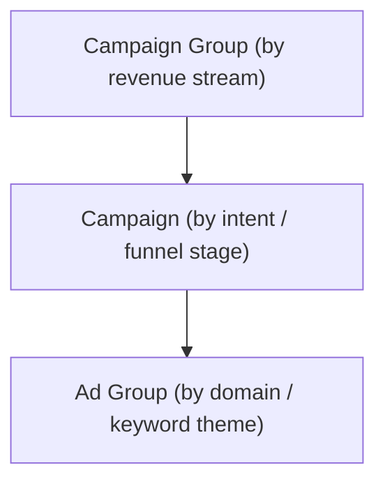

# CARIVIX AI — SEM Campaign Structure

## 1. Overview

This document defines the complete **paid advertising strategy and SEM campaign structure** for CARIVIX AI across **Google Ads** and **LinkedIn Ads**. It covers:

| # | Area |
|---|---|
| 1 | Paid Advertising Strategy (Google + LinkedIn) |
| 2 | Campaign Objectives & Funnel Alignment |
| 3 | Audience Targeting & Segmentation |
| 4 | Campaign Names & Step-by-Step Setup |
| 5 | Creative Strategy & Messaging |
| 6 | Budget Allocation & Bidding Playbook |
| 7 | Implementation Roadmap & Tracking Architecture |
| 8 | A/B Testing Matrix |
| 9 | SEM Campaign Structure (Account Hierarchy) |
| 10 | Execution Readiness Checklist |

> **NOTE:** Every cost figure, budget number, and performance target below is an **assumption**.

---

## 2. Project & Revenue Snapshot

CARIVIX combines NLP, LLMs, GIS, and predictive analytics to convert raw data into executive-ready reports, forecasts, and recommendations across five intelligence domains:

- Business Intelligence
- Government Intelligence
- Economic Intelligence
- Smart City Intelligence
- Research Intelligence

### 2.1 Revenue Model

| Revenue Stream | Buyer | Deal Characteristics | Right Paid-Media Role |
|---|---|---|---|
| **SaaS – Basic (₹4,999/mo)** | SME owner, individual analyst, freelance researcher | Low friction, self-serve, short evaluation | Direct-response: Google Search + retargeting |
| **SaaS – Professional (₹24,999/mo) & Enterprise (₹1,49,999/mo)** | Business Executive, Head of Strategy / Research at a mid–large company | Sales-assisted, multi-stakeholder, demo required | LinkedIn MOFU/BOFU + Google Search (branded + category) |
| **Government Licensing (₹25L–₹5Cr/yr)** | Government Officer, PSU decision-maker, procurement / tender committee | Relationship- and tender-driven, 6–18 month cycle, RFP-gated | LinkedIn awareness / nurture only — paid media supports relationships, it does not close them |
| **Consulting Services** | Investor, policy body, enterprise strategy team | Custom scoping, referral- and credibility-driven | LinkedIn thought leadership + Google branded search |

> **Key Insight:** CARIVIX is **not a single product with one buyer** — it is three revenue streams sold to three different buying committees. The paid media plan must reflect that split rather than treat CARIVIX as one generic B2B SaaS product.

---

## 3. Campaign Objectives, Funnel Alignment & KPIs

### 3.1 Primary Objectives

| # | Objective |
|---|---|
| 1 | **Generate qualified self-serve trials/sign-ups** for the Basic and Professional SaaS tiers among SME owners, analysts, and independent researchers in India |
| 2 | **Build a sales-qualified pipeline of demo requests** from Business Executives and Research Analysts at mid-to-large companies for the Professional and Enterprise tiers |
| 3 | **Build category authority and a warm relationship funnel** with Government Officers and public-sector decision-makers, so CARIVIX is shortlisted when RFPs open — paid media here is a credibility and reach tool, not a conversion tool |
| 4 | **Support investor and consulting-lead generation** through thought-leadership content that showcases CARIVIX's five intelligence domains |

### 3.2 Funnel Alignment Matrix

> **LinkedIn** owns awareness and consideration for the higher-value, longer-cycle segments (Enterprise SaaS, Government, Consulting). **Google Ads** owns high-intent capture across the funnel, from category-education keywords down to branded/competitor terms and pricing-page abandoners. The two platforms are **sequenced, not run in isolation**.

| Funnel Stage | LinkedIn Role | Google Role | Primary KPI |
|---|---|---|---|
| **TOFU (Awareness)** | Thought-leadership content, Document Ads on AI/GovTech topics | Non-brand informational Search (light spend) + YouTube via PMax | CPM, content view rate, engagement rate |
| **MOFU (Consideration)** | Lead Gen Forms gated to whitepaper / ROI calculator / webinar | Non-brand commercial-intent Search ("AI market research tool India") | CPL, form completion rate, cost per MQL |
| **BOFU (Decision)** | Retargeting to site visitors + CRM-matched contacts, "Book a Demo" | Branded Search, competitor conquesting, transactional Search | CPA, SQL conversion rate, demo-to-opportunity rate |
| **Retention / Expansion** | Customer Match audiences with upsell creative for tier upgrades | RLSA on existing customers for upsell keyword terms | Expansion revenue per ₹1 ad spend |

### 3.3 SMART KPI Targets by Funnel Stage

| Stage | Metric | Target (Month 1–3, planning) | Target (Month 4+, optimized) |
|---|---|---|---|
| TOFU | CPM (LinkedIn) | ₹1,400–₹1,800 | ₹1,100–₹1,400 |
| TOFU | CTR (Google Search, non-brand) | ≥1.5% | ≥2.5% |
| MOFU | CPL (LinkedIn Lead Gen Form) | ≤₹3,500 (SaaS) / ≤₹8,000 (Enterprise/Gov) | ≤₹2,500 / ≤₹6,000 |
| MOFU | CPL (Google Search, non-brand) | ≤₹1,800 | ≤₹1,200 |
| BOFU | CPA (Basic/Professional trial-to-paid) | ≤₹8,000 | ≤₹5,500 or 3–4x ROAS |
| BOFU | SQL conversion rate (demo → SQL) | ≥25% | ≥35% |
| Brand | Branded Search CPC | ≤₹15 | ≤₹12 |

---

## 4. Audience Targeting & Segmentation

### 4.1 LinkedIn — Core Targeting Filters

| Segment | Job Titles / Function | Seniority | Industries | Company Headcount |
|---|---|---|---|---|
| **Enterprise SaaS buyer** | Head of Strategy, Market Research, BI, Competitive Intelligence, CSO | Director, VP, C-Suite | IT Services, Financial Services, Consulting, Real Estate, Manufacturing, Pharma | 201–10,000+ |
| **Government / PSU buyer** | Joint Secretary, Director (Planning/IT), Smart City Mission Officer, e-Governance Head, PSU GM/DGM | Manager and above (govt titles skew senior even at "manager" level) | Government Administration, Government Relations, Public Policy, Public Safety | Not applicable — use Industry + Job Title, headcount filter is unreliable for govt bodies |
| **Investor / consulting buyer** | Investment Analyst, VC Associate/Principal, Partner, Economic Advisor, Policy Consultant | Manager, Director, Partner/Owner | Venture Capital & Private Equity, Investment Banking, Think Tanks, Research Services | 1–200 (boutique) and 5,000+ (institutional) |
| **Research Analyst (self-serve)** | Research Analyst, Data Analyst, Academic Researcher | Entry, Senior, Manager | Higher Education, Research Services, Market Research | 1–50 (labs, independent researchers) |

#### Matched Audiences Implementation

| # | Action |
|---|---|
| 1 | **CRM upload:** Export closed-won and active-opportunity contacts monthly to Campaign Manager → Account Assets → Matched Audiences |
| 2 | **Retargeting:** Deploy LinkedIn Insight Tag via GTM. Segment all visitors (90 days), pricing page (30 days), and demo abandoners (30 days, excluding completers) |
| 3 | **Audience expansion:** Enable only when seed lists exceed 300 profiles to prevent weak matching |
| 4 | **Targeting floors:** Maintain >50,000 for cold prospecting and >15,000 for retargeting/CRM. Remove headcount filters if stacking narrows India targets under 10,000 |
| 5 | **Exclusions:** Block current clients from MOFU campaigns, and exclude entry/student profiles from Enterprise/Government segments |

### 4.2 Google Ads — Keyword Intent Tiers

| Tier | Intent | Example Keywords | Campaign Type | Bid Priority |
|---|---|---|---|---|
| **1** | Transactional / Branded | carivix, carivix ai, carivix pricing, carivix login | Search — Brand | Highest (protect position 1) |
| **2** | High-intent transactional | ai market research platform india, government data analytics software, smart city intelligence platform | Search — Non-Brand High Intent | High |
| **3** | Comparison / competitor | [competitor] alternative, ai research tool vs [competitor], best ai decision intelligence platform | Search — Competitor Conquesting | Medium-high, capped daily budget |
| **4** | Informational / category education | how to forecast gdp with ai, ai tools for policy analysis, what is decision intelligence software | Search — Non-Brand Informational (small budget) + PMax/YouTube | Low, capped at 10–15% of Search budget |

#### Negative Keyword Framework

| # | Rule |
|---|---|
| 1 | **Account-level negatives:** free, job, jobs, career, salary, internship, course, tutorial, pdf download, torrent, template, definition |
| 2 | **Cross-tier negation:** Add every Tier 1 (brand) term as a negative on Tier 2–4 campaigns and vice versa — the single highest-leverage fix for wasted spend in a mixed account |
| 3 | **Government campaign negatives:** student, scholarship, exam, syllabus, recruitment, sarkari — government-related informational searches in India skew heavily toward jobs/exam content |
| 4 | **Ongoing hygiene:** Pull the Search Terms report weekly for the first 8 weeks, monthly after |

---

## 5. Campaign Names & Step-by-Step Setup

**Unified naming convention across both platforms:**

```
[Brand]_[Platform]_[FunnelStage/Purpose]_[Segment]_[Format]
```

> This keeps reporting comparable across platforms and makes it easy to filter (e.g., every MOFU campaign, or every Government-targeted campaign).

### 5.1 Google Ads — Campaigns

| Exact Campaign Name | Campaign Type | Purpose | Smart Bidding |
|---|---|---|---|
| `CARIVIX_Google_Brand_Search` | Search | Protect branded terms, own SERP real estate | Target Impression Share (top of page) |
| `CARIVIX_Google_NonBrand_BusinessIntelligence_Search` | Search | Tier 2 keywords for Business Executive buyers | Maximize Conversions → Target CPA |
| `CARIVIX_Google_NonBrand_GovSmartCity_Search` | Search | Tier 2 keywords for Government/Smart City buyers | Maximize Conversions (permanent — low volume) |
| `CARIVIX_Google_NonBrand_ResearchInvestor_Search` | Search | Tier 2 keywords for Research Analyst & Investor buyers | Maximize Conversions → Target CPA |
| `CARIVIX_Google_Competitor_Conquesting_Search` | Search | Tier 3 comparison/competitor terms | Manual CPC or Maximize Clicks, capped budget |
| `CARIVIX_Google_PMax_CategoryAwareness` | Performance Max | Tier 4 + cross-network reach (YouTube, Discover, Gmail) | Target CPA (set 20–30% above Search target) |
| `CARIVIX_Google_Remarketing_RLSA_Display` | Display + Search (RLSA) | Re-engage site visitors and pricing-page viewers | Target CPA / Target ROAS once volume supports it |

### 5.2 LinkedIn Ads — Campaigns

| Exact Campaign Name | Campaign Group | Format | Objective |
|---|---|---|---|
| `CARIVIX_LinkedIn_TOFU_ThoughtLeadership_AllSegments` | TOFU — Thought Leadership & Reach | Document Ad / Single Image / Carousel | Brand Awareness / Engagement |
| `CARIVIX_LinkedIn_MOFU_LeadGen_BusinessExecutive` | MOFU — Lead Generation | Native Lead Gen Form + Carousel | Lead Generation |
| `CARIVIX_LinkedIn_MOFU_LeadGen_InvestorConsulting` | MOFU — Lead Generation | Native Lead Gen Form + Carousel | Lead Generation |
| `CARIVIX_LinkedIn_MOFU_Nurture_GovPSU` | MOFU — Lead Generation | Sponsored Content (softer CTA — "Request a Briefing") | Engagement / Website Visits |
| `CARIVIX_LinkedIn_BOFU_Retargeting_Demo_AllSegments` | BOFU — Retargeting & Demo | Single Image / Video | Conversions (demo booking) |
| `CARIVIX_LinkedIn_BOFU_ABM_ConversationAds_GovEnterprise` | BOFU — Retargeting & Demo | Conversation / Message Ads | Conversions — named account list only |
| `CARIVIX_LinkedIn_Retention_Upsell_ExistingCustomers` | Retention | Single Image / Case Study Carousel | Website Conversions (upgrade page) |

### 5.3 Step-by-Step Setup — LinkedIn Campaign Manager

1. Create **one Campaign Group per funnel stage** (TOFU, MOFU, BOFU, Retention) so budgets and results stay comparable across segments within each group.

#### TOFU — Thought Leadership

Create a **Brand Awareness** or **Engagement** objective campaign. Upload a Document Ad (e.g., a condensed PDF of the 5-domain intelligence framework) or single-image/carousel post. Target broad cold segments using **Job Function + Skills only** — no Seniority filter yet, to keep audience size healthy.

| Setting | Toggle / Value | Why |
|---|---|---|
| Bid type | Maximum Delivery (Cost Cap off) | Prioritizes cheap reach and impressions during the awareness phase |
| Audience expansion | **OFF** | Keep targeting predictable until a seed list exists |
| Enable Audience Network | **OFF** | Keeps delivery on LinkedIn itself — higher quality for a precise B2B/B2G audience |

#### MOFU — Lead Gen Forms

Create a **Lead Generation** objective campaign. Build a native LinkedIn Lead Gen Form (pre-filled with profile data to cut friction) gated to a whitepaper, ROI calculator, or webinar. Target Job Title + Seniority + Industry per Section 4.1. Connect the form to CRM via LinkedIn's native integration or a webhook so leads land within minutes, not at end-of-day CSV export.

| Setting | Toggle / Value | Why |
|---|---|---|
| Bid type | Manual CPC or Cost Cap, near LinkedIn's suggested range | Maximum Delivery tends to overspend on low-quality form fills at this stage |
| Form length | 3–4 fields (name, work email, company, job title) | Longer forms drop completion rates without materially improving lead quality here |

#### BOFU — Retargeting / Demo Requests

Create a **Conversions** objective campaign targeting the Matched Audiences from Section 4.1 (site retargeting + CRM list). Creative should direct to "Book a 20-Minute CARIVIX Demo" linking to a scheduling page with GA4 conversion tracking attached.

| Setting | Toggle / Value | Why |
|---|---|---|
| Bid type — before 15–20 conversions | Cost Cap | Controls spend while data accumulates |
| Bid type — after 15–20 conversions | Manual bidding with a defined Target CPA | Tightens spend once a reliable cost benchmark exists |

> **Governance rule:** Never let a single ad set's forecasted audience drop below ~15,000 (retargeting) or ~50,000 (cold). If Campaign Manager flags "audience too narrow," remove the least-important filter — usually Company Headcount — rather than launching underdelivering.

### 5.4 Step-by-Step Setup — Google Ads

#### Search — Brand & Non-Brand

Build tightly themed ad groups of **5–15 keywords each**, one intent tier per ad group. Never mix Tier 1 brand and Tier 2 non-brand keywords in the same ad group. Use Responsive Search Ads with 10–15 headlines, pinning the brand name in position 1 for brand campaigns only.

| Setting | Toggle / Value | Why |
|---|---|---|
| Networks | Search Network ON, Display OFF, Search Partners OFF at launch | Keeps intent-capture clean; enable Search Partners after 30 days if CPA is healthy |
| Campaign subtype | Standard Search (not bundled into PMax) | Keeps keyword-level data readable in the early stage |
| Location targeting | "Presence: people in or regularly in your targeted locations" | Excludes interest-based traffic from outside the target market |

#### Performance Max

Build **one PMax campaign per major intent theme** (e.g., "Government & Smart City Intelligence," "Business & Investor Intelligence") rather than one catch-all campaign — this keeps asset groups relevant and avoids cannibalizing branded Search. Add the Brand campaign's exact-match terms as an account-level negative for PMax.

#### Remarketing

Layer RLSA lists onto existing Non-Brand Search campaigns first (Observation mode, positive bid adjustment) before building a standalone remarketing campaign — this captures cheaper remarketing clicks without fragmenting the account.

> **Smart Bidding data threshold:** Target CPA/ROAS need roughly **30 conversions in 30 days** at the campaign level to stabilize.

| Stage | Approach | Why |
|---|---|---|
| Month 1–2 | Maximize Conversions with a soft budget cap; count a micro-conversion (pricing-page view + 30s on site, or Lead Gen Form start) as a secondary signal | Gives the algorithm enough volume to learn before hard conversions accumulate |
| Month 3+ | Switch the primary conversion action to demo requests / trial sign-ups once they cross ~30/month, then move to Target CPA | Locks optimization onto the real business outcome once there's enough data |
| Enterprise/Government (permanent exception) | Keep on Maximize Conversions or Manual CPC | These will likely never hit 30 conversions/month on Search alone — forcing Target CPA on thin data causes erratic bidding |

#### Brand vs. Non-Brand Separation

| # | Rule |
|---|---|
| 1 | Keep separate campaigns, separate budgets, separate (cross-negated) keyword lists |
| 2 | Audit monthly that non-brand/PMax search terms reports aren't winning branded impressions |
| 3 | Report Brand and Non-Brand ROAS/CPA separately in every stakeholder update |

---

## 6. Creative Strategy & Messaging

### 6.1 Ad Copy Direction by Platform & Stage

| Platform / Stage | Format | Messaging Direction | Example Headline |
|---|---|---|---|
| LinkedIn TOFU | Document Ad / Single Image | Lead with the problem ("reports without intelligence"), not the product | "Your Data Has Answers. Most Teams Never Find Them." |
| LinkedIn MOFU | Lead Gen Form + Carousel | Name the specific domain (Government, Business, Smart City) and the deliverable behind the gate | "The 5-Domain AI Intelligence Framework Government Teams Are Using — Free Guide" |
| LinkedIn BOFU | Single Image / Video | Direct, low-commitment CTA, remove friction ("20 minutes," "no obligation") | "See CARIVIX Answer Your Hardest Data Question — Live, in 20 Minutes" |
| Google Search — Non-Brand | Responsive Search Ad | Match query intent literally; lead with the outcome (forecast, report, analysis), not the technology | "AI-Powered Market & Policy Intelligence \| Try CARIVIX" |
| Google Search — Brand | Responsive Search Ad | Reinforce trust signals, sitelinks to each of the 5 domains | "CARIVIX AI — Official Site \| Business, Government & Smart City Intelligence" |
| Google PMax | Asset Group | Domain-specific creative per asset group, reuse blog/webinar visuals | "Forecast GDP, Traffic, and Demand — All in One AI Platform" |

### 6.2 CTA Strategy by Buyer Awareness Stage

| Stage | CTA Examples |
|---|---|
| **Unaware / Problem-aware (TOFU)** | "Read the Guide," "See How It Works" — no commitment, content-first |
| **Solution-aware (MOFU)** | "Download the Whitepaper," "Get the ROI Calculator," "Register for the Webinar" — value exchange, still low commitment |
| **Product-aware (BOFU)** | "Book a Demo," "Start Free Trial" (Basic/Professional only), "Talk to Sales" (Enterprise/Government) |

> **Government segment specifically:** Avoid "Buy Now"/"Start Trial" language entirely. Use "Request a Briefing" or "Speak with Our Public Sector Team."

### 6.3 Landing Page Requirements

| # | Requirement |
|---|---|
| 1 | **Message match:** Every ad lands on a page whose H1 restates the ad's specific claim; a Government Intelligence ad must never land on the generic homepage |
| 2 | **Page speed:** Target sub-2.5s LCP (Core Web Vitals) on every paid landing page — slow load is one of the most common, most fixable Quality Score and LinkedIn relevance-score drags |
| 3 | **Form friction:** Self-serve SaaS pages use email + password only (2 fields); Enterprise/Government demo pages can use 5 fields (name, work email, company, role, one qualifying dropdown) since lead quality matters more than volume there |
| 4 | **Trust signals above the fold:** Surface security/compliance language ("ISO 27001, SOC 2, GDPR-aligned, AES-256 encryption") specifically on Enterprise and Government landing pages |
| 5 | **DPDPA-compliant consent:** Every lead form needs a clear, unticked consent checkbox referencing the privacy policy, kept in sync with the GA4/GTM consent state |

---

## 7. Budget Allocation & Bidding Playbook

### 7.1 Phase 1 — Starter Validation Budget (Weeks 1–4)

| Track | Monthly Budget (₹) | Platform |
|---|---|---|
| Research Analyst self-serve + Business Executive lead-gen | 55,000 – 90,000 | Google Search |
| Business Executive lead-gen | 20,000 – 30,000 | LinkedIn MOFU |
| Retargeting (light) | 10,000 – 20,000 | Google Display + LinkedIn |

### 7.2 Target-State Budget (Month 3+, once validated)

| Allocation | % of Budget | Illustrative Monthly (₹3.5L base) | Primary Purpose |
|---|---|---|---|
| Google — Brand Search | 10% | 35,000 | Defend branded SERP, cheapest high-intent conversions |
| Google — Non-Brand Search | 25% | 87,500 | Core acquisition, Tier 2/3 keywords |
| Google — PMax / Category Awareness | 10% | 35,000 | Cross-network reach, content promotion |
| Google — Remarketing/RLSA | 5% | 17,500 | Recapture warm traffic, low CPA |
| LinkedIn — TOFU (Thought Leadership) | 15% | 52,500 | Category authority with Enterprise/Government/Investor personas |
| LinkedIn — MOFU (Lead Gen Forms) | 20% | 70,000 | Gated content conversion, primary MQL engine |
| LinkedIn — BOFU (Retargeting/Demo) | 15% | 52,500 | Demo requests, CRM-matched nurture |

### 7.3 Pacing Strategy

| Timeframe | Action |
|---|---|
| Weeks 1–2 | Launch at **60% of target daily budget** across all campaigns so Smart Bidding and LinkedIn's delivery system can exit the learning phase without a large early spend swing |
| Weeks 3–4 | Move to 100% budget once CTR and CPL are within 25% of the Month 1–3 targets. If a campaign is missing targets by more than 40%, hold it at 60% and diagnose before scaling spend into it |
| Monthly pacing check | Review spend-to-date against days elapsed by the 20th of each month; if pacing to underspend by >15%, widen targeting (add a Skill or Job Title) before the month closes rather than raising bids blindly |

### 7.4 Bid Adjustment Rules

| Signal | Threshold | Action |
|---|---|---|
| Google Search CPA | 20% above target for 7 consecutive days | Move to Target CPA (or lower it 10%) and pause the bottom 20% of keywords by cost with zero conversions |
| LinkedIn CPL | 30% above target for 2 weeks | Tighten audience with an added Skill filter; if audience drops below 15,000, swap creative before touching targeting further |
| Quality Score / Relevance drop | Google QS < 5 or LinkedIn relevance falls a tier | Rewrite ad copy for tighter message match before adjusting bids |
| Conversion rate spike (positive) | CVR beats target by 25%+ for 5+ days | Increase daily budget by 20% increments, not more — large jumps reset Smart Bidding's learning phase |
| Frequency (LinkedIn/Display) | Frequency > 4 in a rolling 30 days on a static audience | Refresh creative or expand audience — fatigue depresses CTR before CPL data shows it |

---

## 8. Implementation Roadmap & Tracking Architecture

### 8.1 Execution Checklist

#### Phase 1 — Setup & Tracking

| # | Action |
|---|---|
| 1 | Confirm GA4/GTM consent mode and key events are live before any ad spend begins |
| 2 | Install the LinkedIn Insight Tag via GTM; verify it fires on all pages and on form-submit events |
| 3 | Import GA4 conversions into Google Ads (Tools > Conversions > Import) and set primary vs. secondary conversion actions per the staged Smart Bidding approach in Section 5.4 |
| 4 | Build and upload Customer Match / Matched Audience lists from the CRM export for both platforms |
| 5 | Set up offline conversion import (Section 8.2) so CRM-stage changes flow back into both ad platforms |
| 6 | Build all landing pages (5 domain pages + pricing + 2 gated-content pages) per Section 6.3 requirements, and QA on mobile |
| 7 | Create the UTM naming convention (Section 8.2) and share it with anyone who can publish a link |

#### Phase 2 — Launch

| # | Action |
|---|---|
| 1 | Launch Google Brand Search first, in isolation, for 3–5 days to confirm tracking fires correctly before other campaigns go live |
| 2 | Launch Google Non-Brand Search and PMax at 60% pacing |
| 3 | Launch LinkedIn TOFU campaigns first (cheapest to validate audience size/CPM), then MOFU Lead Gen Forms 3–5 days later once TOFU CTR confirms creative resonance |
| 4 | Hold LinkedIn BOFU retargeting until the site pixel has accumulated at least 1,000 unique visitors (roughly end of Week 4) so the audience isn't too thin to deliver |

#### Phase 3 — Optimization

| Frequency | Activity |
|---|---|
| Weekly | Search terms report review and negative keyword additions |
| Bi-weekly | Creative refresh check against the frequency/fatigue rule (Section 7.4) |
| Monthly | Full funnel review — CPL, CPA, SQL rate, and (once available) pipeline-influenced revenue per platform per segment; reallocate the budget split in Section 7.2 based on which segment is over/under-performing its target CPA |
| Quarterly | Revisit keyword intent tiers and LinkedIn persona filters against actual CRM win data — the assumed personas in Section 4 should be replaced with the profile of contacts who actually closed |

### 8.2 Tracking Architecture

#### UTM Tagging Convention

**Format:**

```
utm_source=[platform]&utm_medium=[cpc|paid_social]&utm_campaign=[funnel-stage]_[segment]_[month-year]&utm_content=[ad-variant]
```

| Parameter | Value |
|---|---|
| `utm_source` | `google` / `linkedin` |
| `utm_medium` | `cpc` (Google) / `paid_social` (LinkedIn) |
| `utm_campaign` | Example: `mofu_enterprise_jul26`, `bofu_government_jul26` |
| `utm_content` | Example: `doc-ad-v1`, `rsa-headline-a` |

> **Enforce** this via a shared naming-convention sheet and each platform's auto-tagging templates — inconsistent UTMs are the most common reason CRM-to-ad-platform revenue attribution breaks.

#### CRM Integration Rules

| # | Rule |
|---|---|
| 1 | Every lead (Google Ads lead form, LinkedIn Lead Gen Form, or website demo form) must write `gclid` or `li_fat_id` (click IDs) into a hidden CRM field to capture — this is what makes offline conversion import possible |
| 2 | CRM stage changes (MQL → SQL → Opportunity → Closed-Won) should trigger an automated export/webhook back to Google Ads Offline Conversion Import and LinkedIn Conversions API, so both platforms optimize toward pipeline and revenue, not just form fills |
| 3 | Government/Enterprise deals with 6+ month cycles: import at least the SQL and Opportunity stages monthly even before a deal closes, so Smart Bidding has an early signal beyond raw lead volume |

#### Offline Conversion Tracking for Pipeline Impact

| Platform | Method |
|---|---|
| **Google Ads** | Enable Enhanced Conversions for Leads and schedule a weekly Offline Conversion Import (CSV or CRM API) tagged with the original click ID |
| **LinkedIn** | Use the Conversions API (server-side) to pass SQL and Closed-Won events back with the stored `li_fat_id`, so LinkedIn's algorithm and reporting reflect actual revenue quality, not just form volume |
| **Reporting cadence** | A monthly pipeline report blending platform-reported CPL with CRM-reported SQL rate and, once available, Closed-Won revenue — this is the number that should govern budget reallocation, not platform CPA alone |

---

## 9. A/B Testing Matrix

| Element | Variant A | Variant B | Platform | Primary Metric | Min. Sample |
|---|---|---|---|---|---|
| Headline (TOFU) | Problem-led ("Data Without Intelligence") | Outcome-led ("Forecast What's Next") | LinkedIn + Google RSA | CTR | 1,000 impressions/variant |
| CTA (BOFU) | "Book a Demo" | "See CARIVIX Live" | LinkedIn | Form completion rate | 200 clicks/variant |
| Landing page form length | 2 fields (email, password) | 4 fields (+company, role) | Google Search → LP | CVR & lead quality (SQL rate) | 300 sessions/variant |
| Creative format (MOFU) | Static carousel | Document Ad (PDF preview) | LinkedIn | Cost per lead | ₹50,000 spend/variant |
| Ad copy angle (Government) | Compliance/security-led | Efficiency/cost-savings-led | LinkedIn + Google RSA | CTR + engagement rate | 1,500 impressions |

---

## 10. SEM Campaign Structure (Account Hierarchy)

### 10.1 Account Hierarchy

The account is structured in **three tiers**:



> This keeps budget, bidding, and reporting cleanly separable by business line while still allowing domain-level keyword control.

| Level | Basis | Example |
|---|---|---|
| Campaign Group | Revenue stream | `CRVX-SelfServe` / `CRVX-Enterprise` / `CRVX-Government` |
| Campaign | Funnel stage & network | `CRVX-SelfServe-Search-HighIntent` |
| Ad Group | Domain / keyword theme | `AG-Business-Intelligence-Keywords` |

### 10.2 Naming Convention

| Level | Format | Example |
|---|---|---|
| Campaign | `[Brand]-[Stream]-[Network]-[Stage/Purpose]` | `CRVX-Enterprise-Search-Consideration` |
| Ad Group | `AG-[Domain]-[ThemeType]` | `AG-SmartCity-BroadKeywords`, `AG-GovIntel-BrandTerms` |
| UTM Campaign Parameter | Mirrors the Google Ads campaign name exactly | Per the existing CARIVIX UTM convention, so paid and analytics reporting reconcile without manual mapping |

### 10.3 Campaign Types by Revenue Stream

| Revenue Stream | Primary Campaign Type | Supporting Campaign Type(s) | Rationale |
|---|---|---|---|
| Basic/Professional (self-serve) | Search — High Intent | Performance Max, Remarketing | Self-serve buyers convert directly from search; PMax extends reach for top-of-funnel volume |
| Enterprise SaaS | Search — Consideration | LinkedIn (non-Google), Remarketing | Longer cycle needs nurture touches; Search captures active evaluators |
| Government Licensing/Consulting | Search — Brand & Category | Remarketing (low volume, high value) | Low search volume but high stakes; brand defense and named-decision-maker remarketing matter more than reach |

> **Why this fits CARIVIX:** Because the three revenue streams have genuinely different buyer behaviour — self-serve signup, enterprise evaluation, government procurement — splitting at the campaign-group level (rather than one blended account) keeps budget, bidding strategy, and reporting honest to each motion instead of averaging them together.

### 10.4 Ad Group Keyword Themes by Domain

| Domain | Keyword Theme Examples | Primary Stream(s) |
|---|---|---|
| Business Intelligence | business analytics platform India, voice-first data analytics | Self-serve, Enterprise |
| Government Intelligence | government data analytics software, crisis intelligence platform India | Government |
| Economic Intelligence | economic forecasting tool, predictive analytics dashboard | Enterprise |
| Smart City Intelligence | smart city analytics platform, urban data intelligence India | Government, Enterprise |
| Research Intelligence | AI research analytics tool, voice AI for research teams | Self-serve, Enterprise |

### 10.5 Budget & Bidding by Campaign Group

> Carrying forward the indicative **₹3,50,000/month** split used in prior CARIVIX paid advertising work:

| Campaign Group | Monthly Budget (₹) | Bidding Strategy | Notes |
|---|---|---|---|
| Self-Serve (Search + PMax) | 1,40,000 | Maximise Conversions, then tCPA once 30+ conversions/month | Highest volume, fastest optimisation cycle |
| Enterprise (Search + Remarketing) | 1,30,000 | Maximise Clicks initially, move to Target CPA on MQL | Longer cycle — optimise on MQL, not raw conversions |
| Government (Search, Brand + Remarketing) | 80,000 | Manual CPC with enhanced conversions | Low volume; manual control protects spend on high-value, low-frequency terms |

> This split is illustrative and should be replaced once an approved media budget is confirmed; the **proportional logic** (self-serve gets the most volume-driven spend, government the most controlled) should hold regardless of the total.

---

## 11. Campaign Objectives

### 11.1 Objectives by Revenue Stream and Funnel Stage

| Revenue Stream | Funnel Stage | Google Ads Campaign Goal | Primary Success Metric |
|---|---|---|---|
| Self-Serve | Awareness / Reach | Website traffic | Sessions, CTR |
| Self-Serve | Conversion | Sales / Leads | Sign-up conversion rate, CPL |
| Enterprise | Consideration | Leads | MQLs, cost per MQL |
| Enterprise | Conversion | Leads (offline conversion import) | SQLs, cost per SQL |
| Government / Consulting | Awareness & Brand Defense | Website traffic / Brand | Impression share, brand CTR |
| Government / Consulting | Engagement | Leads | Consultation requests, cost per request |

### 11.2 Objective-to-Setting Mapping

| Campaign Type | Goal | Conversion Action | Bidding |
|---|---|---|---|
| Self-serve conversion campaigns | Sales | Paid sign-up | Maximise Conversions → tCPA |
| Enterprise consideration campaigns | Leads | Demo request form | Maximise Clicks → Maximise Conversions once volume supports it |
| Government awareness campaigns | Website Traffic (Brand Awareness secondary signal) | — | Manual CPC to control spend on a thin keyword set |

> **Why this fits CARIVIX:** Setting a single, explicit Google Ads goal per campaign (rather than a generic 'traffic' goal everywhere) lets Smart Bidding optimise toward the metric that actually matters for that revenue stream, and keeps reporting honest about what each campaign was meant to deliver.

---

## 12. Target Audience Segments (Google Ads)

### 12.1 Segment Types and Definitions

| Segment Type | Definition | Primary Use |
|---|---|---|
| **In-Market** | Users actively researching related categories (e.g. "Business Analytics Software", "Data Management Software") | Self-serve and Enterprise Search/PMax |
| **Custom Segments** | Built from URLs, apps, and search terms competitors and category keywords use | All streams — sharpens intent beyond Google's default categories |
| **Remarketing** | Site visitors who did not convert, segmented by page visited (pricing, demo, domain page) | All streams — Remarketing campaigns |
| **Customer Match** | Uploaded lists of existing leads/customers by revenue stream, hashed per DPDPA 2023 requirements | Enterprise and Government nurture, lookalike seed |
| **Lookalike / Similar Audiences** | Modelled from Customer Match seed lists | Self-serve and Enterprise top-of-funnel expansion |

### 12.2 Persona-to-Segment Mapping

| Persona / Buyer Journey | Stream | Segment Mix |
|---|---|---|
| SME self-serve buyer | Self-Serve | In-market (Business Analytics), custom (competitor terms), lookalike from converted sign-ups |
| Enterprise evaluator (IT/Ops lead) | Enterprise | In-market + custom (category & competitor), Customer Match from CRM MQLs, remarketing on demo-page visitors |
| Government officer (long-cycle) | Government | Custom segments (govt tender/procurement terms), Customer Match from known contacts, remarketing on government-domain page |

### 12.3 Phased Rollout

| Phase | Timeframe | Action |
|---|---|---|
| **Phase 1** | Month 1 | In-market and custom segments live on Search campaigns across all three streams; remarketing lists start building from existing traffic |
| **Phase 2** | Month 2 | Customer Match lists uploaded for Enterprise and Government once CRM export is DPDPA-compliant (hashed, consent-checked); remarketing campaigns go live once list sizes clear Google's minimum thresholds |
| **Phase 3** | Month 3+ | Lookalike/similar audiences activated once Customer Match seed lists are stable, expanding Self-Serve and Enterprise top-of-funnel reach |

> **Why this fits CARIVIX:** Sequencing Customer Match and lookalike segments to Phase 2–3 (rather than launching everything on day one) respects both Google's minimum audience-size requirements and DPDPA 2023 consent handling on the underlying CRM data — launching earlier would mean segments too small to serve, or contact data that hasn't cleared consent checks.

---

## 13. Execution Readiness Checklist

| Workstream | First Action | Owner | Dependency |
|---|---|---|---|
| Account structure | Build campaign groups and naming convention in Google Ads | Growth / Marketing lead | None — can start immediately |
| Campaign objectives | Configure goal and conversion action per campaign | Growth / Marketing lead | GA4/GSC conversion tracking must be live |
| Audience segments | Set up in-market and custom segments | Growth / Marketing lead | None — can start immediately |
| Customer Match | Export and hash CRM contact lists by stream | Sales Ops + Growth | DPDPA-compliant consent flag on CRM records |
| Remarketing lists | Confirm GTM/GA4 audience triggers per domain page | Growth / Marketing lead | GTM implementation from analytics workstream |

---

## Version Control

| Version | Date | Author | Changes |
|---|---|---|---|
| 1.0 | 2026-09-18 | Shivanath Samudrala | Initial version — SEM campaign structure and paid advertising strategy |
